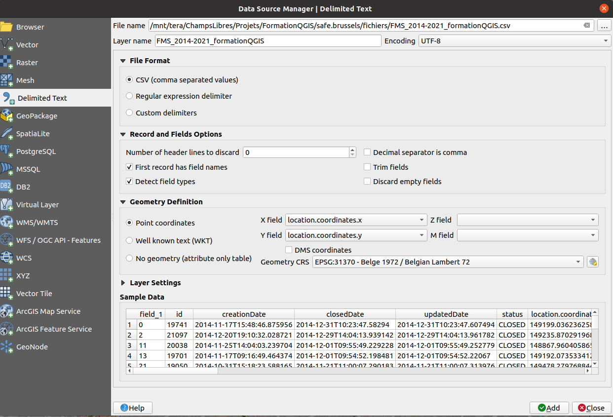

Create a PostGIS layer from a Excel table
==========================================

In this section, we will create a PostGIS layer from a table of point observations and save it as a Postgis layer.

## Add the XY data to QGIS

We have an Excel file of point observations over Brussels, with coordinates of the observations in two columns (e.g., X and Y, or longitude and latitude) and we want to add it in our PostGIS database.

This is typically done by using the "Add delimited text" layer action in the layer menu which will add the table of observations and transform the coordinates columns into points on the map. This manipulation requires that we convert the Excel file to a "CSV" file first, which can be done in Excel or LibreOffice.

Open the Add delimited text layer dialog (Layer > Add Layer > Add delimited text layer ...) and browse to the csv file. The tool will automatically detect the coordinates columns based on their names (X, Y), but sometimes, you have to indicate the right columns for the coordinates. It is also important to choose a coordinate system (Geometry CRS) that is correct with respect to these coordinates!



Note: We can actually directly load the Excel file in QGIS and transform it into points without converting to the CSV format, but this may lead to a layer without column names, so it is not the preferred option. But you can try: drag and drop the Excel file directly in the layer browser of QGIS and then, use the tool "Create points layer from table" available in the "Processing toolbox".

After using the tool, the points layer will be displayed on the map, as follows:


## Save it as a PostGIS layer

Save this layer to a PostGIS database is trivial once you are connected to a PostgreSQL database with PostGIS enabled.

Open the DB manager (Database > DB manager). Browse on the left to the database and click on the third icon "Import Layer / File". You can select the layer in the first field "Input", and then choose in which table you want to store the database.

Important note! By default QGIS will propose to store the data in a new table with the same name as the layer, but please note that you will avoid several problems by choosing a name without special characters (spaces, "-", "&", etc.) and without capital letters! Although PostgreSQL tables *can* have complicated name and users can deal with that (by quoting the table names between ""), it is your responsibility as a GIS manager to avoid these issues by providing simple table names!

Tip: You'd better ticking the box "Create a spatial index": though it will take a little bit more time to create the PostGIS table, an index will increase the performance (i.e. the speed) of reading the data for later use.


## Make a spatial intersection

Now that the observations are imported in a PostGIS table, we can start making some spatial queries!

Please create a polygon in an area of interest. Here I've drawn a polygon around the central station in Brussels. I've imported it into the PostGIS table as seen previously. To create a polygon, you have to create a layer (Layer > Create Layer) and store it on your computer, or you may use the QuickDraw QGIS plugin which is rather useful to quickly create a layer from scratch.

Like any table, we can create a query on the observations table to filter the data. Using PostGIS functionalities, we can create some spatial queries.


To run a spatial query, open the DB manager (Database > DB manager), browse to your PostGIS database and click on the second icon to open the query builder. On the query builder, you can type some queries on your database. In this exercise, we want to filter all the points that falls into the polygon we drew.

### A spatial intersection with the WHERE clause

There are actually 2 ways of making a spatial intersection: (1) using the WHERE clause and (2) using the JOIN statement. Here's the SQL statements to write with the WHERE clause. We use the [PostGIS function "ST_Intersects"](https://postgis.net/docs/ST_Intersects.html): this function returns "true" where there is a spatial intersection between two layers. There are other PostGIS functions for doing spatial intersection, such as ST_Within, ST_Contains, ST_Disjoint, ... with some subtleties in their use.

```sql
SELECT observations.*
FROM observations, gare_centrale
WHERE st_intersects(gare_centrale.geom, observations.geom)
```

You can load the result of the query in the QGIS map panel by clicking on "Load".

### A spatial intersection with JOIN

And here the statement using the (INNER) JOIN statement. Both queries results in the same outputs.

```sql
SELECT observations.*
FROM observations
INNER JOIN gare_centrale ON st_intersects(gare_centrale.geom, observations.geom);
```

To summarize, you learned how to make a simple spatial intersection with some PostGIS function!

Actually this could be done using QGIS tool (select by location), but doing it with the DB manager has some advantages:

- you can save your query as a SQL file to make a collection of SQL recipes to be used and shared across colleagues.
- more importantly, you can save the result of the query in a new view. A view is like a table for the end-users, except the data won't be duplicated and will evolve with the original table.

### Exercise: expand the area of intersection with a buffer

Now, suppose that we want to expand a little bit the analysis by looking at all the observations that are within a buffer zone of 100 m around the central station polygon.

We could redraw a new polygon, importing it in PostGIS and re-do the manipulation, but there is a much simple way: we can modify the query by adding a buffer around the "gare_centrale" geometry.

<!-- SELECT observations.*
FROM observations, gare_centrale
WHERE st_intersects(ST_Buffer(gare_centrale.geom, 100), observations.geom) -->

### Exercise: Filter the observations based on the date of observations

We want to filter the observations based on the date of observations, keeping for instance only observations after the 01/01/2018.

<!-- SELECT observations.*
FROM observations, gare_centrale
WHERE
  st_intersects(gare_centrale.geom, observations.geom)
  AND observations."creationDate" > '2018-01-01'; -->