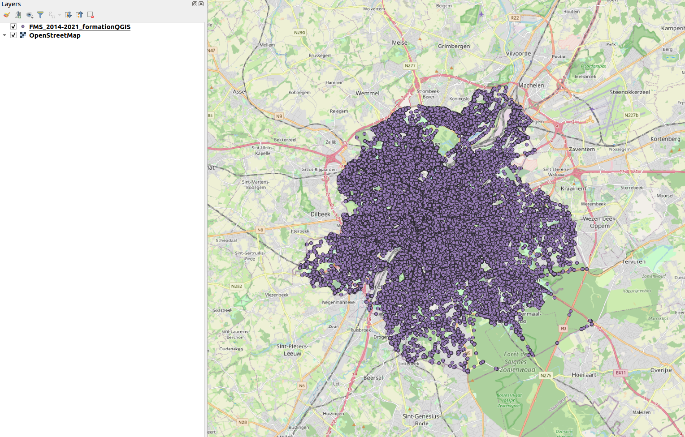
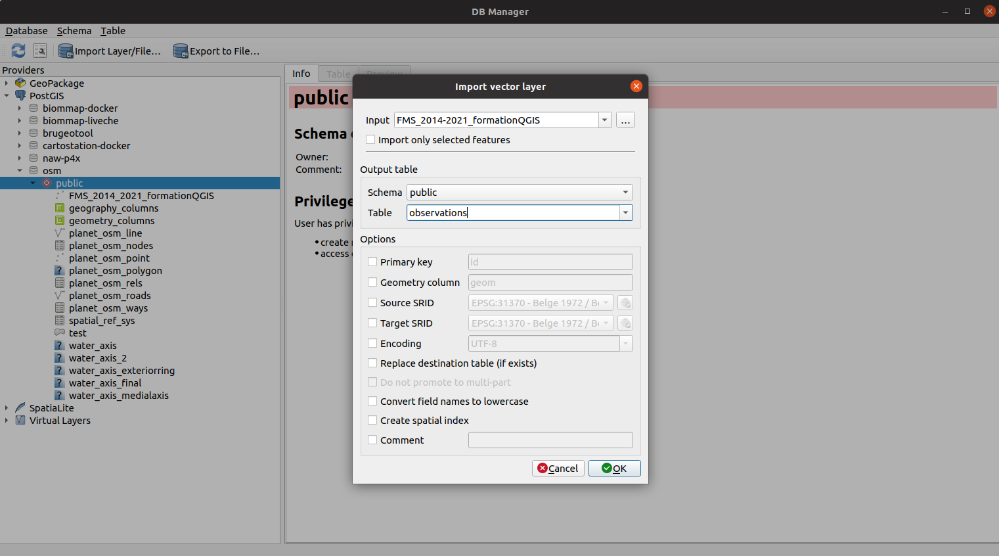
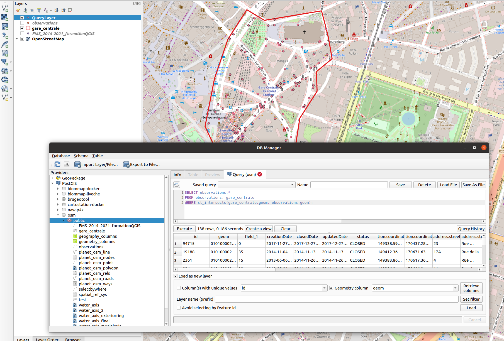

Een postgis laag maken een Excel tabel
==========================================

In deze sectie zullen we een PostGIS-laag maken van een tabel met puntwaarnemingen en deze opslaan als een Postgis-laag.

## Voeg de XY-gegevens toe aan QGIS

We hebben een Excel-bestand met puntwaarnemingen boven Brussel, met de coördinaten van de waarnemingen in twee kolommen (bv. X en Y, of lengte- en breedtegraad) en we willen dit toevoegen aan onze PostGIS-database.

Dit wordt meestal gedaan door de laagactie "Voeg gescheiden tekst toe" in het lagenmenu te gebruiken, waarmee de tabel met waarnemingen wordt toegevoegd en de coördinatenkolommen worden omgezet in punten op de kaart. Deze manipulatie vereist dat we eerst het Excel-bestand converteren naar een "CSV"-bestand, wat kan worden gedaan in Excel of LibreOffice.

Open het dialoogvenster *teken gescheiden tekstlaag toevoegen* (Laag > Laag toevoegen > teken gescheiden tekstlaag ...) en blader naar het csv-bestand. De tool detecteert automatisch de coördinatenkolommen op basis van hun namen (X, Y), maar soms moet u de juiste kolommen voor de coördinaten aangeven. Het is ook belangrijk om een coördinatensysteem (Geometry CRS) te kiezen dat correct is met betrekking tot deze coördinaten!


Opmerking: we kunnen het Excel-bestand in feite direct in QGIS laden en het omzetten in punten zonder te converteren naar het CSV-formaat, maar dit kan leiden tot een laag zonder kolomnamen, dus het is niet de voorkeursoptie. Maar u kunt proberen: sleep het Excel-bestand rechtstreeks naar de lagenbrowser van QGIS en gebruik vervolgens de tool "Create points layer from table" die beschikbaar is in de "Processing toolbox".

Na gebruik van de tool wordt de puntenlaag als volgt op de kaart weergegeven:



## Opslaan als een PostGIS-laag

Het opslaan van deze laag in een PostGIS-database is triviaal als u eenmaal bent verbonden met een PostgreSQL-database met PostGIS ingeschakeld.

Open de DB-manager (Database > DB-manager). Blader links naar de database en klik op het derde icoon "Laag/Bestand importeren". U kunt de laag selecteren in het eerste veld "Invoer", en vervolgens kiezen in welke tabel u de database wilt opslaan.

Belangrijke notitie! Standaard zal QGIS voorstellen om de gegevens op te slaan in een nieuwe tabel met dezelfde naam als de laag, maar houd er rekening mee dat u verschillende problemen zult vermijden door een naam te kiezen zonder speciale tekens (spaties, "-", "&", enz. ) en zonder hoofdletters! Hoewel PostgreSQL-tabellen een gecompliceerde naam *kunnen* hebben en gebruikers daarmee kunnen omgaan (door de tabelnamen tussen "") aan te halen, is het uw verantwoordelijkheid als GIS-beheerder om deze problemen te vermijden door eenvoudige tabelnamen te geven!

Tip: U kunt beter het vakje "Maak een ruimtelijke index aan" aanvinken: hoewel het wat meer tijd zal kosten om de PostGIS-tabel te maken, zal een index de prestatie (d.w.z. de snelheid) van het lezen van de gegevens voor later gebruik verhogen.




## Maak een ruimtelijke join

Nu de waarnemingen zijn geïmporteerd in een PostGIS-tabel, kunnen we beginnen met het maken van enkele ruimtelijke query's!

Maak een polygoon in een interessegebied. Hier heb ik een polygoon getekend rond het centraal station in Brussel. Ik heb het geïmporteerd in de PostGIS-tabel zoals eerder gezien. Om een polygoon te maken, moet u een laag maken (Laag > Laag maken) en deze opslaan op uw computer, of u kunt de plug-in QuickDraw QGIS gebruiken, wat erg handig is om snel een nieuwe laag te maken.

Zoals elke tabel kunnen we een query op de tabel maken om de gegevens te filteren. Met behulp van PostGIS-functionaliteiten kunnen we enkele ruimtelijke query's maken.



Om een ruimtelijke query uit te voeren, opent u de DB-manager (Database > DB-manager), bladert u naar uw PostGIS-database en klikt u op het tweede pictogram om de querybuilder te openen. In de querybuilder kunt u enkele query's op uw database typen. In deze oefening willen we alle punten filteren die vallen in de polygoon die we hebben getekend.w.

### Maak een ruimtelijke intersectie met de WHERE clause

Er zijn eigenlijk 2 manieren om een ruimtelijke intersectie te maken: (1) met behulp van de WHERE-component en (2) met behulp van de JOIN-instructie. Dit zijn de SQL-instructies die moeten worden geschreven met de WHERE-component. Wij gebruiken de [PostGIS functie "ST_Intersects"](https://postgis.net/docs/ST_Intersects.html):  this function returns "true" where there is a spatial intersection between two layers. There are other PostGIS functions for doing spatial intersection, such as ST_Within, ST_Contains, ST_Disjoint, ... with some subtleties in their use.

```sql
SELECT observations.*
FROM observations, gare_centrale
WHERE st_intersects(gare_centrale.geom, observations.geom)
```

U kunt het resultaat van de laden zoeken in het kaartpaneel van QGIS door op "Laden" te klikken.

### Maak een ruimtelijke intersectie met JOIN

En hier de instructie met behulp van de (INNER) JOIN-instructie. Beide vragen worden opgenomen in dezelfde uitvoer.

```sql
SELECT observations.*
FROM observations
INNER JOIN gare_centrale ON st_intersects(gare_centrale.geom, observations.geom);
```

Om samen te vatten, je hebt geleerd hoe je een eenvoudige ruimtelijke kruising kunt maken met een of andere PostGIS-functie!

Eigenlijk zou dit gedaan kunnen worden met het gereedschap QGIS (selecteren op locatie), maar het doen met de DB-manager heeft enkele voordelen:

- u kunt uw zoekopdracht opslaan als een SQL-bestand om een verzameling SQL-recepten te maken die u kunt gebruiken en delen met collega's.
- wat nog belangrijker is, u kunt het resultaat van de zoekopdracht opslaan in een nieuwe weergave. Een weergave is als een tabel voor de eindgebruikers, behalve dat de gegevens niet worden gedupliceerd en mee evolueren met de originele tabel.

### Oefening: breid het snijvlak uit met een buffer

Stel nu dat we de analyse een beetje willen uitbreiden door te kijken naar alle waarnemingen die zich binnen een bufferzone van 100 m rond de polygoon van het centraal station bevinden.

We kunnen een nieuwe polygoon opnieuw tekenen, importeren in PostGIS en de manipulatie opnieuw uitvoeren, maar er is een veel eenvoudige manier: we kunnen de query wijzigen door een buffer toe te voegen rond de "gare_centrale" geometrie.

<!-- SELECT observations.*
FROM observations, gare_centrale
WHERE st_intersects(ST_Buffer(gare_centrale.geom, 100), observations.geom) -->

### Oefening: Filter de waarnemingen op basis van de waarnemingsdatum

We willen de waarnemingen filteren op datum van waarnemingen, bijvoorbeeld enkel waarnemingen na 01/01/2018 behouden.

<!-- SELECT observations.*
FROM observations, gare_centrale
WHERE
  st_intersects(gare_centrale.geom, observations.geom)
  AND observations."creationDate" > '2018-01-01'; -->