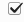
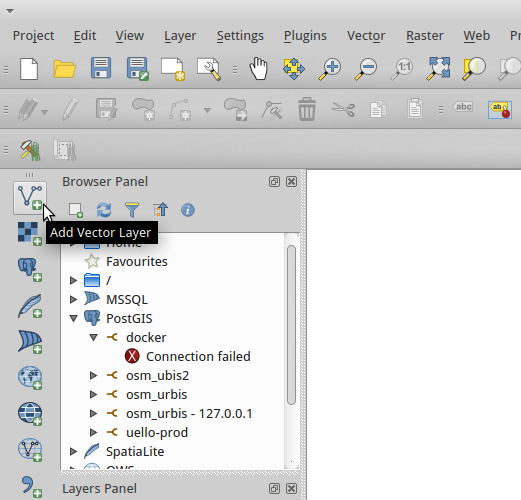
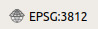
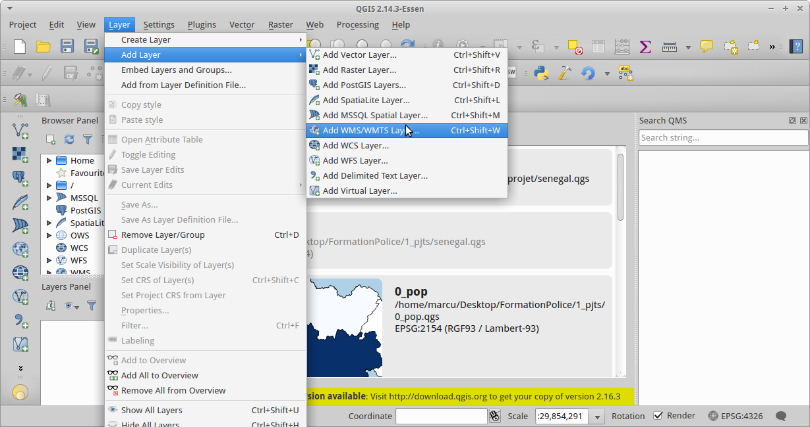
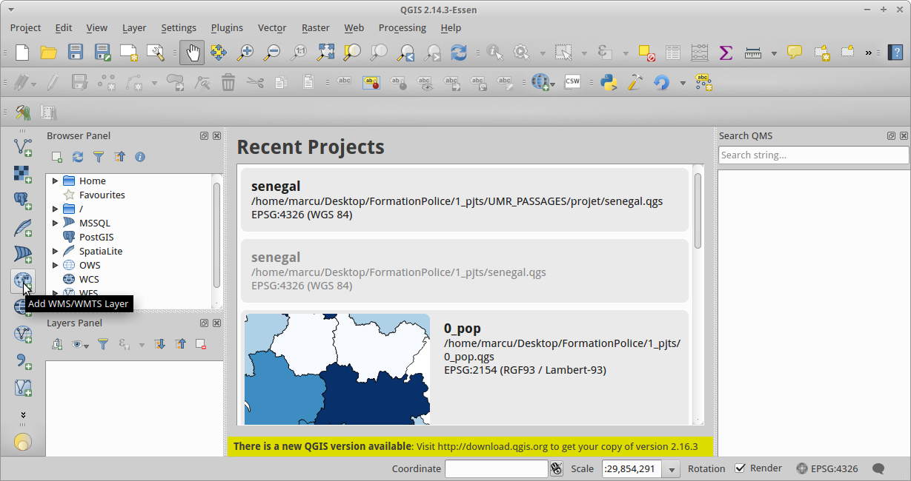
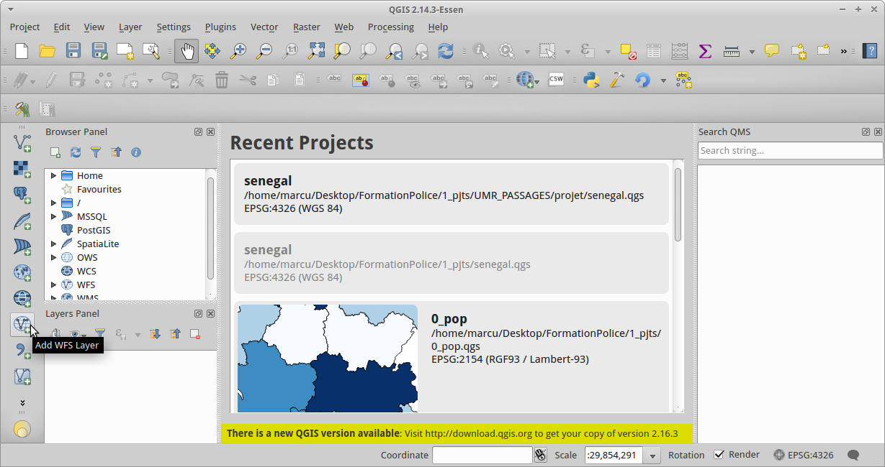
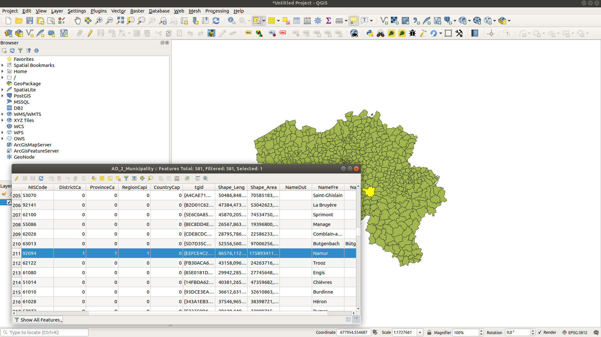
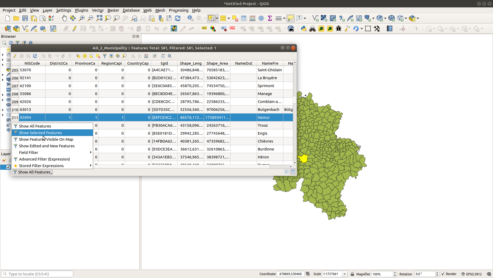

Intro to QGIS
==============

## QGIS interface

**1. Menus**

- Project: set up, open and save your current project
- Edit: Undo, Paste etc.
- View: Edit your map image such as zoom in and out, measure, etc.
- Map layers: add and manage
- Tools: General settings
- Plugins: install additional components
- Database: query databases
- Vector, Raster, Web, Meshes and processing: analysis tools
- Help: Documentation

**2. Toolbars**: The same as in the menus, but in the form of icons. To find out what a tool does, hover your mouse over it and read the tooltip. To add or remove toolbars, right-click anywhere in this area except on a disabled tool, and check or uncheck the desired toolbars.

**3. Layer Management Toolbar**: To easily add layers.

**4. Panels**:

- The first one: the "Browser" which allows you to easily find a file opened by QGIS, a WMS stream, ...
- The second one: list of loaded layers, also called **table of contents** (TOC). If several layers are present, you can change the display order here. To make this area appear or disappear: View > Panels > Layers
- To add panels, View > Panels

**5. View Area**. This area can be zoomed in or out.

**6. Status Bar**. Here you can find the coordinates of the point where the mouse is located, the scale...

## A QGIS project

A project is a workspace. Saving a project is equivalent to saving the list of layers used, the style used for each layer
but not the data!

For a layer the project only retains the path to the layer and not the data contained in the layer.

You can specify relative paths or absolute paths. The advantage of using relative paths is that you can share a
file that contains the project and its layers.

## Exercise: Open a project

Open the project in the files received at the location "projects/part_1/senegal.qgz".

You can change the order in which the layers appear by clicking on them
and dropping it lower or higher.

The order of the layers is important: QGIS displays the layers from bottom to top: it draws the layer at the very bottom, then the one just above it and so on. If you put the cities layer at the bottom of the list, it will be hidden by the regions layer.

 The checkboxes in the "layers" panel allow to display or not a layer.

Warning, the project file we opened did not store the data that are displayed. It just records the path where this data is located. For example, if we look at the details of the LOCALITIES layer, we can see that the path to the data is "/...links-to-exercises.../LOCALITY_P.gpkg".

We can open this layer in another project: go to the directory " /...links-to-exercises...
/donnees/part_1/" and click on the file "LA_LOCALITE_P.gpkg".

We have another project that displays this data but in a different style!

##  Exercise: Open a vector file

First of all, we launch QGIS and choose an empty project. When we start QGIS, the software offers us to open recent projects. We can also choose a new project by going to "Project" > "New".

We are going to open a "shapefile" which is one of the most common vector formats.

In the "layer" menu, click on "add layer", then "add vector layer".

A window appears. Choose the encoding (in general, we leave UTF8 by default).

Then choose the source. In this case you have to select the desired ".shp" file. For this exercise, open the file "donnees/part_1/AD_2_Municipality.shp". This data is generated by the IGN and is available in free access on the Belgian federal portal <https://www.geo.be/#!/catalog/details/fb1e2993-2020-428c-9188-eb5f75e284b9>

If all went well, the map of the municipalities of Belgium should appear.

An alternative way to open a vector layer is to use the "Add a vector layer" icon in the "Layer Management" toolbar.

## Exercise: Coordinate system

When a first layer is added to a QGIS project, the project automatically takes the projection system
of this layer. Here, in the case of the municipalities layer, this is the Belgian Lambert 2008 coordinate system (EPSG:3812). You can see this information in the lower right corner of the project. Click on this button , you will get a window to change the projection system.

You can test other coordinate systems via this window. The most commonly used coordinate systems in GIS are:

- WGS 84 (EPSG:4326): projection system with longitude and latitude in decimal degrees. Sometimes called "GPS coordinates".
- WGS 84 Pseudo-Mercator (EPSG: 3857): projection system based on the Mercator projection, with the metre as unit. Often in webmaps.
- In Belgium: Belgian Lambert 1972 (EPSG: 31370).

Do this test: adding the Belgian municipalities layer in the project "projects/part_1/senegal.qgz" or in a new blank project does not render the same thing.

Do this other test: add the Belgium municipalities layer in a new project having deleted the projection file "AD_2_Municipality.prj" from its directory. What happens?

##  Exercise: Open a WMS

As seen before, WMS streams are web services. Rather than downloading the whole data, we will access the data according to the location and the zoom level. Here, we will open a WMS service to view aerial images of the Walloon region, called "orthophotoplans". The addresses of these WMS services are available on the Internet.

In the window that appears, click on "Load" to load the file of the connection which is in "data/part_1/WMS-SPW-ortho2018.xml".

Loading will bring up data in the drop down menu. Click on "connect" to list the layers provided by the service.

The layers appear in the white area. Click on "add" to add the selected layers to the project.

You should get this as a result:

Now try again with an url from Geobrussels:

`https://geoservices-urbis.irisnet.be/geowebcache/service/wmts?layer=urbisNL&request=getcapabilities`

##  Exercise: Open a WFS stream

Same procedure as for the WMS. Load the file "data/part_1/WFS-BrusselsEnvironment.xml".

Take some time to explore the layers in this WFS service and note the difference with the WMS service.

##  Exercise: Open XYZ tiles

It is also possible to add "tiled" data available on the Web.
A common practice is to add an OpenStreetMap or a satellite imagery background to your QGIS projects in order to find your way in space.

These services are available in the "Browser" tab:

The OpenStreetMap server address is: `https://tile.openstreetmap.org/{z}/{x}/{y}.png`

##  Exercise: Open the attribute table

Open a new QGIS project. Add the vector layer "/donnees/part_1/AD_2_Municipality.shp"

In the "Layer" menu click on "Open Attribute Table".

Another way to access it: right-click on the layer name in the layer menu and
the layer name in the layer menu and click on "Open Attribute Table".

And the table appears.

##  Exercise: Selecting elements with the mouse

In the menu, click on the button.

You can select one or more elements on the map. They are
highlighted in blue in the attribute table.

At the bottom of the attribute table window there are options for
display options. Test them!

Test the other selection modes by clicking on the down arrow of the button:

