Korte intro over QGIS
=====================

## De QGIS interface

**1. Menu's**

- Project: je huidige project instellen, openen en opslaan
- Bewerken: Ongedaan maken, plakken etc. 
- Beeld: Je kaartbeeld bewerken zoals in en uitzoomen, meten etc. 
- Kaartlagen: toevoegen en beheren
- Extra: Algemene instellingen 
- Plugin's: extra componenten installeren
- Database: bevragen databases
- Vector, Raster, Web, Mazen en processing: analyse tools
- Help: Documentatie

**2. Taakbalken**: Hetzelfde als in de menu's, maar dan in de vorm van iconen. Om erachter te komen wat een tool doet, beweegt u uw muis erover en leest u de tooltip. Om werkbalken toe te voegen of te verwijderen, klikt u met de rechtermuisknop ergens in dit gebied, behalve op een uitgeschakelde tool, en schakelt u de gewenste werkbalken in of uit.

**3. De Databronnen beheren Taakbalk**: Om eenvoudig lagen toe te voegen.

**4. Panelen**:
- De eerste: de "Browser" waarmee u gemakkelijk een bestand kunt vinden dat is geopend geweest door QGIS, een WMS-service, ...
- De tweede: lijst met geladen lagen, ook soms de inhoudstafel genoemd. Als er meerdere lagen aanwezig zijn, kunt u hier de weergavevolgorde wijzigen. Om dit gebied te laten verschijnen of verdwijnen: Beeld > Panelen > Lagen
- Om panelen toe te voegen, Beeld > Panelen

**5. Kaartgebied**:
Dit gebied kan worden in- of uitgezoomd.

**6. Statusbalk**:
Hier vind je de coördinaten van het punt waar de muis zich bevindt, de schaal...

## Een QGIS project

Een project is een werkruimte. Het opslaan van een project is gelijk aan het opslaan van de lijst met gebruikte lagen, de stijl die voor elke laag wordt gebruikt maar niet de gegevens!

Voor een laag behoudt het project alleen het pad naar de laag en niet de gegevens in de laag.

U kunt relatieve paden of absolute paden opgeven. Het voordeel van het gebruik van relatieve paden is dat u een bestand dat het project en zijn lagen bevat.

## Oefening: Open een project

Open het project in de bestanden die op de locatie zijn ontvangen <a href="projects/senegal.qgz" download>"projects/senegal.qgz"</a>.

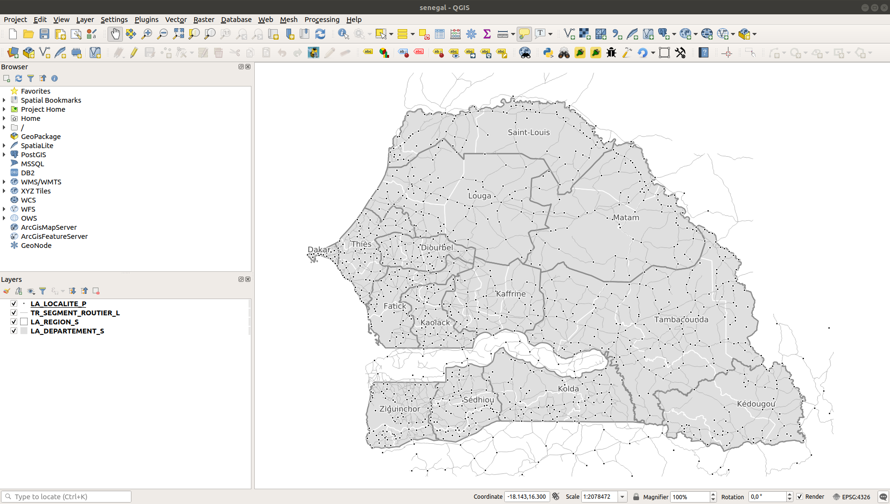

U kunt de volgorde waarin de lagen verschijnen wijzigen door erop te klikken
en het lager of hoger laten vallen.

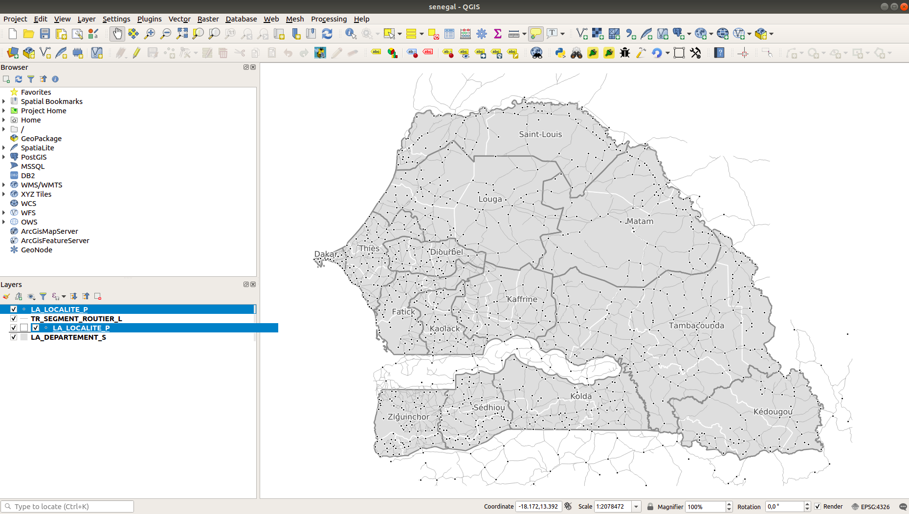

De volgorde van de lagen is belangrijk: QGIS geeft de lagen weer van beneden naar boven: het tekent de laag helemaal onderaan, dan degene er net boven enzovoort. Als u de stedenlaag onderaan de lijst plaatst, wordt deze verborgen door de laag Regio's.

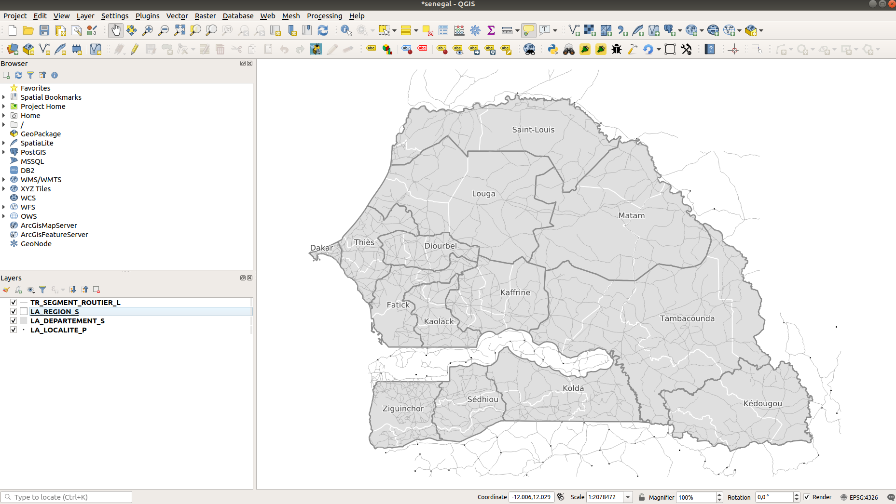

Met de selectievakjes 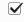 in het paneel "Lagen" kunt u een laag al dan niet weergeven.

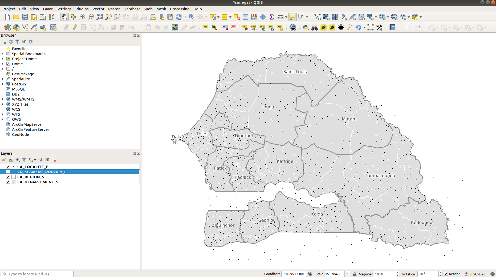

Waarschuwing, het projectbestand dat we hebben geopend, heeft de weergegeven gegevens niet opgeslagen. Het registreert alleen het pad waar deze gegevens zich bevinden. Als we bijvoorbeeld naar de details van de laag LOCALITY_P kijken, kunnen we zien dat het pad naar de gegevens is  <a href="data/LOCALITY_P.gpkg" download>"data/LOCALITY_P.gpkg"</a>.

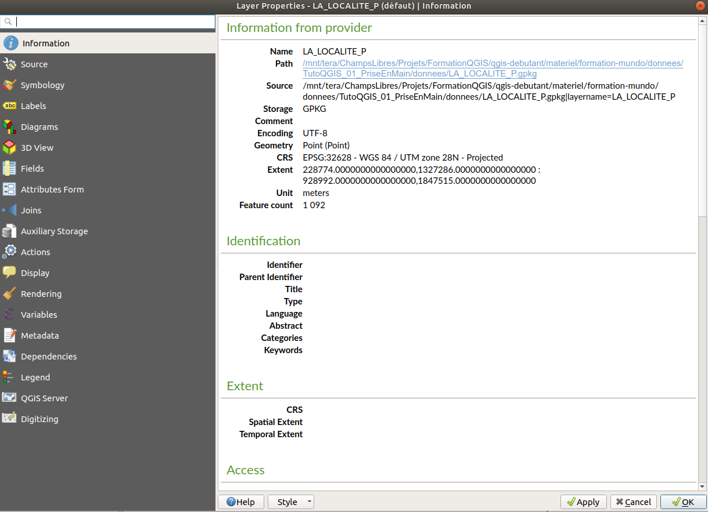

We kunnen deze laag openen in een ander project: download <a href="data/LA_LOCALITE_P.gpk" download>"data/LA_LOCALITE_P.gpk"</a> en sleep het bestand in QGIS.

We hebben een ander project dat deze gegevens weergeeft, maar in een andere stijl!

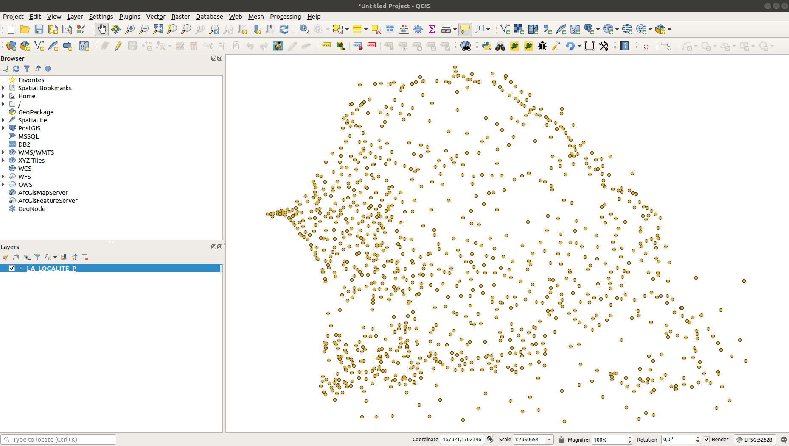

## Oefening: Open een vectorbestand

Allereerst starten we QGIS en kiezen we een leeg project. Wanneer we QGIS starten, biedt de software ons de mogelijkheid om recente projecten te openen. We kunnen ook een nieuw project kiezen door naar "Project" > "Nieuw" te gaan.

We gaan een "shapefile" openen, wat een van de meest voorkomende vectorformaten is.

Klik in het menu "Lagen" op "Laag toevoegen" en vervolgens op "Vectorlaag toevoegen".

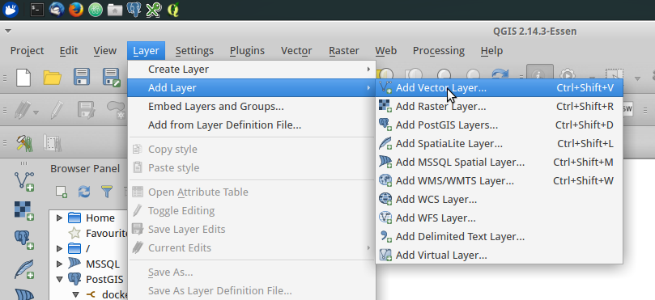

Er verschijnt een venster. Kies de codering (over het algemeen laten we UTF8 standaard staan).

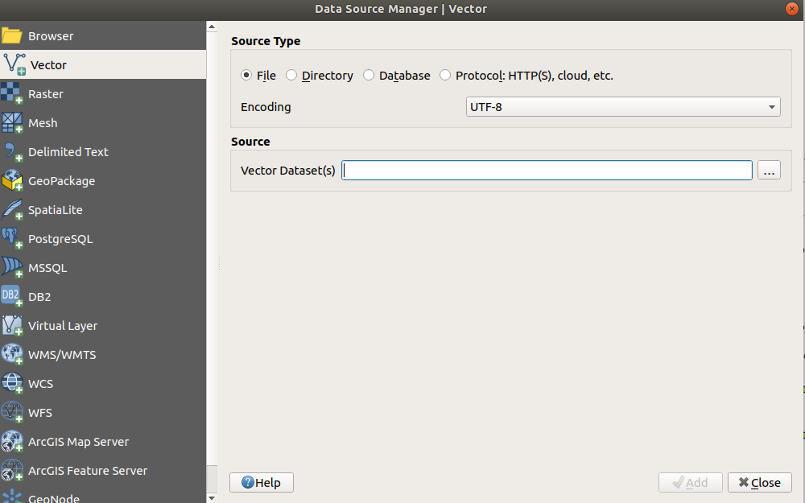

Kies vervolgens de bron. In dit geval moet u het gewenste ".shp"-bestand selecteren. Open voor deze oefening het bestand "donnees/part_1/AD_2_Municipality.shp". Deze gegevens worden gegenereerd door het IGN en zijn vrij toegankelijk op het Belgische federale portaal  <https://www.geo.be/#!/catalog/details/fb1e2993-2020-428c-9188-eb5f75e284b9>

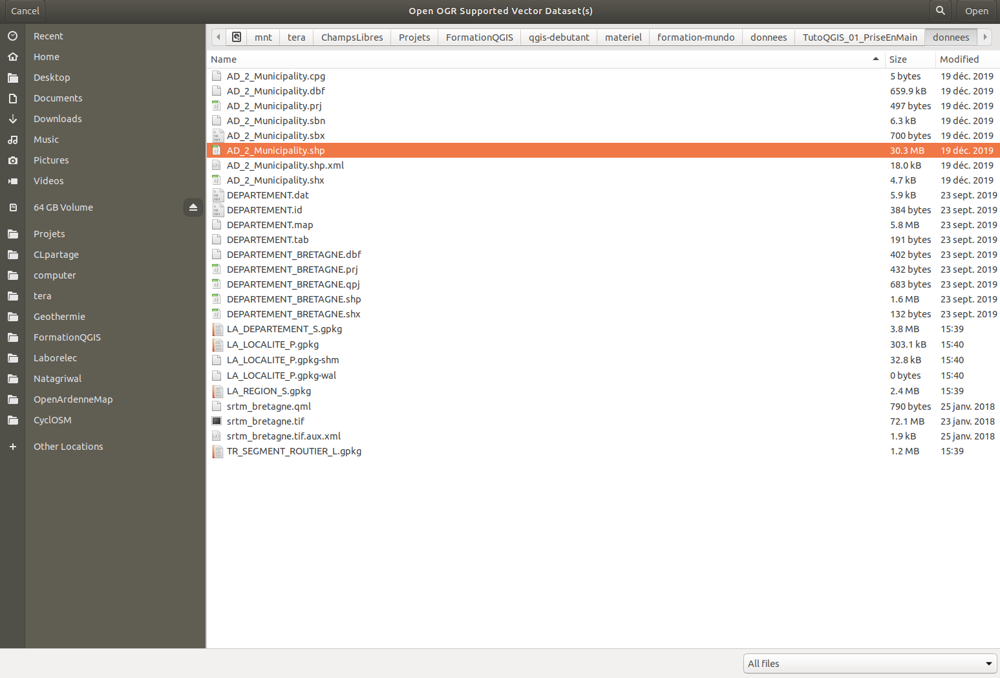

Als alles goed is gegaan, zou de kaart van de gemeenten van België moeten verschijnen.

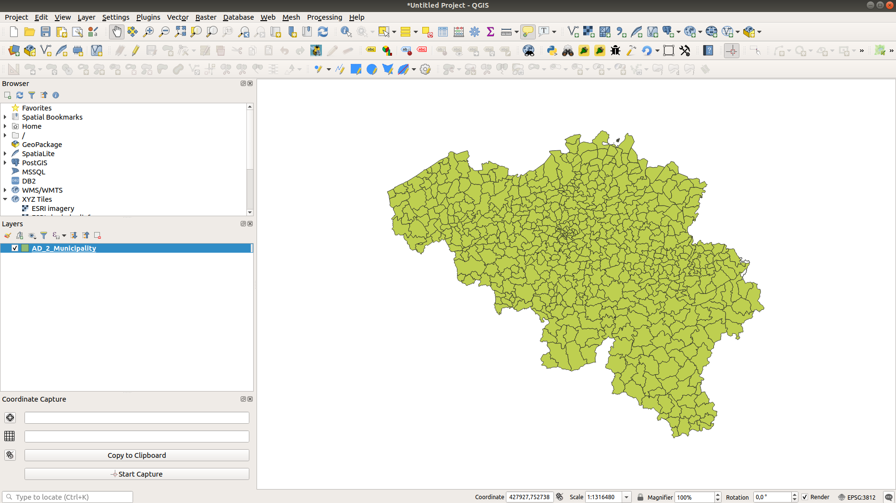

Een alternatieve manier om een vectorlaag te openen is door het pictogram "Een vectorlaag toevoegen" in de werkbalk "Laagbeheer" te gebruiken.

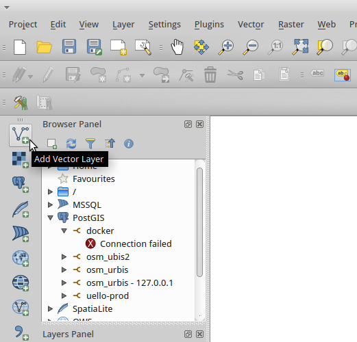

## Coördinaat systemen

Wanneer een eerste laag wordt toegevoegd aan een project van QGIS, neemt het project automatisch het projectiesysteem
van deze laag. Hier, in het geval van de laag gemeenten, is dit het Belgische Lambert 2008 coördinatensysteem (EPSG:3812). U kunt deze informatie in de rechter benedenhoek van het project zien. Klik op deze knop  , je krijgt een venster om het projectiesysteem te veranderen.

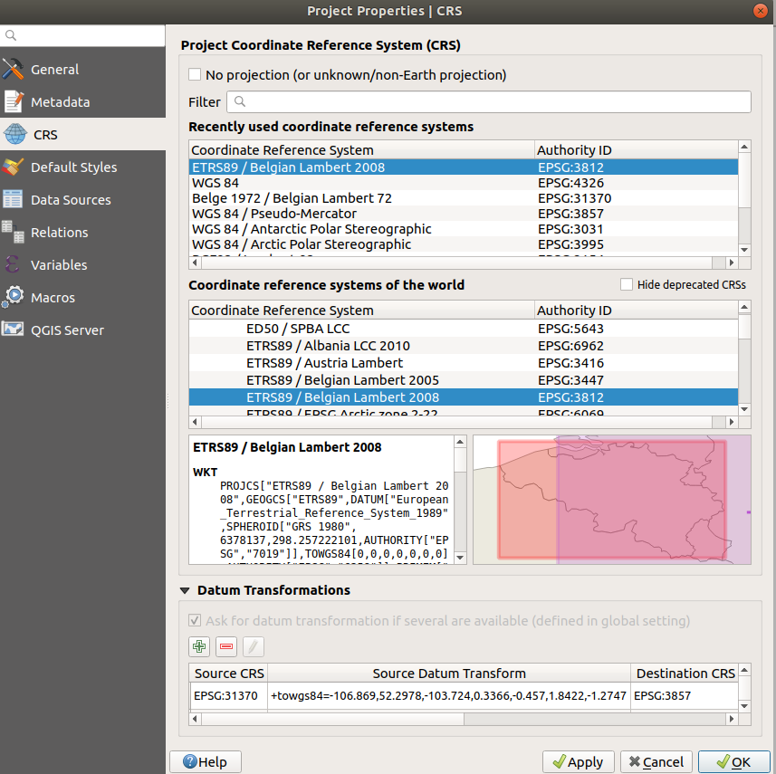

Via dit venster kunt u andere coördinatensystemen testen. De meest gebruikte coördinatenstelsels in GIS zijn:

- WGS 84 (EPSG:4326): projectiesysteem met lengte- en breedtegraad in decimale graden. Soms "GPS-coördinaten" genoemd.
- WGS 84 Pseudo-Mercator (EPSG: 3857): projectiesysteem gebaseerd op de Mercator-projectie, met de meter als eenheid. Vaak in webkaarten gebruikt.
- In België: Belgische Lambert 1972 (EPSG: 31370).
  - *Let op* : Het NGI gebruikt soms Lambert 2008, die Lambert 1972 zou moeten vervangen 

Doe deze test: het toevoegen van de laag Belgische gemeenten in het project <a href="projects/senegal.qgz" download>"projects/senegal.qgz"</a> of in een nieuw leeg project levert niet hetzelfde op.

Voer deze andere test uit: voeg de laag Belgische gemeenten toe aan een nieuw project nadat u het projectiebestand "AD_2_Municipality.prj" uit de map hebt verwijderd. Wat gebeurt er?

## Oefening: Open een WMS

Zoals eerder gezien, zijn WMS-streams webservices. In plaats van alle gegevens te downloaden, hebben we toegang tot de gegevens op basis van de locatie en het zoomniveau. Hier zullen we een WMS-service openen om luchtfoto's van het Waalse Gewest te bekijken, genaamd "orthophotoplans". De adressen van deze WMS-diensten zijn beschikbaar op internet.

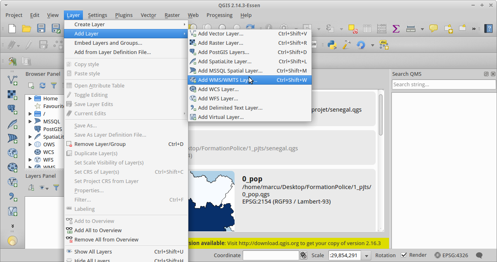

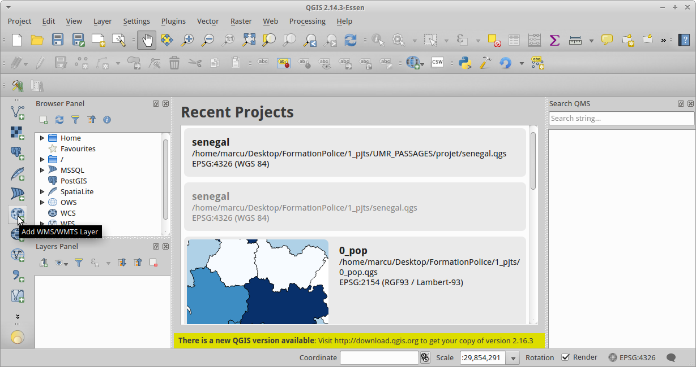

Klik in het venster dat verschijnt op "Laden" om het bestand van de verbinding te laden dat zich in <a href="data/WMS-SPW-ortho2018.xml" download>"data/WMS-SPW-ortho2018.xml"</a> bevindt.

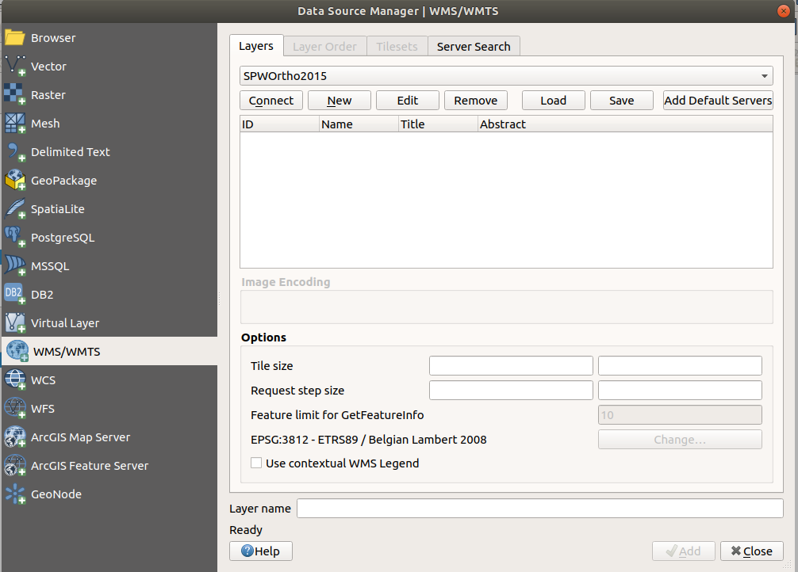

Tijdens het laden verschijnen gegevens in het vervolgkeuzemenu. Klik op "verbinden" om de lagen weer te geven die door de service worden geleverd.

De lagen verschijnen in het witte gebied. Klik op "toevoegen" om de geselecteerde lagen aan het project toe te voegen.

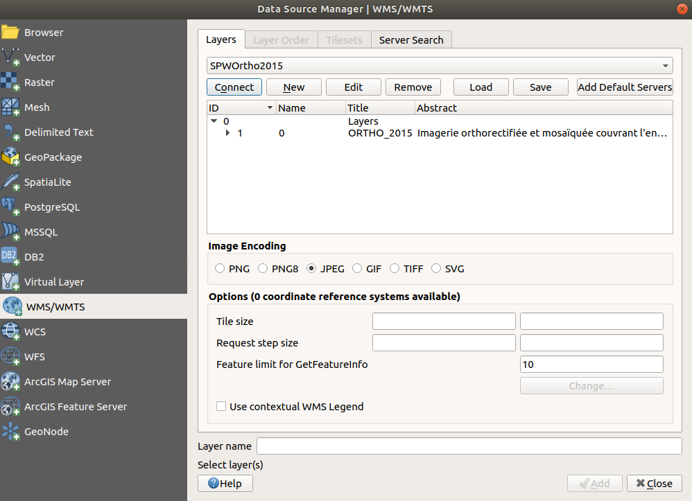

Je zou dit als resultaat moeten krijgen:

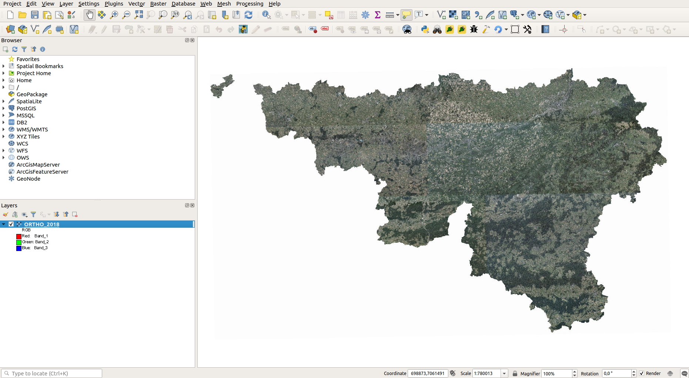

Probeer het nu opnieuw met een url uit Geobrussel:

`https://geoservices-urbis.irisnet.be/geowebcache/service/wmts?layer=urbisNL&request=getcapabilities`

## Oefening: Open een WFS

Zelfde procedure als voor het WMS. Laad het bestand <a href="data/WFS-BrusselsEnvironment.xml" download>"data/WFS-BrusselsEnvironment.xml"</a>.

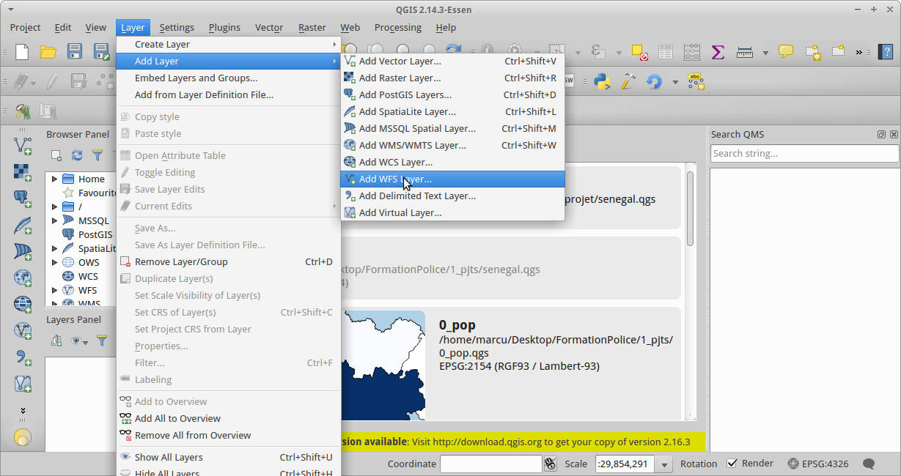

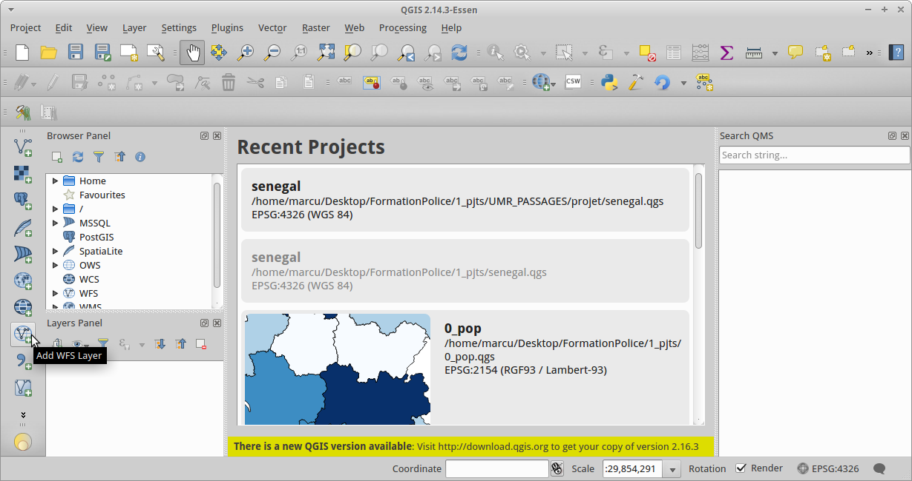

Neem de tijd om de lagen in deze WFS-service te verkennen en let op het verschil met de WMS-service.

## Oefening: Open XYZ-tiles

Het is ook mogelijk om "getegelde" gegevens toe te voegen die beschikbaar zijn op het web.
Een gebruikelijke praktijk is om een OpenStreetMap of een achtergrond van satellietbeelden toe te voegen aan uw projecten van QGIS om uw weg in de ruimte te vinden.

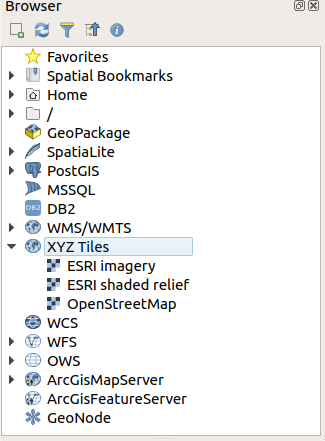

Het adres van de OpenStreetMap-server is:`https://tile.openstreetmap.org/{z}/{x}/{y}.png`

## Oefening: Open de attributen tabel

Open een nieuw QGIS-project. Voeg de vectorlaag "/donnees/part_1/AD_2_Municipality.zip" toe

Klik in het menu "Laag" op "Attributentabel openen".

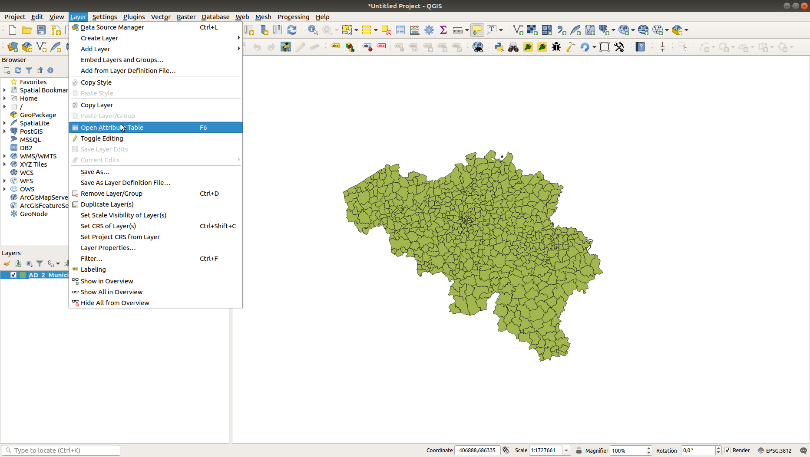

Een andere manier om er toegang toe te krijgen: klik met de rechtermuisknop op de laagnaam in het lagenmenu en
de laagnaam in het lagenmenu en klik op "Open attributentabel".

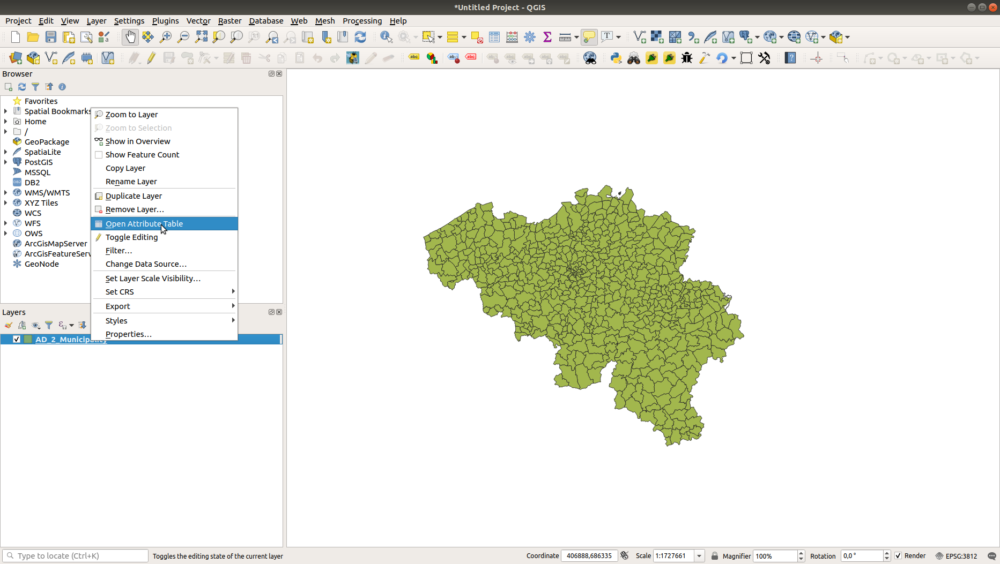

En de tafel verschijnt.

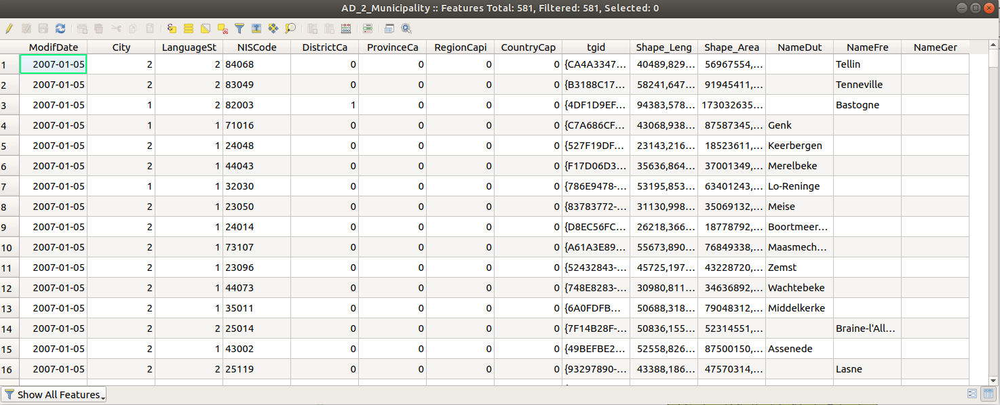

## Oefening: Selecteer elementen met de muis

Klik in het menu op de knop. 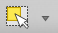

U kunt een of meer elementen op de kaart selecteren. Zij zijn
blauw gemarkeerd in de attributentabel.

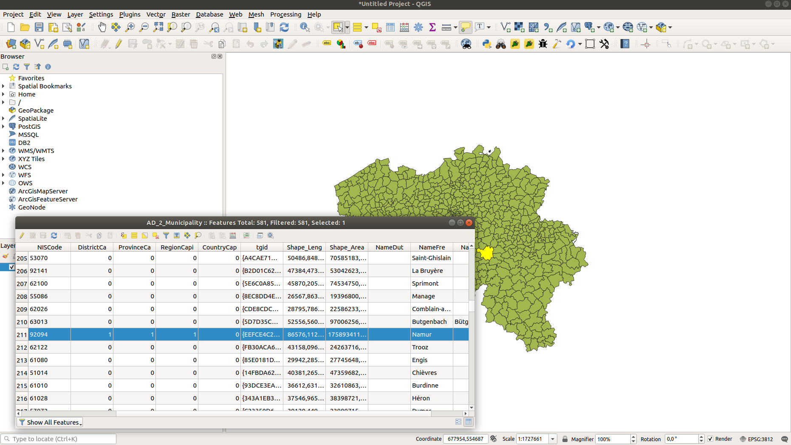

Onderaan het attributentabelvenster staan opties voor
weergaveopties. Test ze!

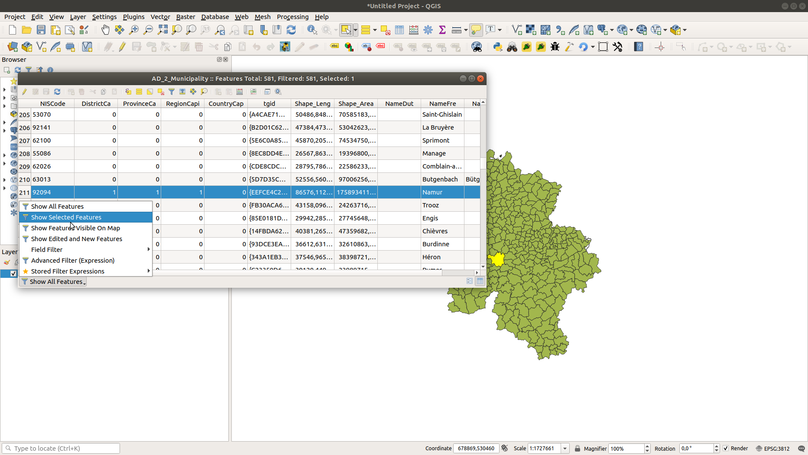

Test de andere selectiemodi door op de pijl naar beneden van de knop te klikken:   

## Extra oefening: kaartlaag bewerken / layouten 

Event Planning: 

- Maak een project “eventplan.qgz” 
  - Voeg Openstreetmap toe als achtergrond (XYZ)
  - Maak 1 polygonen-laag “terrein” en geeft die veld voor de naam (text)
  - Maak 1 lijnen-laag  “evacuatie_route” met veld ID (getal) en naam (text)
    - ⇒ Slaag beide lagen op in 1 geopackage “evacuatie_plan.gpkg”
  - Teken rond de groenplaats in Antwerpen een polygoon (terrein)
    - Maak de kleur rood en maak ook half transparant. 
  - Teken evacuatie route naar het stadhuis en geef die id 1 en een naam
  - Teken evacuatie route naar de meir en geef die id 2 en een naam
    - Gebruik een layout met pijlen.

