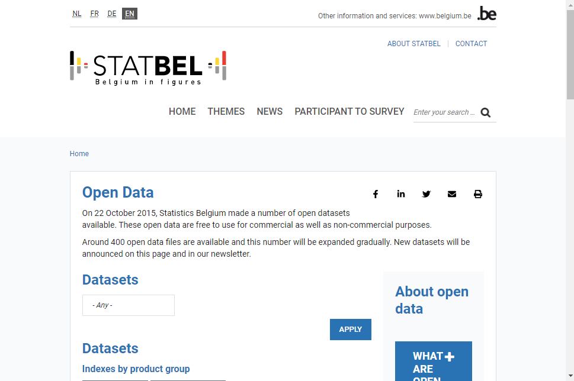

Opendata: Free to use data sources
===================================

Many government agencies provide a opendata-site where you can download their free datasets. 

Some provide services and others file formats. 

## [GEO.be](https://www.geo.be/) (NGI/IGN)

Interesting datasets: 
- All Belgian addresses: [BestAdd](https://www.geo.be/catalog/details/ca0fd5c0-8146-11e9-9012-482ae30f98d9?l=en)
- All administrative divisions of Belgium (community, province, municipality) [Administrative units](https://www.geo.be/catalog/details/63b98ade-71dc-11eb-8bf5-3448ed25ad7c?l=en)
- Postalcode area's: [Postal Districts](https://www.geo.be/catalog/details/9738c7c0-5255-11ea-8895-34e12d0f0423?l=en)
- Statistical divisions of Belgium: [Statistical sectors](https://www.geo.be/catalog/details/d5f503fe-c228-48a6-9f00-927c95bbd450?l=en)
   -  > Used a lot in statistical reporting
- NGI WMTS-basemap: [Cartoweb](https://www.geo.be/catalog/details/0fdbe090-bd35-41b1-8835-823eb769eaee?l=en)
    - > NGI does not provide base vectordata for free. 
- Land Parcels: [Land register plan](https://www.geo.be/catalog/details/65132770-71dc-11eb-b166-3448ed25ad7c?l=en)
  - > ownership info not included

## [Statbel.fgov.be opendata](https://statbel.fgov.be/en/open-data) (Statistics Belgium)

Various statistics of Belgium, like fiscal incomes, population, ...

Mostly flat tables (.csv) or excel-files, usually reported on municipal of statistical sector level.

Using GIS-data from NGI/IGN you can join these tables to make maps with these datasets. 

##  Others

- MIVB: <https://opendata.stib-mivb.be/store/data>
- De lijn: <https://data.delijn.be>
- Infrabel (trains): <https://opendata.infrabel.be>
- Fluvius (energy): <https://opendata.fluvius.be>
- Bosa: <https://data.gov.be>

## Brussels

- Geoportal of the Brussels Capital Region [Geo.brussels](http://Geo.brussels)
- Brussels open data site [datastore.brussels](https://datastore.brussels)
  - > useful to share with external contacts 

## Other regions

- Flanders: 
  - [geopunt.be](https://www.geopunt.be/catalogus)
  - [provincies.incijfers.be](https://provincies.incijfers.be/)
- Walonia:  [geoportail.wallonie.be](https://geoportail.wallonie.be/)

## World

## Openstreetmap

Openstreetmap is a free base map of the world created by hobbyists. QGIS already includes this map under `XYZ-tiles`. This is only the rendered tiles, not the source data.

Retrieving the openstreetmap source data is quite complicated.
The German company geofabrik provides downloads for each country, in the original openstreetmap format (.osm.pbf) and in shapefile format, useful in QGIS if you need basic data from other countries.

The European downloads can be found here:
<https://download.geofabrik.de/europe.html>

## Natural earth

Natural earth contains the basis if you want to make maps on a global scale.
It includes administrative boundaries, larger water bodies, etc.

You can find the download here:
<https://www.naturalearthdata.com/downloads/>

## Exercise

- On the Statbel site <https://statbel.fgov.be/nl/open-data/>
    - Search and download the statistical sectors of Belgium as *shapefile (.shp)*
    - Extract the zip file and add it to qgis.
    - Search "Population by Statistical Sector" and download it as a text file.
    - Add it to qgis using the delimited text tool.
    - Connect both data sources using:
      1) Right-click on the Statistical Sectors layer
      2) Choose "Properties"
      3) Choose "Joins" and then click the plus sign
      4) Connect the sectors on field "CD_SECTOR" Population on field "CD_SECTOR"
      5) Color the polygons of the sectors with the field TOTAL (=number of people) of population
   
