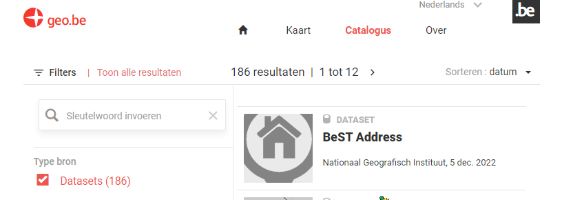
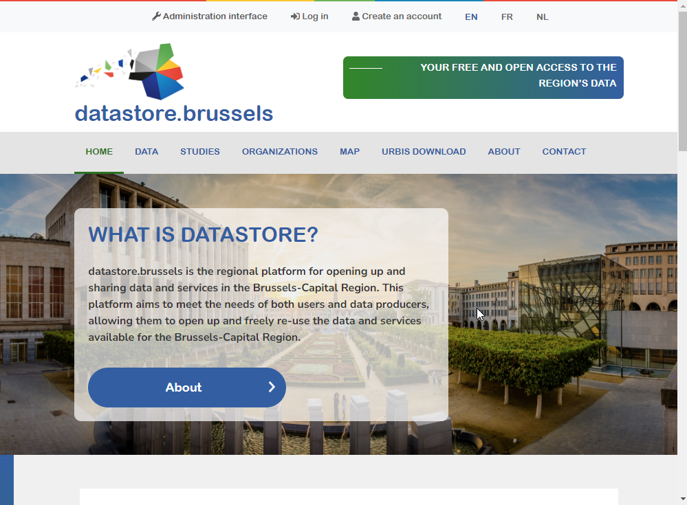
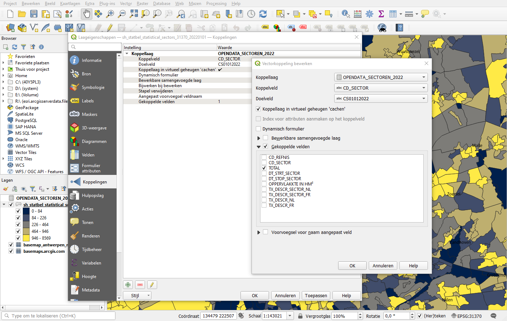

Opendata: Vrij te gebruiken databronnen
=================================

Veel overheidsinstanties bieden een opendata-site aan waar je hun gratis datasets kunt downloaden.

Sommige voorzien services en andere bestanden.

## [GEO.be](https://www.geo.be/) (NGI/IGN)

Interessante datasets:

- Alle Belgische adressen: [BestAdd](https://www.geo.be/catalog/details/ca0fd5c0-8146-11e9-9012-482ae30f98d9?l=en)
- Alle administratieve afdelingen van België (gewest, provincie, gemeente)[Administrative eenheden](https://www.geo.be/catalog/details/63b98ade-71dc-11eb-8bf5-3448ed25ad7c?l=en)
- Postcode gebieden: [Post Districten](https://www.geo.be/catalog/details/9738c7c0-5255-11ea-8895-34e12d0f0423?l=en)
- Statistische afdelingen van België: [Statistische sectoren](https://www.geo.be/catalog/details/d5f503fe-c228-48a6-9f00-927c95bbd450?l=en)
   -  > Veel gebruikt in statistische rapportage
- NGI WMTS-basemap: [Cartoweb](https://www.geo.be/catalog/details/0fdbe090-bd35-41b1-8835-823eb769eaee?l=en)
    - > NGI levert geen gratis basis vectordata.
- Land Parcels: [Land register plan](https://www.geo.be/catalog/details/65132770-71dc-11eb-b166-3448ed25ad7c?l=en)
  - > eigendomsinformatie (legger) niet inbegrepen

## [Statbel.fgov.be opendata](https://statbel.fgov.be/en/open-data) (Statistiek België)

Diverse statistieken van België, zoals fiscale inkomens, bevolking, ...

Meestal platte tabellen (.csv) of excel-bestanden, meestal gerapporteerd op gemeentelijk of statistisch sectorniveau.

Met behulp van GIS-data van NGI/IGN kunt u deze tabellen samenvoegen om kaarten te maken met deze datasets. 

## Andere

- MIVB: <https://opendata.stib-mivb.be/store/data>
- De lijn: <https://data.delijn.be>
- Infrabel (treinen): <https://opendata.infrabel.be>
- Fluvius (Gas en elektriciteit): <https://opendata.fluvius.be>
- Bosa: <https://data.gov.be>

## Brussel

- Geoportaal van het Brussels Gewest [Geo.brussels](http://Geo.brussels)
- Brusselse open data site [datastore.brussels](https://datastore.brussels)
  - > handig om te delen met externe contacten

## Andere regio's

- Vlaanderen:   
  - [geopunt.be](https://www.geopunt.be/catalogus)
  - [provincies.incijfers.be](https://provincies.incijfers.be/)
- Walonië: 
  -  [geoportail.wallonie.be](https://geoportail.wallonie.be/)

## Wereld

## Openstreetmap 

Openstreetmap is een gratis basiskaart van de wereld, gemaakt door hobbyisten. QGIS bevat deze kaart al onder `XYZ-tiles`. Dit zijn alleen de gerenderde tegels, niet de brongegevens.

Het opvragen van de brongegevens openstreetmap is behoorlijk ingewikkeld.
Het Duitse bedrijf geofabrik levert donwloads voor elk land, in de oorspronkelijke openstreetmap-indeling (.osm.pbf) en in shapefile-indeling, handig in QGIS als je basis gegevens van andere landen nodig hebt.

De Europese downloads vind je hier:
<https://download.geofabrik.de/europe.html> 

## Natural earth

Natural earth bevat basis als je kaarten wilt maken op wereldschaal. 
Het bevat onder meer administratieve  grenzen, grotere waterlichamen etc. 

De download vind je hier: 
<https://www.naturalearthdata.com/downloads/>

## Oefening

- Op de site van Statbel <https://statbel.fgov.be/nl/open-data/>
   - Zoek en download de statistische sectoren van België als *shapefile (.shp)*
   - Pak het zipbestand uit en voeg het toe aan qgis.
   - Zoek "Bevolking per statistische sector" en download het als een tekstbestand.
   - Voeg het toe aan qgis met behulp van het hulpmiddel voor gescheiden tekst.
   - Verbind beide gegevensbronnen met behulp van:
     1) klik met de rechtermuisknop op de laag met statistische sectoren
     2) Kies "Eigenschappen"
     3) Kies "Joins" en klik vervolgens op het plusteken
     4) Verbind de sectoren op veld "CD_SECTOR" Bevolking op veld "CD_SECTOR"
     5) Kleur de polygonen van de sectoren in met het veld TOTAL (=aantal mensen) van bevolking
   
