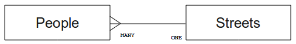
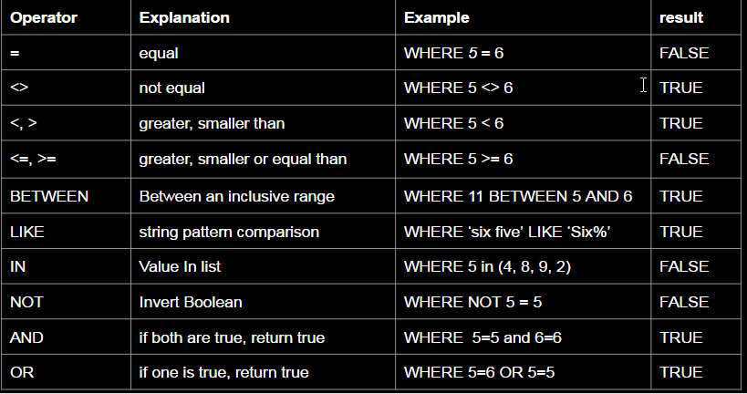

Introduction to relational Databases
=====================================

Intro
-----

Before using a spatial SQL-database, let's make sure of our ground by covering general database theory. You will not need to enter any of the example code; it's only there for illustration purposes.

**The goal for this lesson:** To understand fundamental database concepts.


What is a Database?
-------------------

- A database consists of an organized collection of data.
- A relational database management system (RDBMS) consists of software that operates databases, providing storage, access, security, backup and other facilities, usualy it is manipulated using SQL.
- SQL, the Structured Query Language is a standard language for accessing and manipulating databases.

Typical databases that support storing Geographical data are: posgreSQL (postgis), Oracle and MS SQL-server. These databases run a Server (or multiple) and can serve a lot of users at the same time. 
SQLite (Spatialite) is a single file database, usually used for personal use, simular to like MS Access, but with support spatial operations using the Spatialite extension. 

Tables
------

In relational databases and flat file databases, a table is a set of data elements (values) that is organized using a model of vertical columns (which are identified by their name) and horizontal rows. A table has a specified number of columns, but can have any number of rows. Each row is identified by the values appearing in a particular column subset which has been identified as a candidate key. 

| id | name  | age |
| -- |:-----:| ---:|
| 1  | Tim   | 20  |
| 2  | Horst | 88  |


Columns / Fields
----------------

A column is a set of data values of a particular simple type, one for each row of the table. The columns provide the structure according to which the rows are composed. The term field is often used interchangeably with column, although many consider it more correct to use field (or field value) to refer specifically to the single item that exists at the intersection between one row and one column. 

A column:

| name  |
| ----- |
| Tim   |
| Horst |

A field, a single value: Horst 

Records
-------

A record is the information stored in a table row. Each record will have a field for each of the columns in the table.

| 2 | Horst |  88  <-- one record

Datatypes
---------

Datatypes restrict the kind of information that can be stored in a column. *- Tim and Horst*

There are many kinds of datatypes. Let's focus on the most common:

-   TEXT (=string) - to store free-form text data
-   INTEGER - to store whole numbers
-   REAL (or double) - to store decimal numbers
-   DATE - to store Horst's birthday so no one forgets
-   BOOL - to store simple true/false values

In spatial database the GEOMETRY type is introduced. 


If there is nothing in a field, then the field content is referred to as a **'null' value**:

```
    insert into person (id, age) values (4, 40);

    select * from person;
```
    
Result:

| id | name  | age   |
| -- |:-----:| -----:|
|  1 | Tim   |  20   |
|  2 | Horst |  88   |
|  4 | &lt;null&gt; |  40  |


Modelling an Address Database
-----------------------------

Let's use a simple case study to see how a database is constructed. We want to create an address database.

### Task

    Write down the properties which make up a simple address and which we would want to store in our database.

### Address Structure

The properties that describe an address are the columns. The type of information stored in each column is its datatype. In the next section we will analyse our conceptual address table to see how we can make it better!

Database Theory
---------------

The process of creating a database involves creating a model of the real world; taking real world concepts and representing them in the database as entities.

Normalisation
-------------

One of the main ideas in a database is to avoid data duplication / redundancy. The process of removing redundancy from a database is called Normalisation.

Normalization is a systematic way of ensuring that a database structure is suitable for general-purpose querying and free of certain undesirable characteristics - insertion, update, and deletion anomalies - that could lead to a loss of data integrity. *- Wikipedia*

There are different kinds of normalisation 'forms'.

Let's take a look at a simple example:

 Table "people"

|   Column  |          Type          |      
| --------- | ----------------------:| 
|  id       | INTEGER                |
|  name     |  TEXT                  |
|  address  |  TEXT                  |
|  phone_no |  TEXT                  |


``` 
    select * from people;
```

| id |     name      |           address           |  phone_no   |
| -- |:-------------:| :--------------------------:| -----------:| 
|  1 | Tim Sutton    | 3 Buirski Plein, Swellendam | 071 123 123 |
|  2 | Horst Duester | 4 Plein Street, Capetown    | 072 121 122 |

Imagine you have many friends with the same street name or city. Every time this data is duplicated, it consumes space. Worse still, if a city name changes, you have to do a lot of work to update your database.


### Task

Redesign the theoretical people table above to reduce duplication and to normalise the data structure.
   
You can read more about database normalisation [here](http://en.wikipedia.org/wiki/Database_normalization)

Indexes
-------

A database index is a data structure that improves the speed of data retrieval operations on a database table.  

Imagine you are reading a textbook and looking for the explanation of a concept - and the textbook has no index! You will have to start reading at one cover and work your way through the entire book until you find the information you need. The index at the back of a book helps you to jump quickly to the page with the relevant information.

```
    create index person_name_idx on people (name);
```
    
> Now searches on name will be faster.


Entity Relationship Diagramming
-------------------------------

In a normalised database, you typically have many relations (tables). The entity-relationship diagram (ER Diagram) is used to design the logical dependencies between the relations. Consider our non-normalised people table from earlier in the lesson:

``` 
    select * from people;
``` 
    
|  id |     name     |           address           |  phone_no   |
| --- |:------------:| :--------------------------:| -----------:|
|  1  | Tim Sutton   | 3 Buirski Plein, Swellendam | 071 123 123 |
|  2  | Horst Duster | 4 Plein Street, Capetown    | 072 121 122 |

With a little work we can split it into two tables, removing the need to repeat the street name for individuals who live in the same street:

``` 
    select * from streets;
``` 
    
| id |     name     |
| -- | ------------:|
| 1  | Plein Street |

and:

``` 
    select * from people;
``` 
    
| id |     name     | house_no | street_id |  phone_no   |
| -- |:------------:|:--------:|:---------:| -----------:| 
|  1 | Horst Duster |        4 |         1 | 072 121 122 |

We can then link the two tables using the 'keys' streets.id and people.streets\_id.

If we draw an Database Diagram for these two tables it would look something like this:


<!--[gimmick:yuml]( [people]many -.->[streets] )-->

The Database Diagram helps us to express 'one to many' relationships. In this case the arrow symbol show that one street can have many people living on it.

### Task

Our people model still has some normalisation issues - try to see if you can normalise it further

Constraints, Primary Keys and Foreign Keys
------------------------------------------

A database constraint is used to ensure that data in a relation matches the modeller's view of how that data should be stored. For example a constraint on your postal code could ensure that the number falls between 1000 and 9999.

A Primary key is one or more field values that make a record unique. Usually the primary key is called id and is a sequence.

A Foreign key is used to refer to a unique record on another table (using that other table's primary key).

If we look at our people example, the table definition shows that the street column is a foreign key that references the primary key on the streets table. In a real database you would put a constraint on the people table that says that value in the street_id column always has a counterpart in the streets table.

Selection Query
-------

A selection query in SQL usually has 3 basic parts:

- **Select** --> what you want to select, a list of colums, or calculated value composed on a column or just \* if you want all columns.
- **From** --> the table(s) you want to select from
- **Where** --> filter you results based on the clause given, see next chapter.

``` 
SELECT name, (age * 365 ) as AGE_IN_DAYS
FROM people
WHERE AGE_IN_DAYS > 730
```

Where Clause
-----------

Often you won't want to see every single record in the database - especially if
there are thousands of records and you are only interested in seeing one or
two.

Here is an example of a numerical filter which only returns objects whose `house_no` is less than 5::

``` 
  select name, house_no 
  from people 
  where house_no < 5;
``` 
  
|  name         | house_no    |
| ------------- | -----------:| 
|  Tim Sutton   |  3          |
|  Horst Duster |  4          |

You can also filter based on text data:

``` 
  select name, house_no from people 
  where name LIKE '%Tim%';
``` 
    
|  name         | house_no    |
| ------------- | -----------:| 
|  Tim Sutton   |  3          |


Here we used the `LIKE` clause to find all names with an `Tim` in them.

Some typically used clauses are:



Table JOINS
------------

What if you want to see the person's details and their street's name instead of
the ID? In order to do that, you need to join the two tables together in a single
query. Lets look at an example:

``` 
  select people.name, people.house_no, streets.name
  from people,streets
  where people.street_id=streets.id;
``` 
  
Here is what the correct output will look like::

|  people.name | people.house_no | streets.name  |
| ------------ |:---------------:| -------------:| 
| Tim Sutton   |  3              | Buirski Plein |
| Horst Duster |  4              | Plein Street  | 

**Warning:** With joins,you always need to specify which two keys must match (foreign key & primary key). 
If you don't specify that, you will get a list of all possible combinations of people and streets!

Learn more
----

A more complete SQL tutorial: http://www.w3schools.com/sql/sql_intro.asp