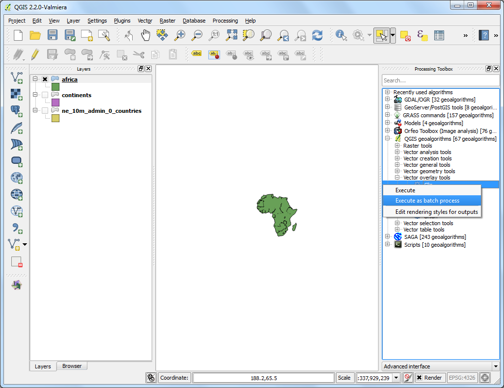
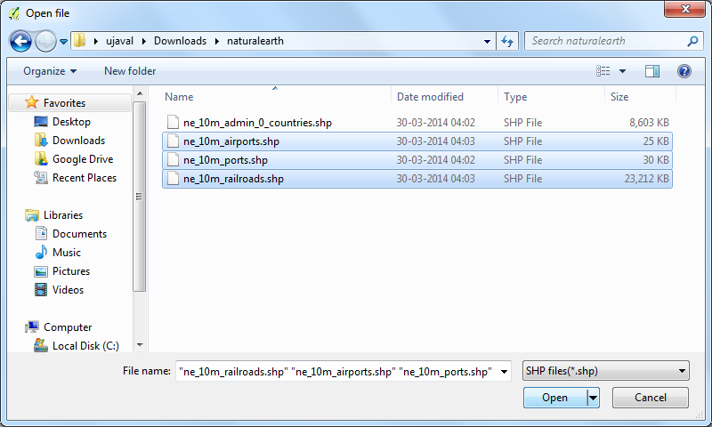
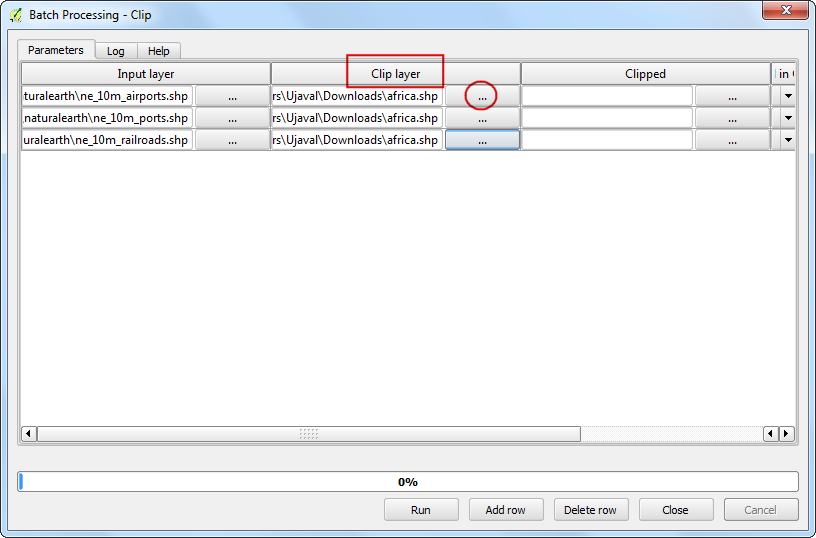
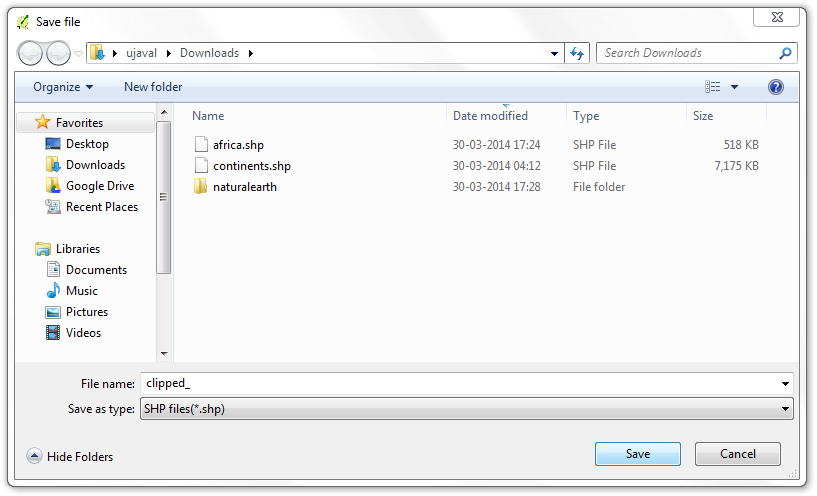
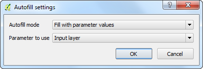
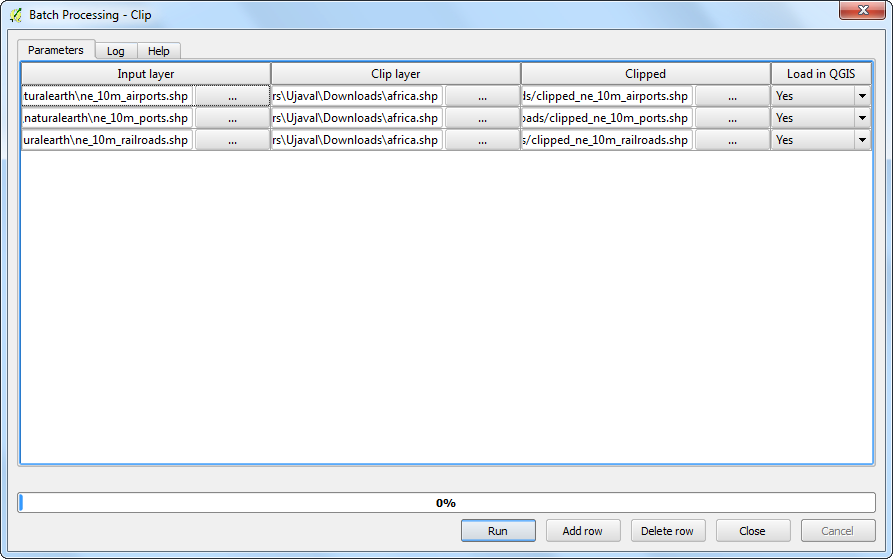

Batch Processing using Processing Framework
===========================================

Intro
----

All algorithms (including models) can be executed as a batch process. That is, they can be executed using not just a single set of inputs, but several of them, executing the algorithm as many times as needed. This is useful when processing large amounts of data, since it is not necessary to launch the algorithm many times from the toolbox.
 
**Goal of this task:** We will take several global vector layers and clip them to the extent of Africa in a single batch command. We will dissolve (merge) polygons from a layer that have the same attribute.

Get the data
------------

[Natural Earth](http://naturalearthdata.com) has several global vector layers. Download the following layers

-   [Admin 0 - Countries](http://www.naturalearthdata.com/http//www.naturalearthdata.com/download/10m/cultural/ne_10m_admin_0_countries.zip)
-   [Railroads](http://www.naturalearthdata.com/http//www.naturalearthdata.com/download/10m/cultural/ne_10m_railroads.zip)
-   [Ports](http://www.naturalearthdata.com/http//www.naturalearthdata.com/download/10m/cultural/ne_10m_ports.zip)
-   [Airports](http://www.naturalearthdata.com/http//www.naturalearthdata.com/download/10m/cultural/ne_10m_airports.zip)

Once downloaded, unzip and extract all the shapefiles in a single
folder.

Procedure
---------

-  Go to Layer --&gt; Add Vector Layer.

2.  Browse to the downloaded Admin 0 Countries shapefile
    `ne_10m_admin_0_countries.shp` and click Open.

3.  As our task is to clip the global layers to the boundary of Africa,
    we need to first prepare a layer containg a polygon for the
    entire continent. The countries layer has an attribute called
    **CONTINENT**. We can use a geoprocessing concept called *Dissolve*
    to merge all countries that have the same continent value and merge
    them to a single polygon.

4.  Open the Dissolve tool from Vector --&gt; Geoprocessing Tools
    --&gt; Dissolve.

5.  Select `ne_10m_admin_0_countries` as the Input vector layer. The
    Dissolve field would be `CONTINENT`. Name the output file as
    `continents.shp` and check the box next to Add result to convas.

alert: If you want to merge **ALL** polygons regardless of their attributes,
you can select -- Dissolve All -- as the Dissolve field. This will
combine all polygons in the layer and give you a single aggregate
polygon.

6.  The dissolve processing may take a while. Once the process finishes,
    you will see the new `continent` layer added to QGIS. Use the Select
    Single Feature tool from the toolbar and click on Africa to select
    the polygon representing the continent.

7.  Right-click the `continents` layer and select Save Selection As....

8.  Name the output file as `africa.shp`. Since we are only interested
    in the shape of the continent and not any attributes, you may check
    the Skip attribute creation. Make sure the Add saved file to map box
    is checked and click OK.

9.  Now you will have the `africa` layer loaded in QGIS containing a
    single polygon for the entire continent. Now, it's time to start our
    batch clip process. Open Processing --&gt; Toolbox.

10. Browse all available algorithms and find the Clip tool from QGIS
    geoalgorithms --&gt; Vector overlay tools --&gt; Clip. You may also
    use the Search box to easily find the algorithm as well.

1- Right-click the Clip algorithm and select Execure as batch process.

12. In the Batch Processing dialog, the first tab is Parameters where we
    define out inputs. Click the ... next to the first row in the Input
    layer column.

13. Browse to the directory containing the global transportation layers
    that you had downloaded. Hold the Ctrl key and select all the layers
    that you want to clip. You may also use Shift or Ctrl-A to make
    multiple selection. Click Open.

14. You will notice that the Input layer columns will be auto-populated
    with all layers you had selected. You may use Add row button to add
    more rows and define more inputs. Next, we need to select the layer
    containing the boundary to clip our input layers. Click the ...
    button for the first row and add the `africa.shp` Clip layer. Since
    the clip layer is the same for all our inputs, you can double-click
    the column header Clip layer and the same layer will be auto-filled
    for all the rows. Next, we need to define our outputs. Click the ...
    buton next to the first row in the Clipped column.

15. Browse the the directory where you want your output layers. Type the
    filename as `clipped_` and click Save.

16. You will see a new Autofill settings dialog pop up. Select Fill with
    parameter values as the Autofill mode. Select Parameter to use as
    Input layer. This setting will add the input file name to the output
    along with the specified `output_` filename. This is important to
    ensure all the output files have unique names and they do not
    overwrite each other.

17. Now we are ready to start the batch procesing. Click Run.

18. The clip algorithm will run for each of the inputs and create output
    files are we have specified. Once the batch process finishes, you
    will see the layers added to QGIS canvas. As you will notice, all
    the global layers are properly clipped to the continent boundary
    that we had specified.

