Creating Heatmaps
=================

Intro
-----

Heatmaps are one of the best visualization tools for dense point data. Heatmaps are used to easily identify find clusters where there is a high concentration of activity. They are also useful for doing cluster analysis or hotspot analysis.

**Goal of the task:** We will work with a dataset of crime locations in Surrey, UK for the year 2011 and find crime hotspots in the county.

Get the data
------------

[data.police.uk](https://data.police.uk) provides street-level crime, outcome, and stop and search data in simple CSV format.

Download the data for [Surrey Police](https://data.police.uk/data/) and unzip the downloaded archive to extract the CSV file.

For convenience, you may directly download a copy of the dataset from the link below:

[2015-08-surrey-street.csv](http://www.qgistutorials.com/downloads/2015-08-surrey-street.csv)

Procedure
---------

- To start, we will import the CSV file into QGIS. (see importing\_spreadsheets\_csv. for more details). Click Layer --&gt; Add Delimited Text Layer.

- Browse to the `2015-08-surrey-street.csv` file on your computer and open it. (Your filename maybe different if you downloaded a fresh copy of the dataset). Select CSV (comma separated values) as the file format. You will see the `Longitude` and `Latitude` columns automatically selected as X and Y fields. Make sure you check the Use spatial index option as that will speed up your operations on this layer. Click OK.

- You may see some errors. You can ignore those for the purpose of this tutorials. Click Close.

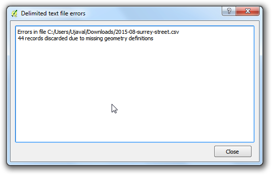

- As the data layer is loaded in QGIS, you will see a warning dialog CRS was undefined: defaulting to CRS EPSG:4326 - WGS84. The CSV importer assumes the CRS EPSG:4326 if your coordinates are in Latitude/Longitude. If your X and Y coordinates were in a projected CRS, you will get a dialog prompting you to choose the CRS. As our data is in EPSG:4326, you can ignore the warning.

If you need to change the automatically assigned CRS, you can use Vector --&gt; Data Management Tols --&gt; Define Current
Projection....

- Zoom-in a bit closer to get a better look at the data. You will notice that the data is quite dense and it is hard to get an idea of where there is a high concentration of points. This is where a heatmap will come in handy.

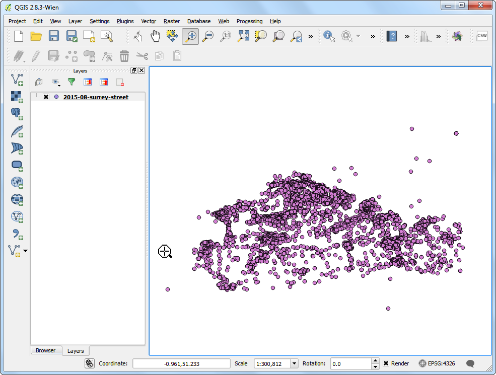

- If you need to create a heatmap for purely visual purpose or for printing -QGIS has a built-in symbology renderer called Heatmap. Let's try that first. Right-click on the layer `2015-08-surrey-street` and select Properties.

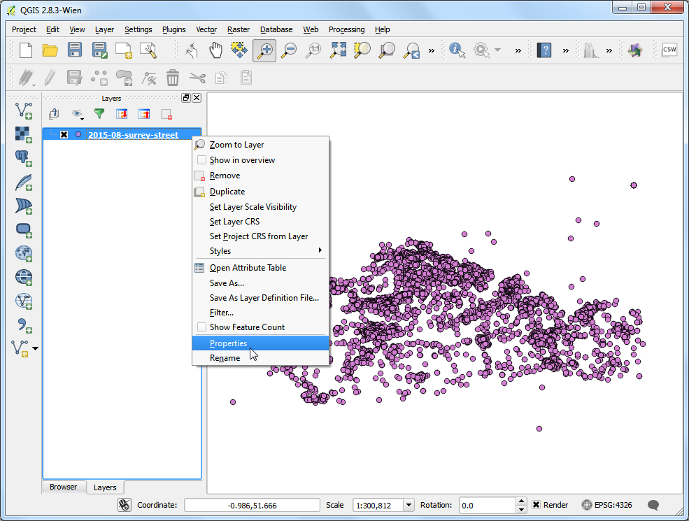

- In the Properties dialog, switch to the Style tab. Select Heatmap as the renderer. You have a lot of choice of color-ramps for the heatmap. Choose the `Oranges` color-ramp. Leave the other parameters to default and click OK.

- You will see a nice heatmap of your data and pockets of *heat* where there is a high concentration of crime. There are quite a few options available in the heatmap renderer to create the most appropriate visualization for your dataset. If you just wanted to create a heatmap for print or visual inspection - you are done! But we will explore another more powerful heatmap creation option where you can use the results in your analysis also.

- Enable a core plugin named `Heatmap`. See using\_plugins to know how to enable built-in plugins. Once you have enabled the plugin, go to Raster --&gt; Heatmap --&gt; Heatmap.

- In the Heatmap Plugin dialog, choose `crime_heatmap` as the name out the Output raster. Enter 1000 meters as the Radius. Radius is the area around each point that will be used to calculate the i\`heat\` a pixel received. Check the Advanced so we can specify the output size of our heatmap. Enter `2000` as Rows value. The Columns value will update automatically. Click OK to start the heatmap creation process.

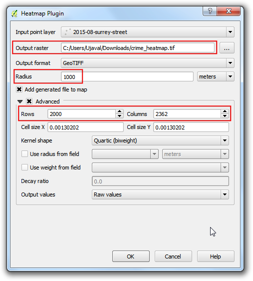

- Once the processing is finished, you will see a grayscale layer called `crime_heatmap` loaded into the canvas. Uncheck the `2015-08-surrey-street` layer.

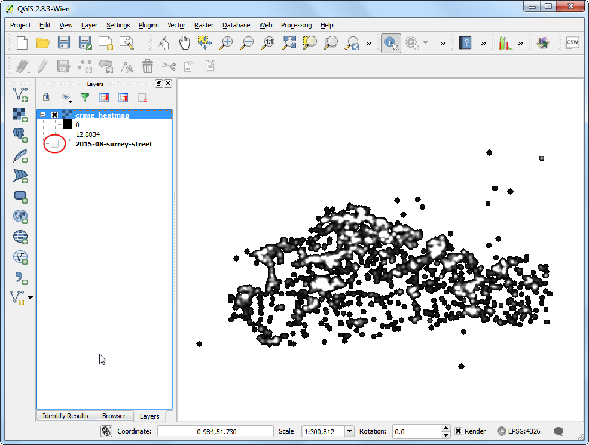

- Let's make our heatmap look more like the traditional heatmap similar to the earlier visualization. Right-click on the heatmap layer and click Properties.

- In the Style tab, select Singleband pseudocolor as the Render type. Next, under the section Load min/max values, select the Estimate (faster) as the Accuracy and click Load. This will scan the heatmap and find the minimum and maximum pixel values. These values will be used to generate an appropriate color ramp. In the section Generate new color map, select YlOrRd (Yellow-Orange-Red) as the color ramp, and click Classify. Click OK.

- Now you will see a more appealing heatmap-like rendering of the layer. You can select the Identify tool and click on any pixel of the heatmap. You will see the pixel value in the resulting pop-up. This pixel-value is a measure of how many points from the source layer are contained within the specified radius ( in our case - 1000m) around the pixel.

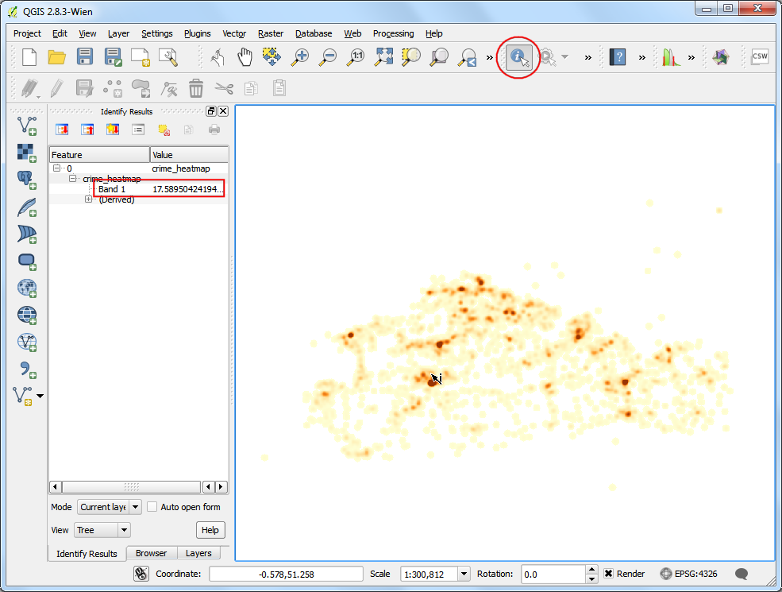

- Now you have your heatmap layer that can be saved for future use. Many times, you want to identify the hotspots where there is high-concentration of points. We will now try to identify such hotspots using this heatmap. Go to Raster --&gt; Raster Calculator.

- You will have to decide on a threshold value first. All pixel values above that threshold will be considered to be in a cluster. Let's use a value of `10` for this data. In Raster calculator dialog, name the output layer as `crime_hotspots_vector`. Double-click on `crime_heatmap@1` under the Raster bands section and it will be added to the Raster calculator expression textarea. Complete the expression as shown below. Check the box next to Add result to project and OK.

    "crime_heatmap@1" > 10

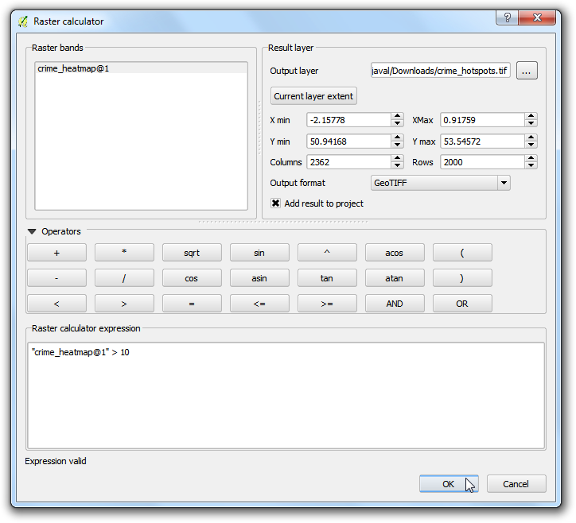

- A new layer called `crime_hotspots` will be added to QGIS. This layer has pixels with values of either 0 or 1. All pixels in the input layer where the pixel value was larger than `10` now have a value of 1 and all remianing pixels are 0. Click on Raster --&gt; Conversion --&gt;
    Polygonize (Raster to Vector).

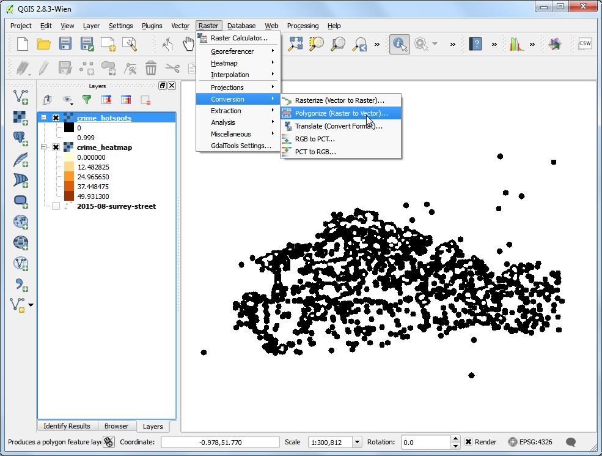

- Name the output file as `crime_hotspots_vector`. Check the box next to Field name as well as Load into canvas when
    finished. Click OK.

- Once the conversion finishes, you will have yet another layer named `crime_hotspots_vector` added to QGIS. This is the vector representation of the clusters that were created in the previous step. The layers contain clusters with both 0 and 1 values. Let's filter out the 0 values, so we get the clusters of hotspots. Right-click on the layer and select Open Attribute Table.

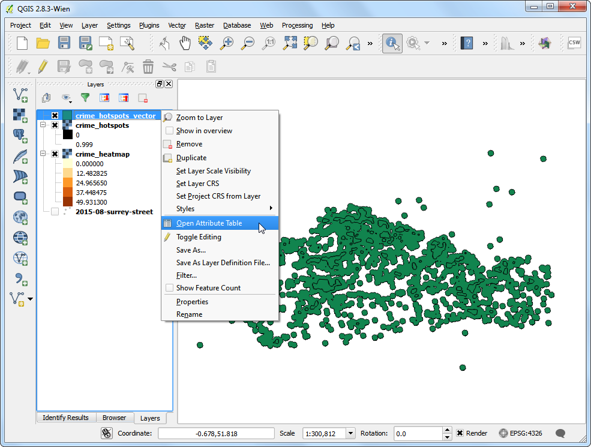

- In the Attribute table, click on Select feature
    using an expression.

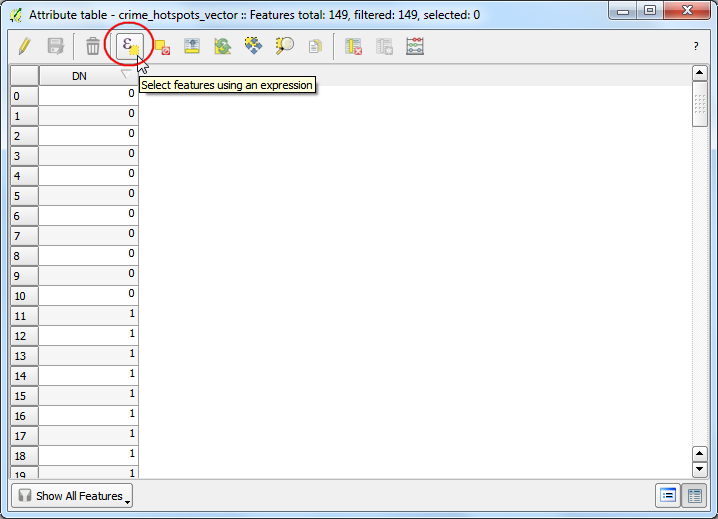

- Enter the expression as shown below and click Select. Next, click on Close.

    "DN" = 0

- In the main attribute table window, you will see some features highlighted. These are the features that matched our query. Click the Toggle
    editing mode button in the toolbar and then click the Delete
    selected features (DEL) button.

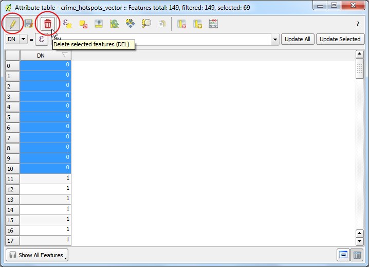

- Once the selected features are deleted, click the Save Edits button and then Toggle editing mode again to put the layer in read-only mode. Close the attribute table window.

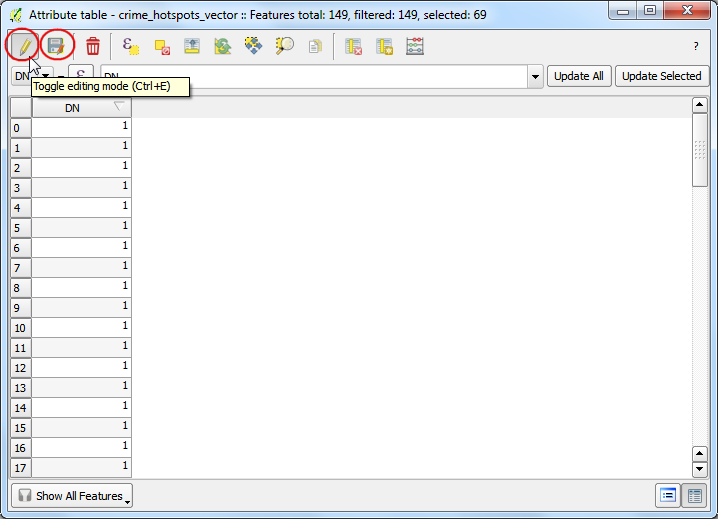

- In the main QGIS window, un-check the `crime_hotspots` layer. The final layer `crime_hotspots_vector` contains the cluster extracted from the heatmap. These clusters are the *intelligence* gathered from the raw data and can provide useful insights as well as serve as an input for further action.

