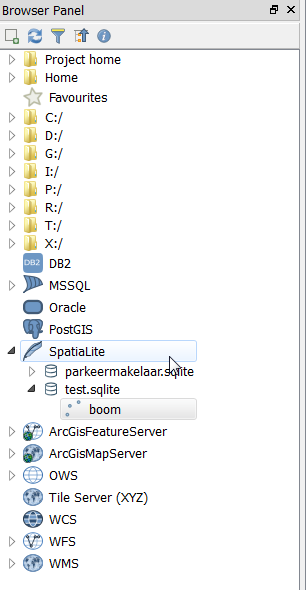
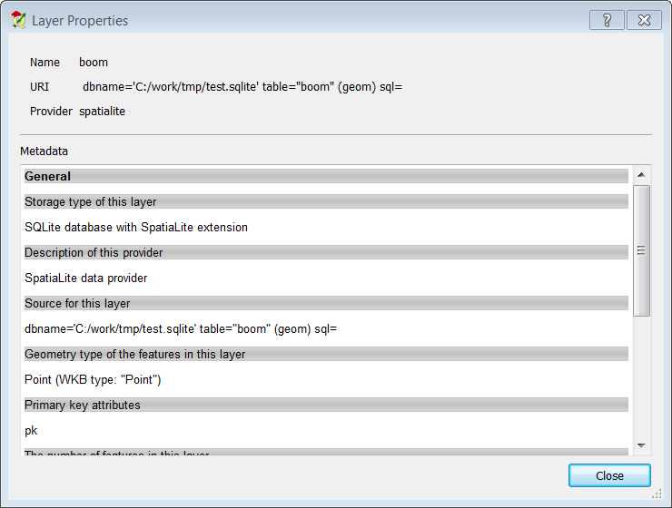

Working with Databases in the QGIS Browser
============================================

**The goal for this lesson:** To learn how to interact with spatial databases using the QGIS Browser interface.

Intro
----

In the previous module we looked at the basic concepts, features and functions of relational databases as well as extensions that let us store, manage, query and manipulate spatial data in a relational database. This section will dive deeper into how to effectively use spatial databases in QGIS.

Adding Database Tables to QGIS using the Browser
---------------------------------------------- 

We have already briefly looked at how to add tables from a database as QGIS layers, now lets look at this in a bit more detail and look at the different ways this can be done in QGIS. Lets start by looking at the new Browser interface.

-   Start a new empty map in QGIS.
-   Open the Browser by clicking the Browser tab at the bottom of the *Layer Panel*
-   Open the Spatialite portion of the tree and you should find your previously configured connection available (you may need to click the Refresh button at the top of the browser window).

-   Double clicking on any of the table/layers listed here will add it to the Map Canvas.
-   In case of Spatialite you can create a new database by right clicking on Spatialite entry and choosing  *Create Database*.
-   You can copy layers into a database by dragging and dropping them from one source to the other.
-   Right Clicking on a table/layer in this view will give you a few options. Click on the Properties item to look at the properties of the layer.

Of course you can also use this interface to connect to databases hosted on a server external to your workstation. Right clicking on the entry in the tree will allow you to specify connection paramaters for a new connection.

### Task

- Create a new Spatialite database and name it "antwerp"
- Add this ArcGIS Feature Service to the brower, use button on the toolbar or the menu: http://geodata.antwerpen.be/arcgissql/rest/services/P_Publiek/OpenDataAntwerpen/MapServer
- Copy the BBQ layer to the "antwerp" database
- Add BBQ to the map.
- Do the same for "bioscoop_detail"

