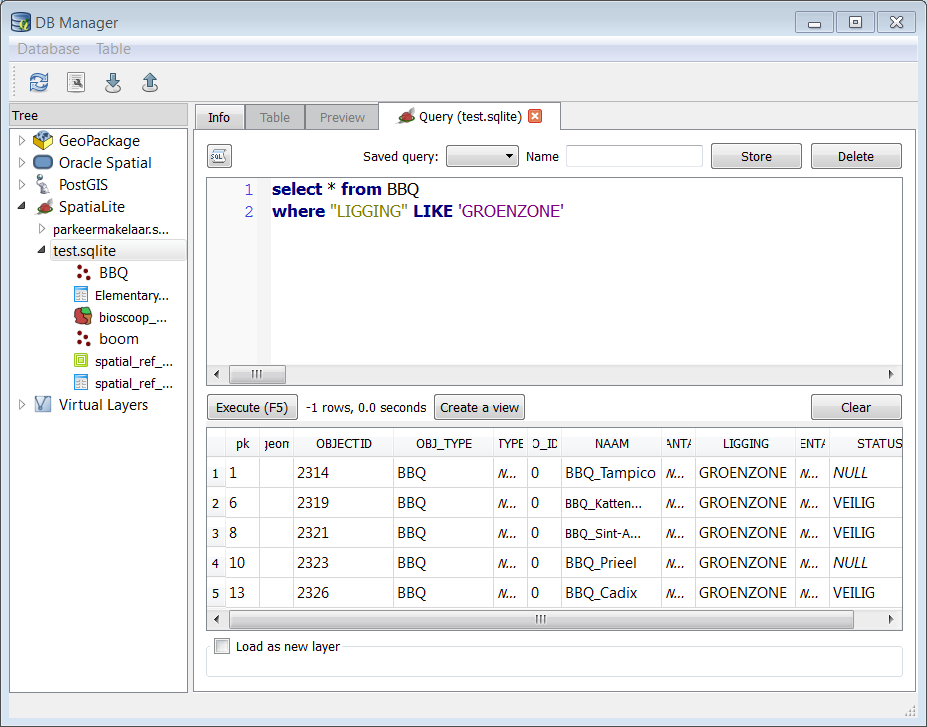

Using DB Manager to work with Spatial Databases in QGIS
========================================================

**The goal for this lesson:** To learn how to interact with spatial databases using the QGIS DB Manager.

Managing Databases with DB Manager
----------------------------------

You should first open the DB Manager interface by selecting Database --&gt; DB Manager --&gt; DB Manager on the menu or by selecting the DB Manager icon on the toolbar: `Database > DB Manager`

You should see the supported databases the previous connections you have configured.

DB Manager can be used to manage the tables within your database. 

First, its useful to just look at a table's metadata by clicking on its name in tree and looking in the Info tab.

In this panel you can see the General Info about the table as well the information that the PostGIS extension maintains about the geometry and spatial reference system.

If you scroll down in the Info tab, you can see more information about the Fields, Constraints and Triggers for the table you are viewing.

Its also very useful to use DB Manager to simply look at the records in the database in much the same way you might do this by viewing the attribute table of a layer in the Layer Tree. You can browse the data by selecting the Table tab.

There is also a Preview tab which will show you the layer data in a map preview.

Right-clicking on a layer in the tree and clicking **Add to Canvas** will add this layer to your map.

So far we have only been viewing the database its schemas and tables and their metadata, but what if we wanted to alter the table to add an additional column perhaps? DB Manager allows you to do this directly.

-   Select the table you want to edit in the tree
-   Select Table --&gt; Edit Table from the menu to open the Table Properties dialog.

You can use this dialog to Add Columns, Add geometry columns, edit existing columns or to remove a column completely. In Spatialite you are not allowed to remove or change a row once it has been created so *Edit Column* and *Delete column* are grayed out. 

Using the Constraints tab, you can manage constraints line primary-foreign key relations, but this not implemented for Spatialite. The Indexes tab can be used to add and delete indexes on fields.

Creating a New Table
--------------------

The database mamager providers a GUI to create tables. 

###Task

Let's use DB Manager to create a new table.

-   If it is not already open, open the DB Manager window, and expand the tree until you see the list of tables already in your databse.
-   From the menu select Table --&gt; Create Table to bring up the Create Table dialog.
-   Add the id, place\_name, and elevation fields as shown below
-   Make sure the id field is set as the primary key.
-   Click the checkbox to Create geometry column and make sure it is set to a POINT type and leave it named geom and specify 4326 as the SRID.
-   Click the checkbox to Create spatial index and click Create to create the table.

-   Dismiss the dialog letting you know that the table was created and click Close to close the Create Table Dialog.

You can now inspect your table in the DB Manager and you will of course find that there is no data in it. From here you can Toggle Editing on the layer menu and begin to add places to your table.

Importing and exporting Data into/from a Database with DB Manager
----------------------------------------------

Import:

-   Click the Import layer/file button on the toolbar in the DB Manager dialog. 
-   you can select a layer form the map or browse to a location on your drive. 
-   Click the Update Options button to pre-fill some of the form values.
-   You can reproject you data by selecting a different source SRID and target SRID.
-   Enable the checkbox to Create Spatial Index
-   Click OK to perform the import.

Export:

Of course DB Manager can also be used to export data from your spatial databases, so lets take a look at how that is done. Select a layer in the Tree and click the Export to File button on the toolbar to open the Export to vector file dialog.

Executing SQL Queries with DB Manager
--------------------------------------

DB Manager also provides a way for you to write SQL queries against your database tables and to view the results. 

### Task

-   Select the BBQ table in the tree.
-   Select the SQL window button in the DB Manager toolbar.

-   Compose the following SQL query in the space provided:

    select * from BBQ
    where "LIGGING" LIKE 'GROENZONE'

-   Click the Execute (F5) button to run the query.
-   You should now see the records that match in the Result panel.

-   Click the checkbox for **Load as new layer** to add the results to your map.
-   You can Select the OBJECTID column as the Column with unique integer values and the geom column as the Geometry column.
-   Enter Good\_bbq as the Layer name (prefix).
-   Click Load now! to load the results as a new layer into your map.

The layers that matched your query are now displayed on your map. You can of course use this query tool to execute any arbitrary SQL command including many of the ones we looked at in previous modules and sections.

### Extra Task

Lets try a spatial Query now.

First download the VELO-stations from Antwerp and copy the into your database, make sure that output CRS is Lambert Belge, SRID=31370: http://geodata.antwerpen.be/arcgissql/rest/services/P_Publiek/OpenDataAntwerpen/MapServer

Then write a query that searches the velo station within 0.5 km of the city hall of Antwerp, which lies in Belge Lambert coordinates at (152119 , 212356 )

