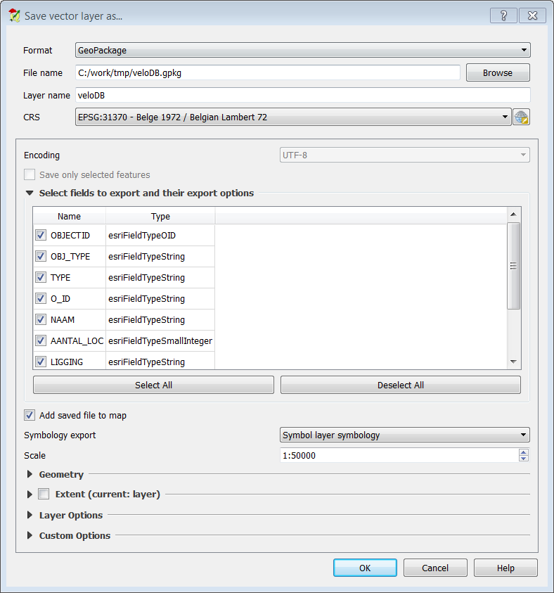
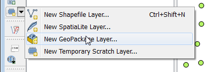
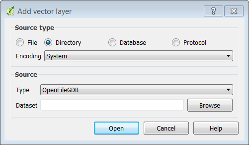
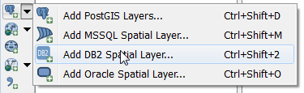
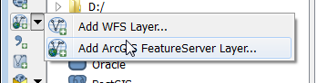
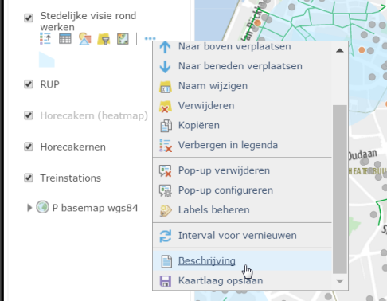

Interoperability between ESRI Arcgis and QGIS
======

Shapefiles
------

The `shapefile` format is still the most popular geospatial vector format in environments were interoperability among Esri and other GIS software products is needed, becuase its almost universal support in GIS-software. The term `shapefile` is misleading since the format consists of a collection of files with a common filename but a diffrent extension, stored in the same directory.

QGIS has always supported shapefiles for both viewing and editing, since its creation. So most organisations in need of a interoperabal format will use shapefile.

Shapefiles however have many downsides:

- Fieldnames are limited to 10 characters 
- TEXT fields are limited to 254 characters
- The size of the attribute table or the .shp-file cannot exceed 2 GB.
- Poor support for Unicode and non-european language characters
- It can only store one layer, so you can end up with a lot of files if you have multiple layers in a project. That can be messy to manage and share. 

Geopackage
----------

`Geopackage` is a new OGC-standard for the storage of both Raster and vector data in a vendor- and platform-independent, portable, self-describing, compact format for transferring geospatial information. Its based on a sqlite database but with a .gpg or gpkg extension.

Its partly intented as a replacement for shapefiles as a interoperabal file format. Supports vectordata and rasterdata (in tile structure inside the database). Other uses include a portable format for use in mobile devices. Becuase it is a database and not a textfile, larger datasets can be accessed quickly. 

It is fully supported in QGIS 2.16 and ESRI Arcmap 10.3 and Arcgis-pro 1.1. Also other GIS-software compagnies like Luciad and Mapinfo support Geopackage in the latest version of their product. 

If you are working with te latest versions of the software in a mixed ESRI - QGIS environment, you should consider switching from Shapefile to Geopackage. 

In QGIS you can save a layer as a new Geopackage by rigth clicking on it and choosing Geopackage.

You can also add new Geopackage-layers to a existing Geopackage by using the down Arrow the 'New layer'-button or from the menu `Layer > Create layer > New Geopackage Layer`.

More info: <http://www.geopackage.org/>

ESRI File Geodatabases
----------------------

The `File Geodatabase` is the main format to store geospatial data for current ESRI-products. It improved on most flaws in the shapefile-format, but it is a proprietary format that is much less supported outside the ESRI ecosystem. 

`File Geodatabases` is also a misleading name, because it is a folder and not a File. 
To open a File Geodatabase in QGiS, klik the `Add vector layer` button or form the menu: `Layer > Add layer > Add vector layer`, then choose *Directory* and *OpenFile* and browse to the FileGDB Folder. 

Some QGIS-builds support writing into FGDB's, but newer QGIS-versions only support reading File Geodatabase. To support writing a ESRI library was used, that was only available for windows. Later a opensource implemetation was developped, that works on every platform and supported older versions of FileGDB, but cannot write or modify the contents. 

Some organisations choose to store their data in FileGDB's, becuase it can be read by both ArcGIS and QGIS. This a valid choise for organisations that mosty use ESRI ArcGIS as their GIS-platform, but also have QGIS-users. 

The older MS-access (.mdb) based personal geodatabase form Arcgis is also supported as a Vectorfile.  This format is deprecated because Microsoft moved away from this format and the restriction of a maximum size of 2GB.

ESRI ArcSDE
-----------

`ArcSDE` is a layer on top of a database that allows it to behave as a ESRI Geodatabase. 
It is not possible to access ArcSDE directly using QGIS, but QGIS can usualy access the underlying database. In the more recent versions of ArcSDE, default the native Geometry type of the database is used, but with older intances of ArcSDE, you can only read the attribute table but not geometries that are stored in a ESRI format. In that case the only thing you can do is export the data to shapefile using Arcgis. 

In version 2.18 of QGIS 4 types of 'server'-databases: PostGIS, MS SQL-server, Oracle and DB2. You can add these using the 'Add <Database> Layer' button to add them, press the downarrow to choose the type of database or just use the menu `Layer > Add Layer > Add <Database> Layer`

Warning: It is not recommended to edit a ArcSDE-Database through QGIS or other non_ESRI products. 

Rasters
-------

`Rasters` inside a FileGDB or ArcSDE are not supported in QGIS. In that case the only thing you can do is export the data to geotiff using Arcgis. 
The older ESRI Arc/info binairy GRID and ASCII GRID are supported and so Geotiff and many other formats. 

Both QGIS and Arcgis can read and write Geotiff.

It is recommended to use Geotiff as your main raster format. It the most supported raster format in the GIS-world, it supports most features GIS-users want, like pyramids, compression and storing Spatial references. 

An overview of supported rasterformats in QGIS can be found here: <http://gdal.org/formats_list.html>

ArcGIS server and ArcGIS Online
-------------------------------

Since QGIS 2.16, extended support for data from `Arcgis Server` was added to QGIS. 
Both Mapservices (WMS equivalent) and Feature services (WFS equivalent) can be added as a layers. 
You can add them using the downarrow next the Add WMS-button and Add WFS-button. 
You can then add a new ArcGis Service by clicking on the *New* button, the just enter the *Url* and a *Name* you choose freely.

Data you placed on ArcGIS Online can also be accessed as a Feature Service. To get url, you can click on the description button in Arcgis Online:

### Task 

Add the "velo" layer to the map and save it as a Geopackage. 
http://geodata.antwerpen.be/arcgissql/rest/services/P_Publiek/OpenDataAntwerpen/MapServer

