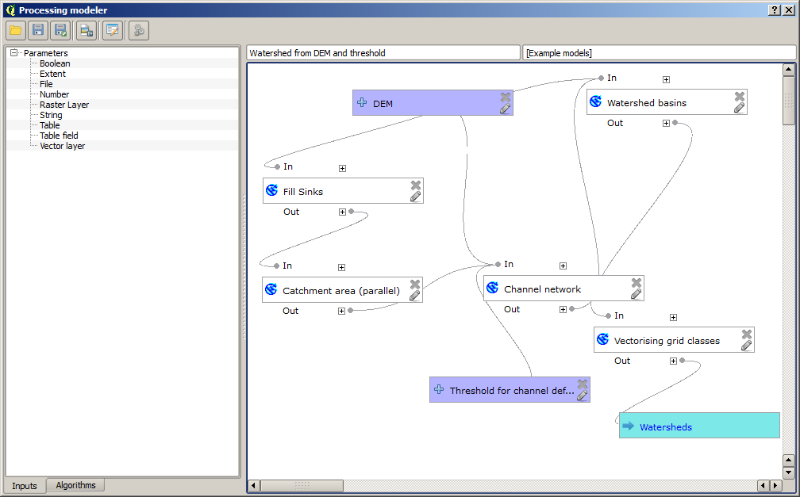
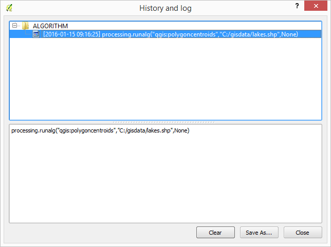
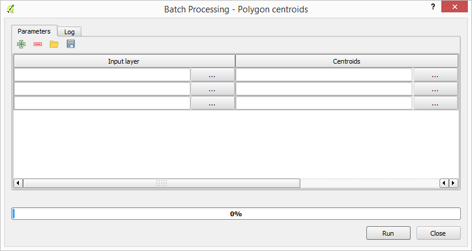
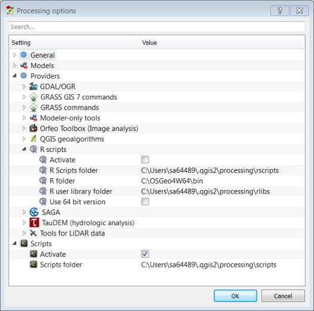

Introduction
============

The QGIS processing framework is a geoprocessing environment that can be used to call both native and third-party algorithms from QGIS, making your spatial analysis tasks more productive and easy to accomplish.

The processing framework is a plugin, but its is installed by default. If you can't see a menu entry called `Processing`, go to `Plugins > Manage and install plugins > Installed > Processing` and check the box. 

In the following sections, we will review how to use the graphical elements of this framework and make the most out of each one of them.

There are four basic elements in the framework GUI, which are used to run algorithms for different purposes. Choosing one tool or another will depend on the kind of analysis that is to be performed and the particular characteristics of each user and project. All of them (except for the batch processing interface, which is called from the toolbox or the algorithm execution dialog, as we will see) an be accessed from the `Processing` menu item. (You will see more than four entries. The remaining ones are not used to execute algorithms and will be explained later in
this chapter.)

* The toolbox. The main element of the GUI, it is used to execute a single algorithm or run a batch process based on that algorithm.

   

* The graphical modeler. Several algorithms can be combined graphically
  using the modeler to define a workflow, creating a single process that involves
  several subprocesses.

   

* The history manager. All actions performed using any of the
  aforementioned elements are stored in a history file and can be later easily
  reproduced using the history manager.

   

* The batch processing interface. This interface allows you to
  execute batch processes and automate the execution of a single algorithm on
  multiple datasets.

   

* The `Processing options` dialog can be opended trougth on the menu: `Processing` > `Options ...` . You can  activate additional providers and configure the path where these tools are installed. You can also configure the folder where you store models and scripts and change various general settings. 

    

###Task

Make sure the SAGA and GDAL toolbox are installed and activated. 
    
    