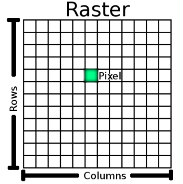
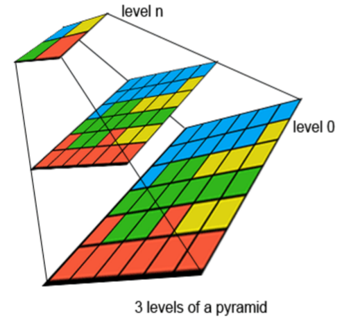

Introduction to working with raster data
=====

Raster data in GIS are matrices of discrete cells that represent features on, above or below the earth’s surface. Each cell (or pixel) in the raster grid is the same size, and cells are usually rectangular (in QGIS they will always be rectangular).

Rasters are usually stored in imageformats like Tiff, JPEG or PNG, Geotiff is a extension on the Tiff-format that als stores all georeferencing information inside the file. There are also specialized software specific raster rasterformats like: MrSID, ArcInfo Binary Grid, ERDAS IMAGINE, ... QGIS supports most commom rasterformats.

Raster data is usually used to store data varies across a surface. Typical raster datasets include aerial photography, satellite imagery, Lidar elevation models, precipatation data etc. But also rendered maps and scanned and georeferenced maps are rasterized datasets. 

Unlike vector data, raster data typically do not have an associated database record for each cell. They are geocoded by pixel resolution and the x/y coordinate of a corner pixel of the raster layer. This allows QGIS to position the data correctly in the map canvas.

Typical raster properties include: 

- Pixel Value: always nummeric, 8-32 bit integer or float 32-64
- Raster bands: singleband or RBG --> red green bleu + transparency band (alpha band)
- Nodata value
- Compression: lossless, types include: Deflate, LZW -- lossy, types include: JPEG, Wavelet (JPEG2000)
- Georeferencing: CRS + origin point
- Cellsize in ground units: `x` meter on `y` meter , usually square, so `x` and `y` are the same.
- Color Palette: associate value with specific color
- Raster pyramids:
    - Series of smaller versions of the same raster 
    - Greatly improved performance
    - External (.ovr or .rdd) or internal (MrSID, GeoTIFF)
 

