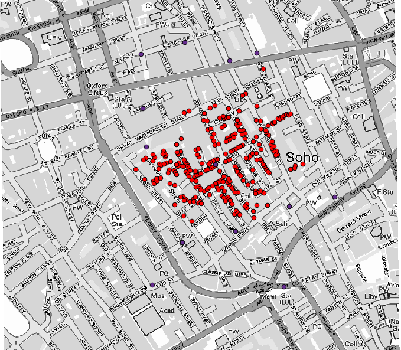
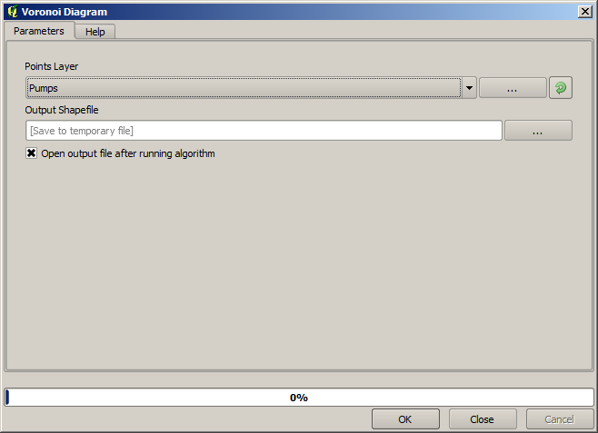
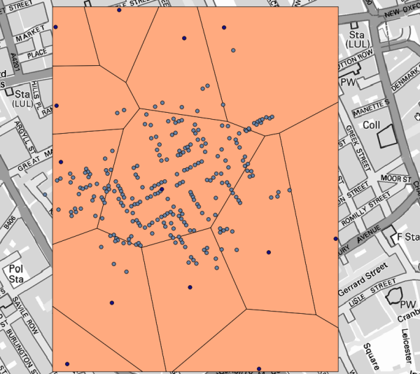
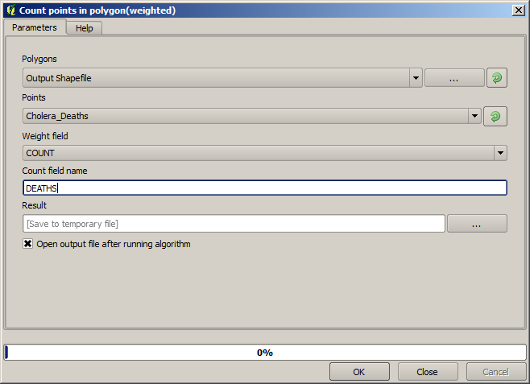
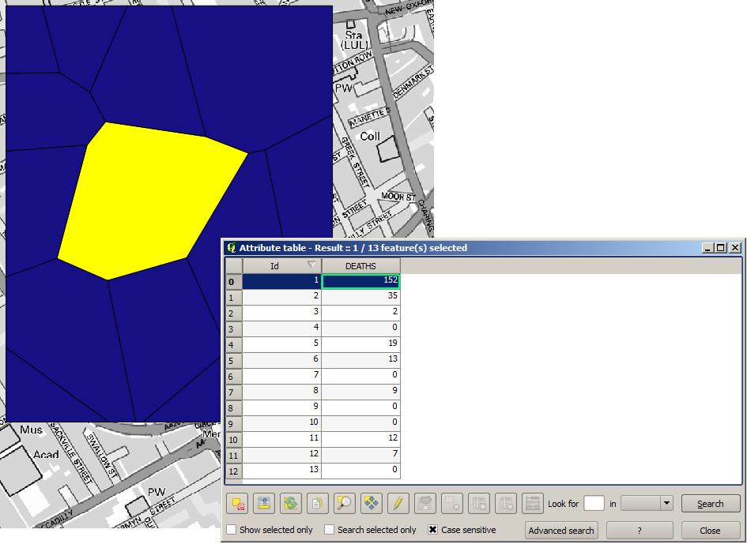
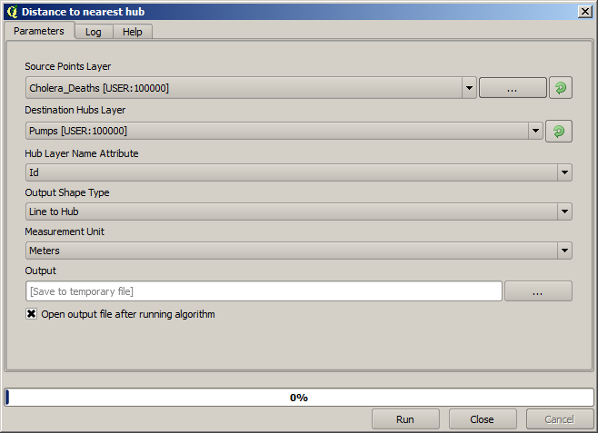
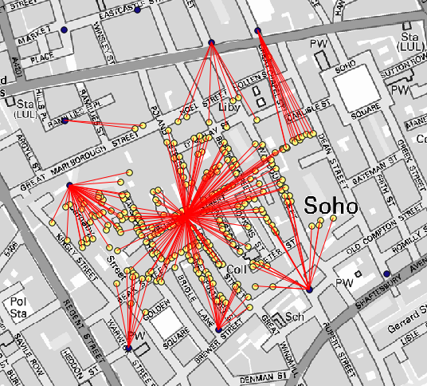
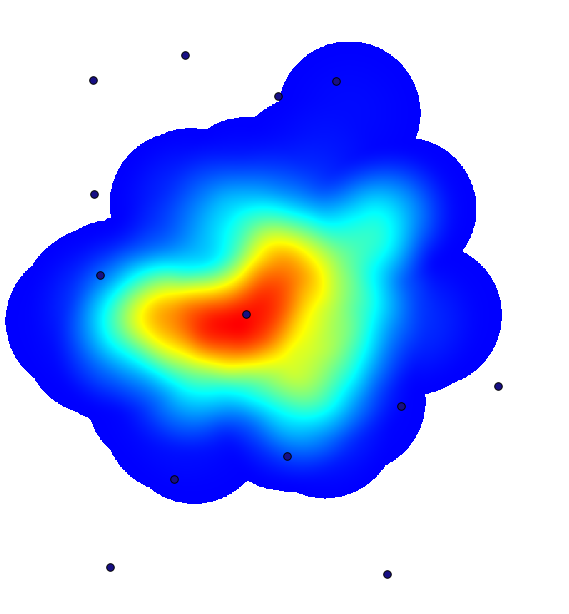
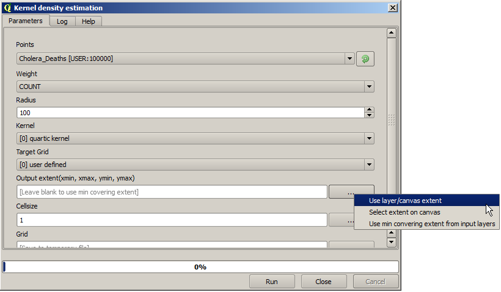

First analysis example with John Snow 
======================

Intro
------

In this lesson we will perform some real analysis using just the toolbox, so you can get more familiar with the processing framework elements.

Make sure the processing frame is configured, so we can use external algorithms. See previous chapter about that.

**Goal of this task:** We will be using the well-known dataset that John Snow used in 1854, in his groundbreaking work (<http://en.wikipedia.org/wiki/John_Snow_%28physician%29>), and we will get some interesting results. The analysis of this dataset is pretty obvious and there is no need for sofisticated GIS techniques to end up with good results and conclusions, but it is a good way of showing how these spatial problems can be analyzed and solved by using different processing tools.

Procedure
--------

You have to download the [sampledata](../data/john_snow.zip). The dataset contains shapefiles with cholera deaths and pump locations, and an OSM rendered map in TIFF format. Open the corresponding QGIS project for this lesson.

The first thing to do is to calculting the Voronoi diagram (a.k.a. Thyessen polygons) of the pumps layer, to get the influence zone of each pump. The *Voronoi Diagram* algorithm can be used for that.

Pretty easy, but it will already give us interesting information.

Clearly, most cases are within one of the polygons

To get a more quantitative result, we can count the number of deaths in each polygon. Since each point represents a building where deaths occured, and the number of deaths is stored in an attribute, we cannot just count the points. We need a weighted count, so we will use the *Count points in polygon (weighted)* tool.

The new field will be called *DEATHS*, and we use the *COUNT* field as weighting field. The resulting table clearly reflects that the number of deaths in the polygon corresponding to the first pump is much larger than the other ones.

Another good way of visualizing the dependence of each point in the `Cholera_deaths` layer with a point in the `Pumps` layer is to draw a line to the closest one. This can be done with the *Distance to nearest hub* tool, and using the configuration shown next.

The result looks like this:

Although the number of lines is larger in the case of the central pump, do not forget that this does not represent the number of deaths, but the number of locations where cholera cases were found. It is a representative parameter, but it is not considering that some locations might have more cases than other.

A density layer will also give us a very clear view of what is happening. We can create it with the *Kernel density* algorithm. Using the *Cholera\_deaths* layer, its *COUNT* field as weight field, with a radius of 100, the extent and cellsize of the streets raster layer, we get something like this.

Remember that, to get the output extent, you do not have to type it. Click on the button on the right-hand side and select *Use layer/canvas extent*.

Select the streets raster layer and its extent will be automatically added to the text field. You must do the same with the cellsize, selecting the cellsize of that layer as well.

Combining with the pumps layer, we see that there is one pump clearly in the hotspot where the maximum density of death cases is found.
