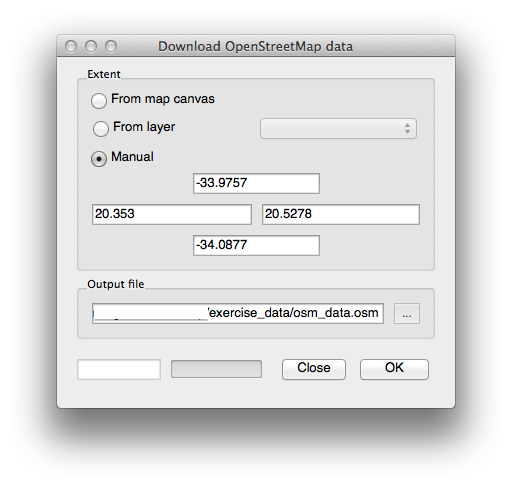
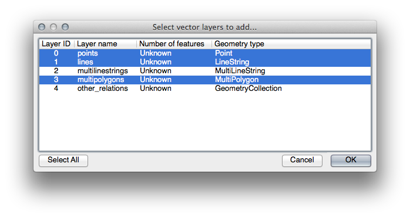
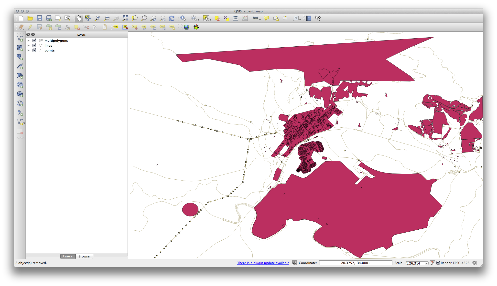
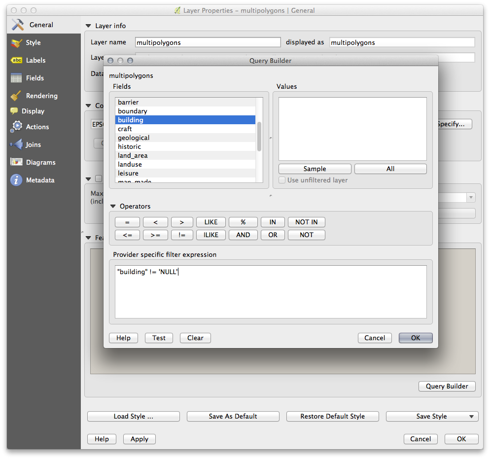

Get data for your region from OSM and other free sources
=======================

Openstreetmap data
----------

You can download whole countries from: http://download.geofabrik.de/

If you want to have openstreetmap data for your specifick region, you follow these steps:

-   Open a new QGIS project
-   In the Vector menu dropdown, select OpenStreetMap 
    --&gt; Download Data. You can then manually enter the coordinates of the region you wish to use, or you can use an existing layer to set the coordinates.
-   Choose a location to save the resulting .osm file and click Ok:

-   You can then open the .osm file using the Add Vector Layer button. You may need to select All files in the browser window. Alternatively, you can drag and drop the file into the QGIS window.
-   In the dialog which opens, select all the layers, *except* the other\_relations and multilinestrings layer:

This will load three layers into your map which relate to OSM's naming conventions (you may need to zoom in/out to see the vector data).

We need to extract the useful data from these layers, rename them and create corresponding shape files:

-   First, double-click the multipolygons layer to open the Layer properties dialog.
-   In the General tab, click Query Builder to open the Query builder window.

For example you if you want the following datasets:

-   building
-   natural (specifically, water)
-   landuse

You can sample using the identify the data your region contains in order to see what kind of results your region will yield. 

You'll need to write filter expressions for each field to extract the data we need. We'll use the "building" field as an example here:

-   Enter the following expression into the text area: *building != "NULL"* and click Test to see how many results the query will return. If the number of results is small, you may wish to have a look at the layer's Attribute Table to see what data OSM has returned for your region:

-   Click Ok and you'll see that the layer elements which are not buildings have been removed from the map.

You can now save the resulting data as a Dhapefile or another fileformat:

-   Right-click the layer and select **Save As...**
-   Choose the format you like Shapefile, Geojson or Spatialite 
-   Set the output Spatial Reference System, default OSM-data is in WGS84.
-   Set output location, and set other parameters.

###Task 

Choose a random location, repeat the previous process for the natural and landuse fields using the following expressions:

-   natural: "natural = 'water'"
-   landuse: "landuse != 'NULL'"

Create SRTM DEM tiff Files
----------------------------

If you need elevation data a free source is the Space shuttle Radar Topography Mission Digital Elevation Model (SRTM DEM). It has a 90 meter resolution so it is only usefull at smaller scales.

The CGIAR-CGI (<http://srtm.csi.cgiar.org/>) provides some SRTM DEM you can download from <http://srtm.csi.cgiar.org/SELECTION/inputCoord.asp>.

You'll need images which cover the entire region you have chosen to use. Keep the GeoTiff format. Once the form is filled, click on the Click here to Begin Search &gt;&gt; button and download the file(s).

Once you have downloaded the required file(s), they should be saved in the exercise\_data directory, under raster/SRTM subfolders.

Adminstrative and physical borders
------------------------------------

[Natural Earth](http://www.naturalearthdata.com/downloads/) has several global vector layers, most of the are physical or administrative (they cal it cultural) borders.

Imagery Files and Satelite data
--------------------------

NASA has some low resolution realtime data: <https://earthdata.nasa.gov/earth-observation-data/near-real-time/rapid-response/modis-subsets>

A free source for  Satelite imagery is the landsat dataset, but the resolution is not good: 
<https://earthexplorer.usgs.gov/> 

There are no global sources for high resolution imagery, although many countries distribute national airial imagery freely. 

In QGIS you can use the **QuickMapServices** Plugin to use online sources as background images. You cannot use thes images for analyses though. More info: <http://nextgis.com/blog/quickmapservices/>

