Automating Complex Workflows using Processing Modeler
=====================================================

Intro
----

GIS Workflows typically involve many steps - with each step generating intermediate output that is used by the next step. If you change the input data or want to tweak a parameter, you will need to run through the entire process again manually. Fortunately, QGIS has a graphical modeler built-in that can help you define your workflow and run it with a single invocation. You can also run these workflows as a batch over a large number of inputs.

Make sure the SAGA-toolbox is enable in the processing settings.

**Goal of this task:** This tutorial shows how to build a model to extract areas for a particular class from a classified land use raster.

Get the data
------------

We will use the [Global Mosaics of the standard MODIS land cover type data product](http://www.landcover.org/data/lc/) from [Global Land Cover Facility](http://www.landcover.org/) as an example.

Download the [0.5 Degree resolution GeoTIFFs](ftp://ftp.glcf.umd.edu/glcf/Global_LNDCVR/Global_HD_Rev1/GeoTIFF/) for 2001 and 2012.

For convenience, you may directly download a copy of both the datasets from the links below:

[LC\_hd\_global\_2001.tif.gz](http://www.qgistutorials.com/downloads/LC_hd_global_2001.tif.gz)

[LC\_hd\_global\_2012.tif.gz](http://www.qgistutorials.com/downloads/LC_hd_global_2012.tif.gz)

Procedure
---------

Our workflow for this exercise will have the following steps.

-   Apply a `Majority Filter` algorithm to the input landcover raster. This will reduce noise in our output by eliminating isolated pixels.
-   Convert the resulting raster to a polygon layer.
-   Query for a class value from the attribute table of the polygon layer and create a vector layer for that class.

The following steps outline the process to code the above process into a model and run it on the downloaded datasets.

-  Launch QGIS and go to Processing --&gt; Graphical Modeler....

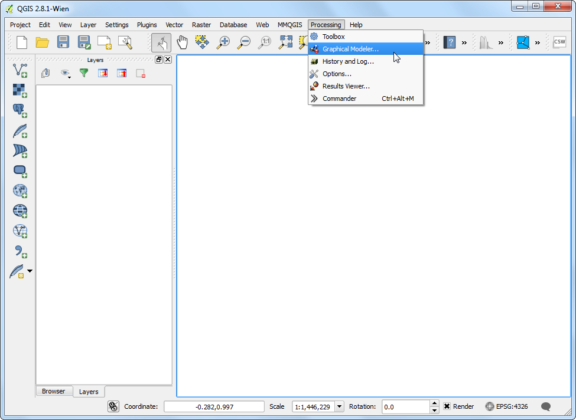

-  The Processing modeler dialog contains a left-hand panel and a main canvas. Select the Inputs tab in the left-hand panel and drag the + Raster layer to the canvas.

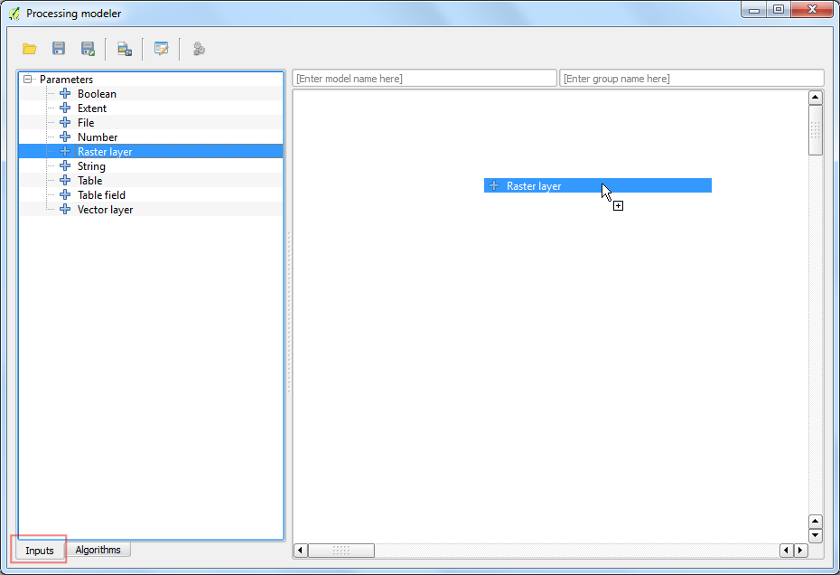

-  A Parameter definition dialog will pop-up. Enter `Input` as the Parameter name and mark `Yes` to Required. Click OK.


-  You will see a box with the name Input appear in the canvas. This represents the landcover raster that we will use as input. Next step is to apply a `Majority filter` algorithm. Switch to the Algorithm tab from the bottom-left corner. Search for the algorithm and you will find it listed under SAGA provider. Drag it to the canvas.

If you do not see this algorithm or any of the subsequent algorithms mentioned in thi tutorial, you may be using the Simplified
Interface of the Processing Toolbox. Switch to the Advanced
Interface by using the dropdown at the bottom of the Processing Toolbox in the main QGIS window.


-  A configuration dialog for Majority Filter will be presented. Leave the values to their default and click OK.


-  You will note that there is now a new box named Majority Filter in the canvas and it is connected to the Input box. This is because the Majority Filter algorithm uses the Input raster as its input. The next step in our workflow is to convert the output of majority filter to vector. Find the `Polygonize (raster to vector)` algorithm and drag it to the canvas.

The boxes can be moved and arranged by clicking on it and dragging it while holding the left mouse button. You can also use the scroll-wheel to zoom in and out in the model canvas.


-  Select 'Filtered Grid' from algorithm 'Majority Filter' as the value for Input layer. Click OK.


-  The final step in the workflow is to query for a class value and create a new layer from the matching features. Search for the `Extract by attribute` algorithm and drag it the canvas.

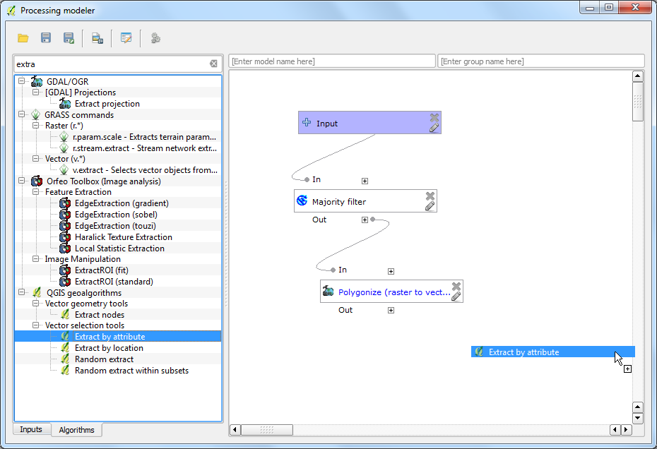

-  Select 'Vectorized' from algorithm 'Polygonize (raster to vector) as the Input Layer. We want to extract the pixels that represent Croplands. The corresponding pixel value for this class will be 12. (see [Code Values](http://www.landcover.org/data/lc/)). Enter `DN` as the Selection attribute and `12` as the value. As the output of this operation will be the final result, we need to name the output. Enter `vectorized class` as the Output.

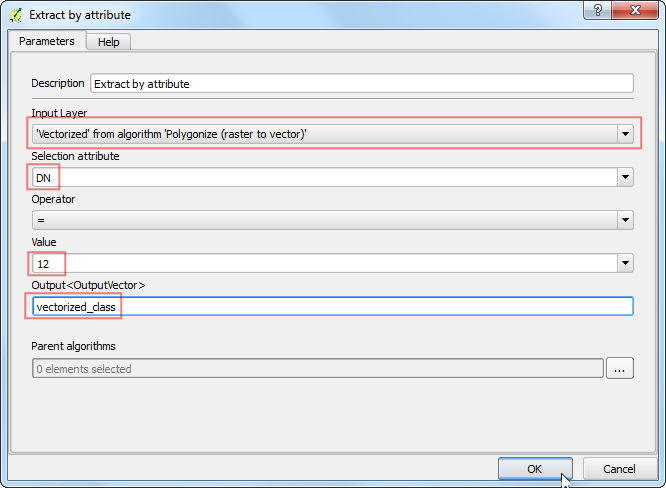

-  Enter the Model name as `vectorize` and Group
    name as `raster`. Click the Save button.


-  Name the model `vectorize` and click Save.


-  Now it is time to test our model. Close the modeler and switch to the main QGIS window. Go to Layer --&gt; Add Layer --&gt; Add Raster
    Layer....


-  Browse to the downloaded `LC_hd_global_2001.tif.gz` file and click Open. Once the raster is loaded, go to Processing --&gt; Toolbox.


-  Find the newly created model under Models --&gt; raster --&gt;
    vectorize. Double-click to launch the model.


-  Select `LC_hd_global_2001` as the Input and click Run.


-  You will see all the steps being executed without any user input. Once the processing finishes, a new layer `vectorized_class` will be added to QGIS. Let's improve the model a little bit. Right-click on the `vectorize` model and select Edit model.

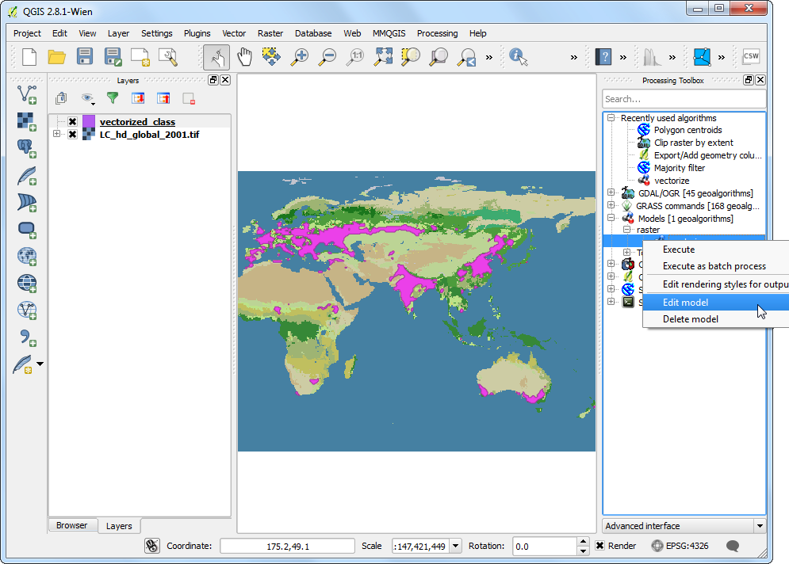

-  In Step 12, we hard-coded the value `12` as the class value. Instead, we can specify it as a input parameter which the user can change. To add this, switch to the Inputs tab and drag the + String to the model.


-  Enter the Parameter Name as `Class`. Enter `12` as the Default value.


-  We will now change the `Extract by attribute` algorithm to use this input instead of the hard-coded value. Click the Edit button next to the Extract by attribute box.


-  Click the dropdown arrow for Value and select `Class`. Click OK.

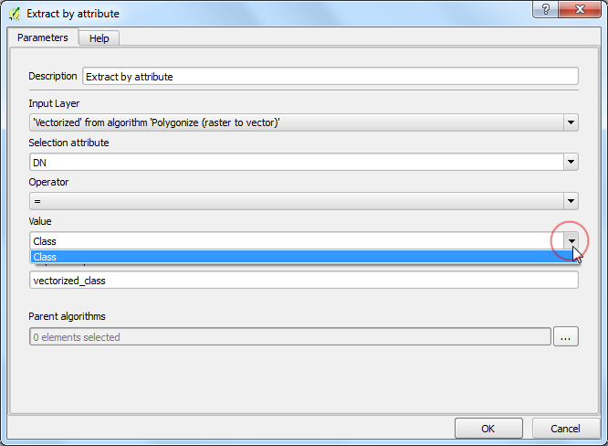

-  You will see from the model diagram that the Extract by
    attribute algorithm now uses 2 inputs. The modeler has a shortcut to launch the model and test it. Click the Run button from the toolbar.


-  Notice that the model dialog has a new editable field called Class. Enter `16` as the Class value and click Run.


-  Once the processing finishes, you will see that with just a click of a button we were able to run a complex workflow and extract the area for class 16.

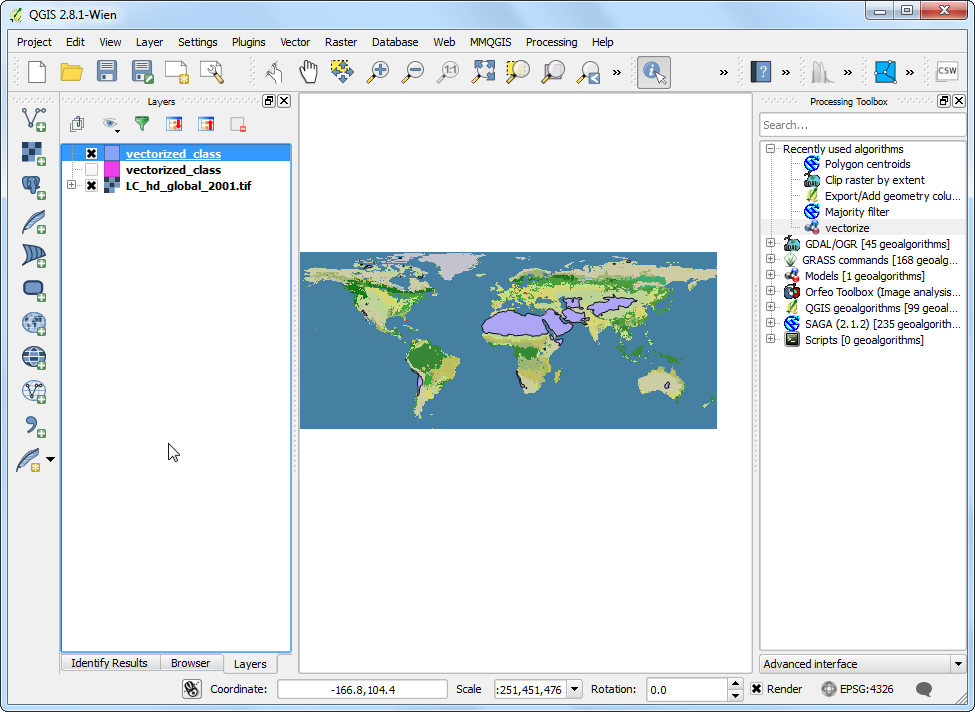

-  Now that our model is ready, we can run it just as easily on a new raster layer. Load the `LC_hd_global_2012.tif.gz` file by going to Layer --&gt; Add Layer --&gt; Add Raster Layer.... Click the vectorize\` model from the Processing Toolbox panel.

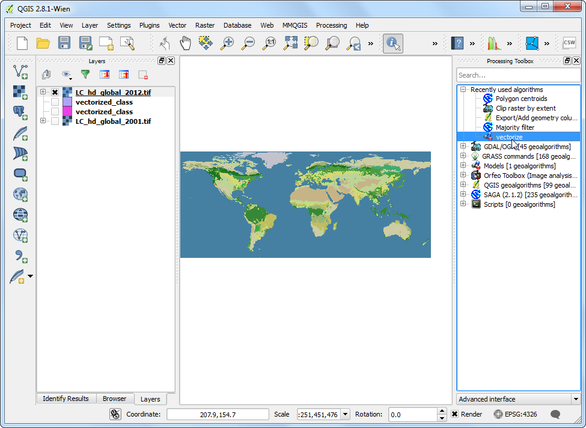

-  Pick the `LC_hd_global_2012` layer as the Input and click Run.

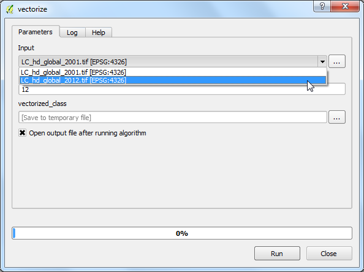

-  Once the new output is loaded, you can compare the changes in the Croplands from 2001 to 2012.


-  It is always a good idea to add documentation to your model. The modeler has a built-in Help editor that allows you to embed help directly in the model. Right-click the `vectorize` model and select Edit model.


-  Click the Edit model help button from the toolbar.

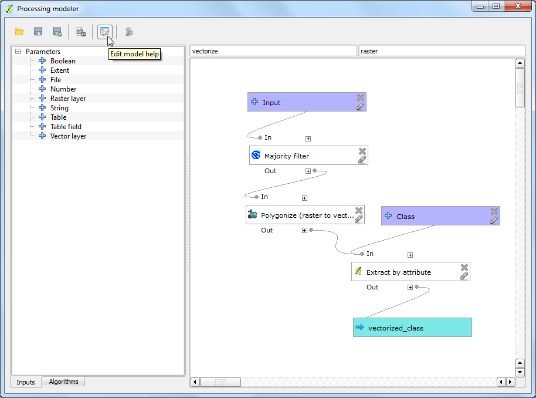

-  In the Help editor dialog, select any item from the Select element to edit panel and enter the help text in Element description. Click OK. This help will be available in the Help tab when you launch the model to run.

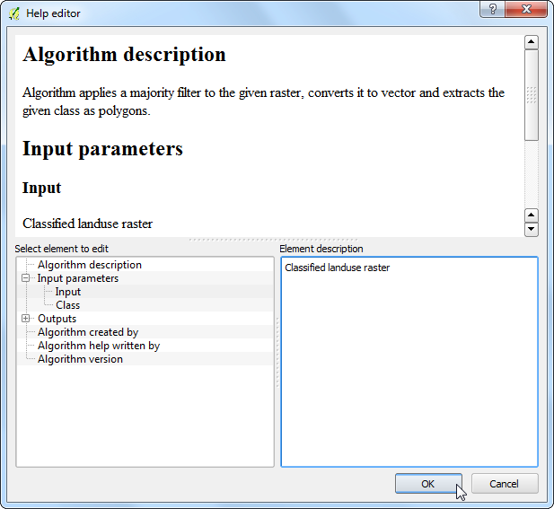

Models can be a great timesaver and allow you to write your workflow once and run it multiple times. You can even share your model with other users. The model files are saved in the `.qgis2` directory. You can send the `.model` file to another user who can copy it to the appropriate directory on their computer and it will appear in the Processing toolbox. The models directory location will depend on the platform as follows: (Replace `username` with your login name)

**Windows**

```
c:\Users\username\.qgis2\processing\models\
```

**Mac**

```
/Users/username/.qgis2/processing/models/
```

**Linux**

```
/home/username/.qgis2/processing/models/
```
