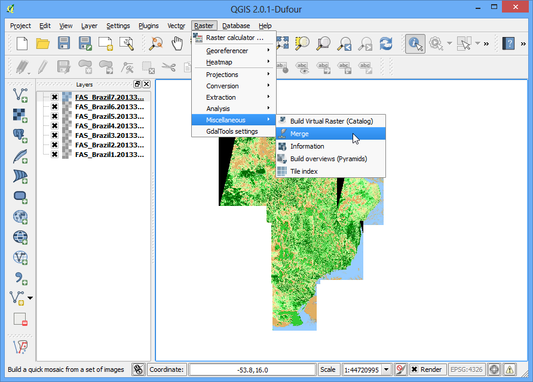
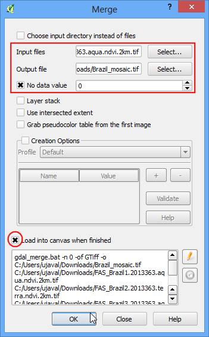
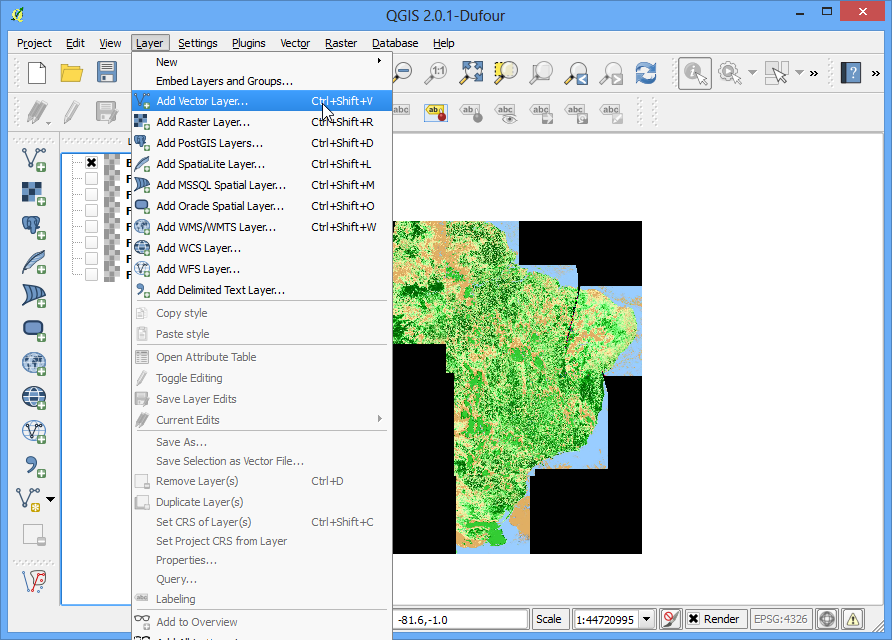
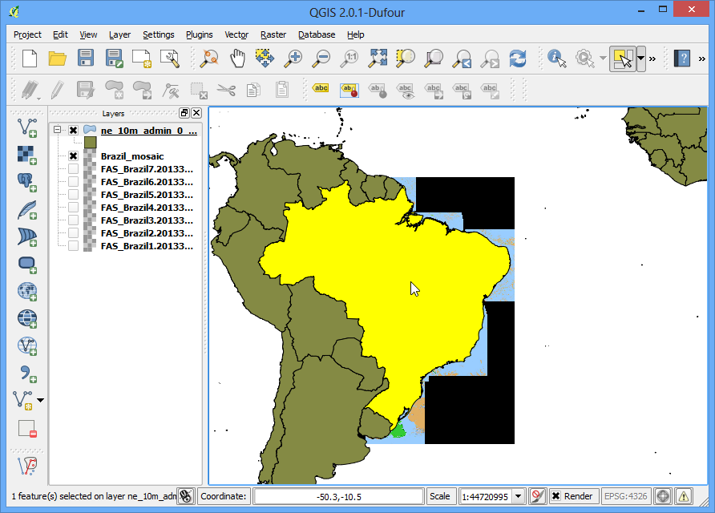
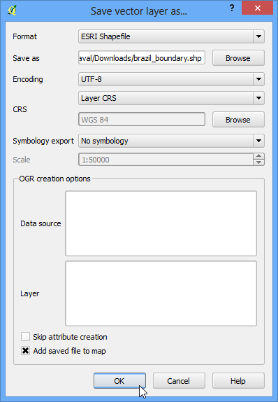
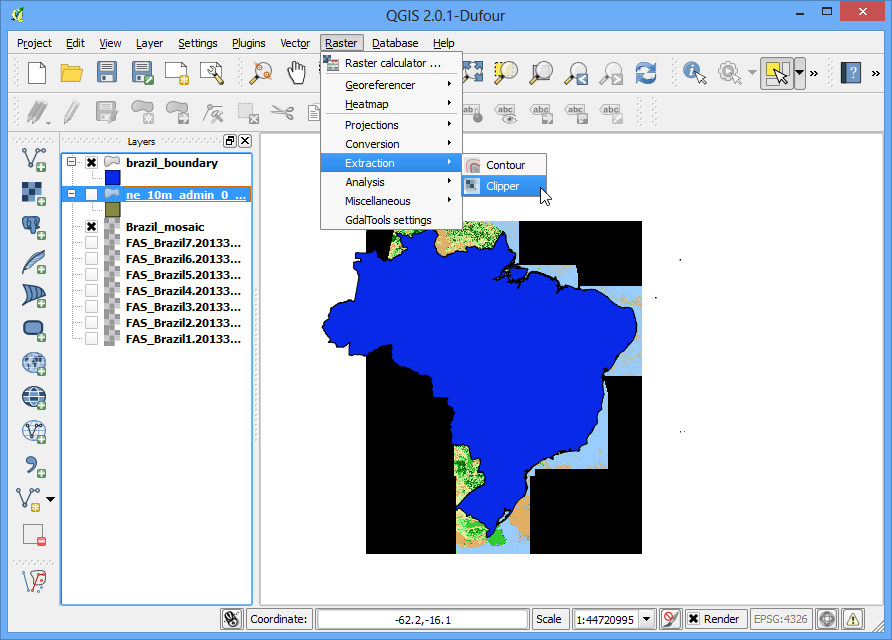
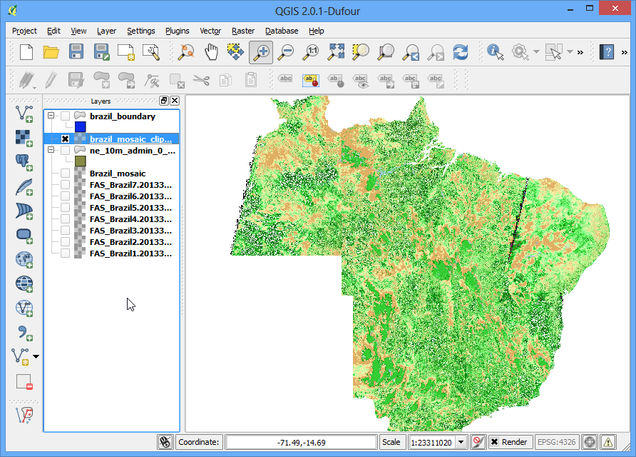

Raster Mosaicing and Clipping
=============================

Intro
-----

This exercise explores some basic raster operations in QGIS such as viewing, mosaicing and subsetting.

**Goal of the task:** We will download some public domain raster data for Brazil and view it in QGIS. Next, we will merge these into a single mosaic and clip it using a country boundary to get a single seamless dataset for the country.

Other skills you will learn:

-   Searcing and downloading near real-time public domain satellite imagery.
-   Selecting a single feature from a vector layer and saving it to a new shapefile.

Get the data
------------

We need Brazil country boundary to clip our raster. You can get the [Admin 0 - Countries](http://www.naturalearthdata.com/http//www.naturalearthdata.com/download/10m/cultural/ne_10m_admin_0_countries.zip) shapefile from Natural Earth.

[NASA/GSFC, Rapid Response site](https://earthdata.nasa.gov/data/near-real-time-data/rapid-response/modis-subsets) has a good collection of near real-time satellite imagery. A good regional product is [USDA Foreign Agricultural Service (FAS) subsets.](http://lance-modis.eosdis.nasa.gov/imagery/subsets/?project=fas). We will use 2km resolution FAS subsets for Brazil for this exercise.

Here is how to search and download the revelant data.

-  Open the [South America region subsets](http://lance-modis.eosdis.nasa.gov/imagery/subsets/?area=sa). Find the Brazil subsets shown in the FAS Subsets section. Click on any one of them.

-  In the details page, click the 2km link under the product of your choice. Here we will download the NDVI product. [Learn more about NDVI](http://en.wikipedia.org/wiki/Normalized_Difference_Vegetation_Index).

-  Click the Download GeoTIFF file link to download the raster image.

Repeat the process for all 7 FAS subsets for Brazil.

For convenience, you can directly download sample data used in this exercise from links below.

[ne\_10m\_admin\_0\_countries.zip](http://www.qgisexercises.com/downloads/ne_10m_admin_0_countries.zip)

[FAS\_Brazil1.2013363.aqua.ndvi.2km.tif](http://www.qgisexercises.com/downloads/FAS_Brazil1.2013363.aqua.ndvi.2km.tif)

[FAS\_Brazil2.2013363.terra.ndvi.2km.tif](http://www.qgisexercises.com/downloads/FAS_Brazil2.2013363.terra.ndvi.2km.tif)

[FAS\_Brazil3.2013363.aqua.ndvi.2km.tif](http://www.qgisexercises.com/downloads/FAS_Brazil3.2013363.aqua.ndvi.2km.tif)

[FAS\_Brazil4.2013363.aqua.ndvi.2km.tif](http://www.qgisexercises.com/downloads/FAS_Brazil4.2013363.aqua.ndvi.2km.tif)

[FAS\_Brazil5.2013363.aqua.ndvi.2km.tif](http://www.qgisexercises.com/downloads/FAS_Brazil5.2013363.aqua.ndvi.2km.tif)

[FAS\_Brazil6.2013363.terra.ndvi.2km.tif](http://www.qgisexercises.com/downloads/FAS_Brazil6.2013363.terra.ndvi.2km.tif)

[FAS\_Brazil7.2013363.aqua.ndvi.2km.tif](http://www.qgisexercises.com/downloads/FAS_Brazil7.2013363.aqua.ndvi.2km.tif)

Data Sources: \[LANCE\]\_ \[NATURALEARTH\]\_

Procedure
---------

-  Open QGIS and go to Layer --&gt; Add Raster Layer...

-  Browse to the directory with the individual images. Hold down the Ctrl key and click on the image files to make a multiple selection. Click Open.

-  You will see the images load up in the Table of Content on the left panel. Now let us create a single Mosaic image from all these individual images. Click on Raster --&gt; Miscellaneous --&gt; Merge.

The Raster menu in QGIS comes from a core plugin called GdalTools. If you do not see the Raster menu, enable the GdalTools plugin from Plugins --&gt;
Manage and install plugins --&gt; Installed. See using\_plugins for more details.

-  In the Merge dialog, click Select... next to Input files and browse to the directory containing all the individual geotiffs. Keep holding Ctrl key and select all the. subsets. Now click Select... next to Output file and name the output as `Brazil_mosaic.tif`. At the bottom, check the box next to Load into canvas when finished. Click OK.

-  You will get a pop-up message saying Processing complete, once the mosaic is created and loaded to the QGIS Canvas. You will see that the individual images and now combined and mosaiced into a single layer. You can now turn off individual layers by un-checking the box next to them.

-  Another Raster operation you can do is to subset or crop an image. We can use a polygon from a vector layer to crop the raster to the exact shape. Let's load the country polygons shapefile we downloaded from Natural Earth. Go to Layer --&gt; Add Vector Layer.

-  Select the `ne_10m_admin_0_countries.zip` file and click Open. When prompted to select the layer within the zip file, select `ne_10m_admin_0_countries.shp`.

-  Once the vector layer is loaded, we want to select and extract the polygon for Brazil. Select the Select Single Feature tool from the toolbar.

-  Click anywhere on the Brazil polygon and it will be selected.

-  Right-click the `ne_10m_admin_0_countries` layer and select Save Selection As....

-  Name your output as `brazil_boundary.shp` and make sure Add
    saved file to map box is checked. click OK.

-  You will see the Brazil boundary polygon now loaded in QGIS.

-  Now go to Raster --&gt; Extraction --&gt; Clipper.

-  Select the input file (raster) as `Brazil_mosaic`. Name the Output file as `Brazil_mosaic_clipped`. In the Clipping mode section, choose Mask layer. Select the newly created `brazil_boundary` as the mask layer. Check the box next to Load into canvas when finished. Click OK.

-  The new cropped layer will be loaded into QGIS. You will notice the black pixels surrounding the actual mosaic. Let's remove that. Right-click on the `Brazil_mosaic_clipped` layer and select Properties.

-  Go to the Transparency tab, and add 0 as an Additional no data value.

-  Now you have a nice mosaic cropped to a country boundary that you can use in your project as a background layer or do further analysis on.

###Extra Task

Do this exercise using the *Processing tools* instead of the menu and create a model.
