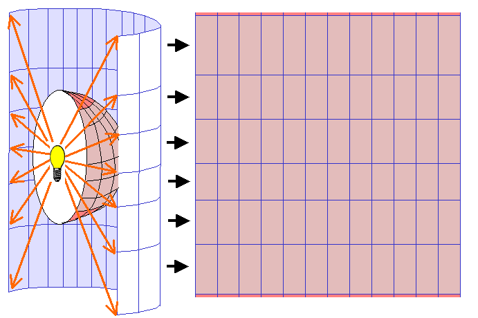
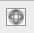
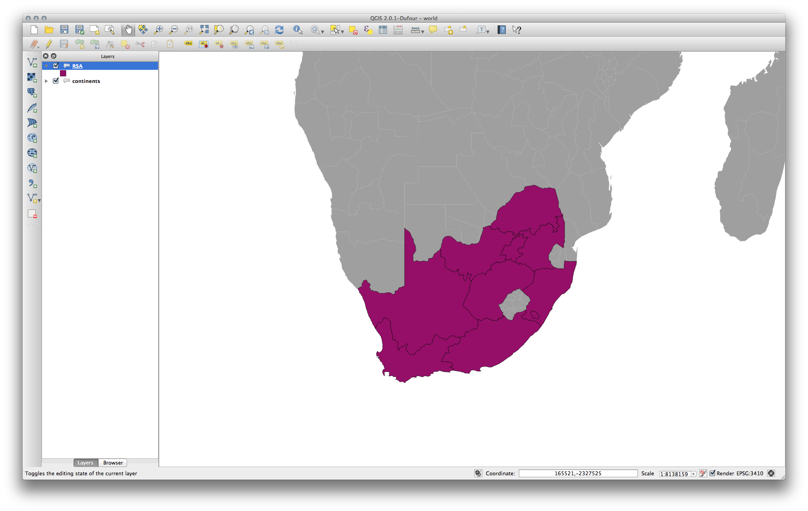
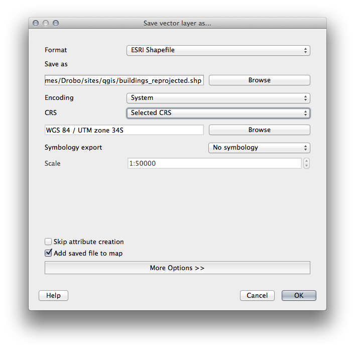
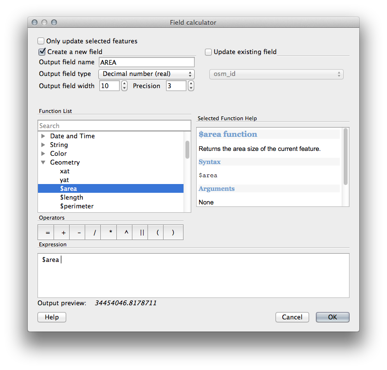
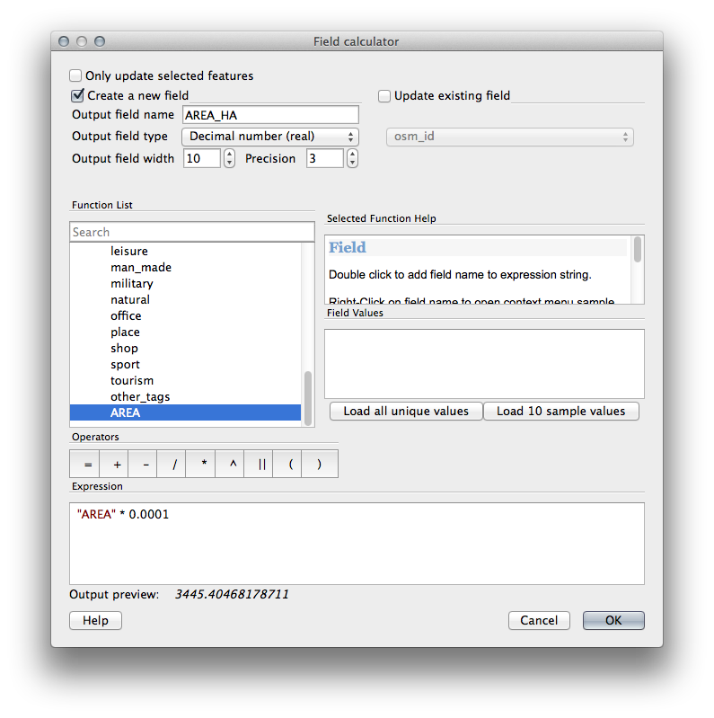
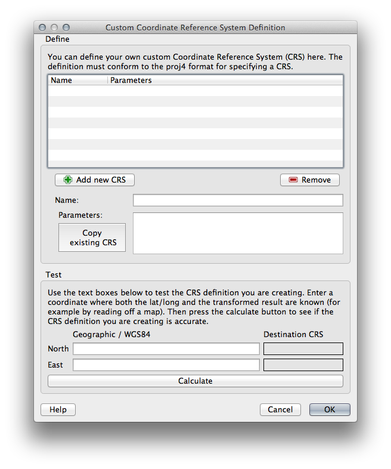
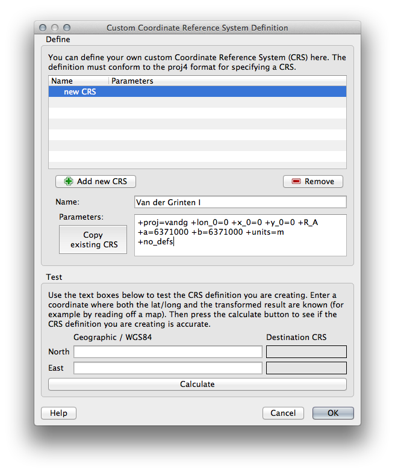
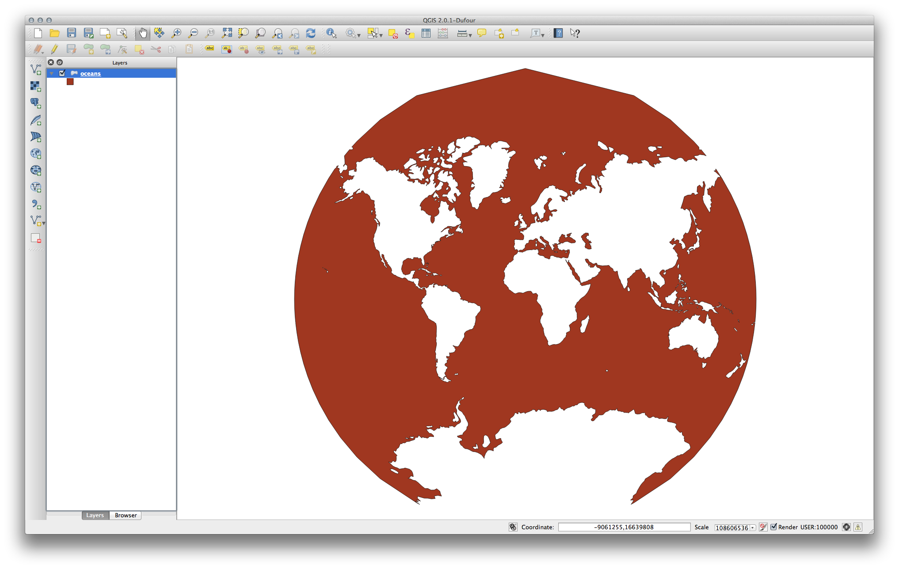

Reprojecting and Transforming Data
=======================================

Intro
-----

A problem that often ocurs with data form different sources is the use of different projections, Spatial reference systems. 

Map projections try to portray the surface of the earth or a portion of the earth on a flat piece of paper or computer screen. A `Spatial Reference System` (SRS) or `Coordinate Reference System` (CRS) defines, with the help of coordinates, how the two-dimensional, projected map o,n your screen is related to real places on the earth. 

The decision as to which Spatial reference system to use, depends on the regional extent of the area you want to work in, on the analysis you want to do and often on the availability of data.
Most nations have their own SRS, that displays geographical features in best way for surface, but is often incorrect far outside their borders. 

If you want to display data, that was created in different Spatial reference systems, on the same map, you need to reproject them to a commom Spatial Reference System.  

QGIS supports many types of projections. It can display data `On the Fly` that means it will inspect a dataset to find what CRS it has and will try to match that with CRS of your map. If you save data in QGIS you can always choose what CRS to use. 

**Goal of this task:** Follow the exercise below to learn how work with CRS.

Projections
----------- 

The CRS that all the data as well as the map itself are in right now is in a SRS called WGS84. This is a very common `Spatial reference systems` for representing data. But there's a problem, as we will see.

-   Download the data: [World.zip](../data/world.zip)
-   Then open the map of the world which you'll find under world/world.qgs.
-   Zoom in to South Africa by using the Zoom In tool.
-   Try setting a scale in the Scale field, which is in the Status Bar along the bottom of the screen. While over South Africa, set this value to 1:5000000 (one to five million).
-   Pan around the map while keeping an eye on the Scale field.

Notice the scale changing? That's because you're moving away from the one point that you zoomed into at 1:5000000, which was at the center of your screen. All around that point, the scale is different.

To understand why, think about a globe of the Earth. It has lines running along it from North to South. These longitude lines are far apart at the equator, but they meet at the poles.

In a GCS, you're working on this sphere, but your screen is flat. When you try to represent the sphere on a flat surface, distortion occurs, similar to what would happen if you cut open a tennis ball and tried to flatten it out. What this means on a map is that the longitude lines stay equally far apart from each other, even at the poles (where they are supposed to meet). This means that, as you travel away from the equator on your map, the scale of the objects that you see gets larger and larger. What this means for us, practically, is that there is no constant scale on our map!

To solve this, let's use a Projected Coordinate System (PCS) instead. A PCS "projects" or converts the data in a way that makes allowance for the scale change and corrects it. Therefore, to keep the scale constant, we should reproject our data to use a PCS.

"On the Fly" Reprojection
--------------------------

QGIS allows you to reproject data "on the fly". What this means is that even if the data itself is in another CRS, QGIS can project it as if it were in a CRS of your choice.

-   To enable "on the fly" projection, click on the CRS Status button in the Status Bar along the bottom of the QGIS window: 
-   In the dialog that appears, check the box next to Enable 'on the fly' CRS transformation.
-   Type the word global into the Filter field. One CRS (NSIDC EASE-Grid Global) should appear in the list below.
-   Click on the NSIDC EASE-Grid Global to select it, then click OK.
-   Notice how the shape of South Africa changes. All projections work by changing the apparent shapes of objects on Earth.
-   Zoom in to a scale of 1:5000000 again, as before.
-   Pan around the map.
-   Notice how the scale stays the same!

"On the fly" reprojection is also used for combining datasets that are in different CRSs.

-   Deactivate "on the fly" re-projection again:
    -   Click on the CRS Status button again.
    -   Un-check the Enable 'on the fly' CRS transformation box.
    -   Clicking OK.
-   In QGIS 2.0, the 'on the fly' reprojection is automatically activated when layers with different CRSs are loaded in the map. To understand what 'on the fly' reprojection does, deactivate this automatic setting:
    -   Go to Settings --&gt; Options...
    -   On the left panel of the dialog, select CRS.
    -   Un-check Automatically enable 'on the fly' reprojection if layers
        have different CRS.
    -   Click OK.
-   Add another vector layer to your map which has the data for South Africa only. You'll find it as world/RSA.shp.

What do you notice?

The layer isn't visible! But that's easy to fix, right?

-   Right-click on the RSA layer in the Layers list.
-   Select Zoom to Layer Extent.

OK, so now we see South Africa... but where is the rest of the world?

It turns out that we can zoom between these two layers, but we can't ever see them at the same time. That's because their Coordinate Reference Systems are so different. The continents dataset is in *degrees*, but the RSA dataset is in *meters*. So, let's say that a given point in Cape Town in the RSA dataset is about 4 100 000 meters away from the equator. But in the continents dataset, that same point is about 33.9 degrees away from the equator.

This is the same distance - but QGIS doesn't know that. You haven't told it to reproject the data. So as far as it's concerned, the version of South Africa that we see in the RSA dataset has Cape Town at the correct distance of 4 100 000 meters from the equator. But in the continents dataset, Cape Town is only 33.9 *meters* away from the equator! You can see why this is a problem.

QGIS doesn't know where Cape Town is *supposed* to be - that's what the data should be telling it. If the data tells QGIS that Cape Town is 34 meters away from the equator and that South Africa is only about 12 meters from north to south, then that is what QGIS will draw.

To correct this:

-   Click on the CRS Status button again and switch Enable 'on the fly' CRS transformation on again as before.
-   Zoom to the extents of the RSA dataset.

Now, because they're made to project in the same CRS, the two datasets fit perfectly:

When combining data from different sources, it's important to remember that they might not be in the same CRS. "On the fly" reprojection helps you to display them together.

Before you go on, you probably want to have the 'on the fly' reprojection to be automatically activated whenever you open datasets having different CRS:

-   Open again Settings --&gt; Options... and select CRS.
-   Activate Automatically enable 'on the fly' reprojection if
    layers have different CRS.

Saving a Dataset to Another CRS
--------------------------------

Remember when you calculated areas for the buildings in the Classification lesson? You did it so that you could classify the buildings according to area.

-   Open your usual map again (containing the |majorUrbanName| data).
-   Open the attribute table for the buildings layer.
-   Scroll to the right until you see the AREA field.

Notice how the areas are all very small; probably zero. This is because these areas are given in degrees - the data isn't in a Projected Coordinate System. In order to calculate the area for the farms in square meters, the data has to be in square meters as well. So, we'll need to reproject it.

But it won't help to just use 'on the fly' reprojection. 'On the fly' does what it says - it doesn't change the data, it just reprojects the layers as they appear on the map. To truly reproject the data itself, you need to export it to a new file using a new projection.

Using the openstreetmap data from previous exercise:

-   Right-click on the openstreetmap layer in the Layers list.
-   Select Save As... in the menu that appears. You will be shown the Save vector layer as... dialog.
-   Click on the Browse button next to the Save as field.
-   Navigate to a folder and specify the name of the new layer as openstreetmap\_reprojected.shp.
-   Leave the Encoding unchanged.
-   Change the value of the Layer CRS dropdown to Selected
    CRS.
-   Click the Browse button beneath the dropdown.
-   The CRS Selector dialog will now appear.
-   In its Filter field, search for 34S.
-   Choose WGS 84 / UTM zone 34S from the list.
-   Leave the Symbology export unchanged.

The Save vector layer as... dialog now looks like this:

-   Click OK.
-   Start a new map and load the reprojected layer you just created.

Refer back to the lesson on Classification to remember how you calculated areas.

-   Update (or add) the AREA field by running the same expression as before:

This will add an AREA field with the size of each building in square meters

-   To calculate the area in another unit of measurement, for example hectares, use the AREA field to create a second column:

Look at the new values in your attribute table. This is much more useful, as people actually quote building size in meters, not in degrees. This is why it's a good idea to reproject your data, if necessary, before calculating areas, distances, and other values that are dependent on the spatial properties of the layer.

Creating Your Own Projection
----------------------------

There are many more projections than just those included in QGIS by default. You can also create your own projections.

-   Click on the Add new CRS button to create a new projection.
-   Enter its name in the Name field.
-   Enter the parameters of CRS as proj4 sting, this a standart way to encode CRS-parameters. 

### Task

An interesting projection to use is called Van der Grinten I.

-   Start a new map.
-   Load the world/oceans.shp dataset.
-   Go to Settings --&gt; Custom CRS... and you'll see this dialog:

This projection represents the Earth on a circular field instead of a rectangular one, as most other projections do.

-   As name use: "Van der Grinten I"
-   For its parameters, use the following proj4 string:

    +proj=vandg +lon\_0=0 +x\_0=0 +y\_0=0 +R\_A +a=6371000 +b=6371000 +units=m +no\_defs

-   Click OK.
-   Enable "on the fly" reprojection.
-   Choose your newly defined projection (search for its name in the Filter field).
-   On applying this projection, the map will be reprojected thus:

