Terrain Analysis
=====================

Intro
----

Certain types of rasters allow you to gain more insight into the terrain that they represent. Digital Elevation Models (DEMs) are particularly useful in this regard. In this lesson you will use terrain analysis tools to find out more about the study area for the proposed residential development from earlier.

**The goal for this lesson:** To use terrain analysis tools to derive more information about the terrain.

Calculating a Hillshade
------------------------------------

The DEM you have on your map right now does show you the elevation of the terrain, but it can sometimes seem a little abstract. It contains all the 3D information about the terrain that you need, but it doesn't look like a 3D object. To get a better look at the terrain, it is possible to calculate a *hillshade*, which is a raster that maps the terrain using light and shadow to create a 3D-looking image.

To work with DEMs, you should use QGIS' all-in-one DEM (Terrain
models) analysis tool.

-   Click on the menu item Raster --&gt; Analysis --&gt; DEM (Terrain
    models).
-   In the dialog that appears, ensure that the Input file is the DEM layer.
-   Set the Output file to hillshade.tif in the directory exercise\_data/residential\_development.
-   Also make sure that the Mode option has Hillshade selected.
-   Check the box next to Load into canvas when finished.
-   You may leave all the other options unchanged.
-   Click OK to generate the hillshade.
-   When it tells you that processing is completed, click OK on the message to get rid of it.
-   Click Close on the main DEM (Terrain models) dialog.

You will now have a new layer called hillshade that looks like this:

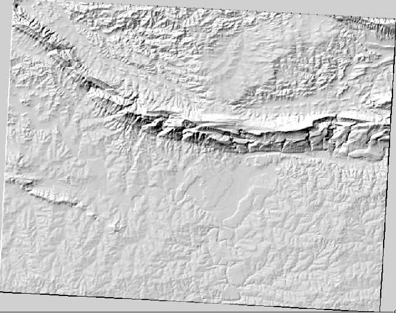

That looks nice and 3D, but can we improve on this? On its own, the hillshade looks like a plaster cast. Can't we use it together with our other, more colorful rasters somehow? Of course we can, by using the hillshade as an overlay.

Using a Hillshade as an Overlay
--------------------------------------------

A hillshade can provide very useful information about the sunlight at a given time of day. But it can also be used for aesthetic purposes, to make the map look better. The key to this is setting the hillshade to being mostly transparent.

-   Change the symbology of the original DEM to use the Pseudocolor scheme as in the previous exercise.
-   Hide all the layers except the DEM and hillshade layers.
-   Click and drag the DEM to be beneath the hillshade layer in the Layers list.
-   Set the hillshade layer to be transparent by opening its Layer Properties and go to the Transparency tab.
-   Set the Global transparency to 50%:
-   Click OK on the Layer Properties dialog. You'll get a result like this:

    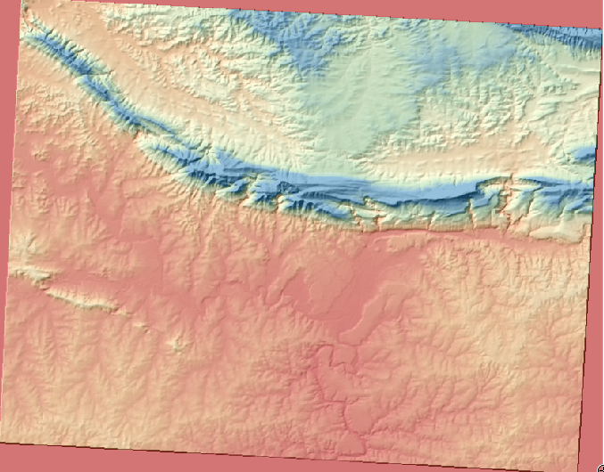

-   Switch the hillshade layer off and back on in the Layers list to see the difference it makes.

Using a hillshade in this way, it's possible to enhance the topography of the landscape. If the effect doesn't seem strong enough to you, you can change the transparency of the hillshade layer; but of course, the brighter the hillshade becomes, the dimmer the colors behind it will be. You will need to find a balance that works for you.

Remember to save your map when you are done.

For the next two exercises, please use a new map. Load only the DEM raster dataset into it (exercise\_data/raster/SRTM/srtm\_41\_19.tif). This is to simplify matters while you're working with the raster analysis tools. Save the map as exercise\_data/raster\_analysis.qgs.

Calculating the Slope
-------------------------------------

Another useful thing to know about the terrain is how steep it is. If, for example, you want to build houses on the land there, then you need land that is relatively flat.

To do this, you need to use the Slope mode of the DEM
(Terrain models) tool.

-   Open the tool as before.
-   Select the Mode option Slope:

    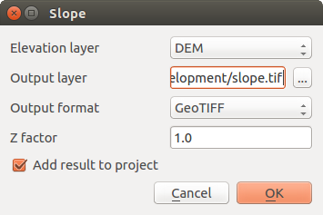

-   Set the save location to exercise\_data/residential\_development/slope.tif
-   Enable the Load into canvas... checkbox.
-   Click OK and close the dialogs when processing is complete, and click Close to close the dialog. You'll see a new raster loaded into your map.
-   With the new raster selected in the Layers list, click the Stretch Histogram to Full Dataset button. Now you'll see the slope of the terrain, with black pixels being flat terrain and white pixels, steep terrain:

    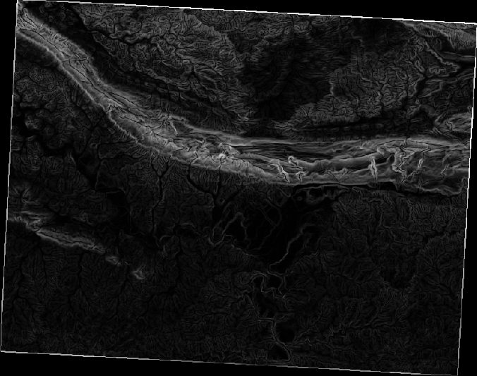

Calculating the aspect
--------------------------------------

The *aspect* of terrain refers to the direction it's facing in. Since this study is taking place in the Southern Hemisphere, properties should ideally be built on a north-facing slope so that they can remain in the sunlight.

-   Use the Aspect mode of the DEM (Terain models) tool to calculate the aspect of the terrain.

Check your results &lt;raster-analysis-1&gt;

Using the Raster Calculator
-------------------------------------------

Think back to the estate agent problem, which we last addressed in the *Vector Analysis* lesson. Let's imagine that the buyers now wish to purchase a building and build a smaller cottage on the property. In the Southern Hemisphere, we know that an ideal plot for development needs to have areas on it that are north-facing, and with a slope of less than five degrees. But if the slope is less than 2 degrees, then the aspect doesn't matter.

Fortunately, you already have rasters showing you the slope as well as the aspect, but you have no way of knowing where both conditions are satisfied at once. How could this analysis be done?

The answer lies with the Raster calculator.

-   Click on Raster &gt; Raster calculator... to start this tool.
-   To make use of the aspect dataset, double-click on the item aspect@1 in the Raster bands list on the left. It will appear in the Raster calculator expression text field below.

North is at 0 (zero) degrees, so for the terrain to face north, its aspect needs to be greater than 270 degrees and less than 90 degrees.

-   In the Raster calculator expression field, enter this expression:

    aspect@1 &lt;= 90 OR aspect@1 &gt;= 270

-   Set the output file to aspect\_north.tif in the directory exercise\_data/residential\_development/.
-   Ensure that the box Add result to project is checked.
-   Click OK to begin processing.

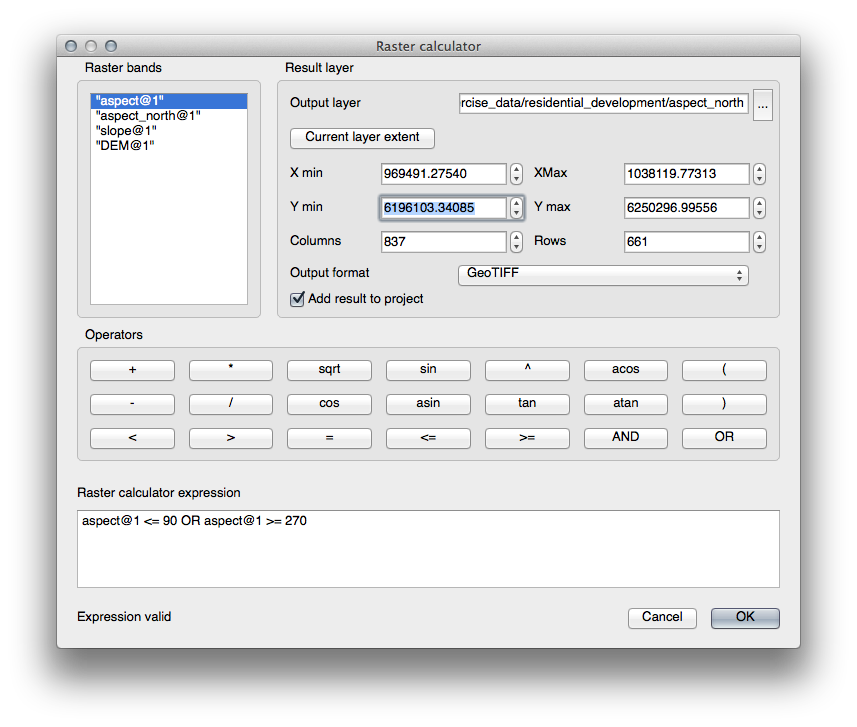

Your result will be this:

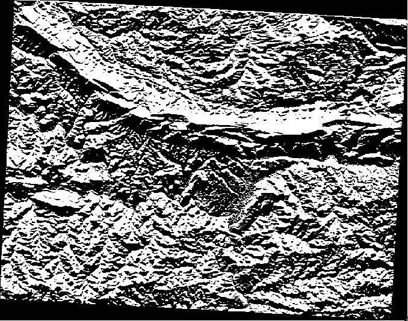

Now that you've done the aspect, create two separate new analyses of the DEM layer.

-   The first will be to identify all areas where the slope is less than or equal to 2 degrees.
-   The second is similar, but the slope should be less than or equal to 5 degrees.
-   Save them under exercise\_data/residential\_development/ as slope\_lte2.tif and slope\_lte5.tif.

Check your results &lt;raster-analysis-2&gt;

Combining Raster Analysis Results
-------------------------------------------------

Now you have three new analysis rasters of the DEM layer:

-   aspect\_north: the terrain faces north
-   slope\_lte2: the slope is at or below 2 degrees
-   slope\_lte5: the slope is at or below 5 degrees

Where the conditions of these layers are met, they are equal to 1. Elsewhere, they are equal to 0. Therefore, if you multiply one of these rasters by another one, you will get the areas where both of them are equal to 1.

The conditions to be met are: at or below 5 degrees of slope, the terrain must face north; but at or below 2 degrees of slope, the direction that the terrain faces in does not matter.

Therefore, you need to find areas where the slope is at or below 5 degrees AND the terrain is facing north; OR the slope is at or below 2 degrees. Such terrain would be suitable for development.

To calculate the areas that satisfy these criteria:

-   Open your Raster calculator again.
-   Use the Raster bands list, the Operators buttons, and your keyboard to build this expression in the Raster calculator
    expression text area:

    ( aspect\_north@1 = 1 AND slope\_lte5@1 = 1 )  OR slope\_lte2@1 = 1

-   Save the output under exercise\_data/residential\_development/ as all\_conditions.tif.
-   Click OK on the Raster calculator. Your results:

    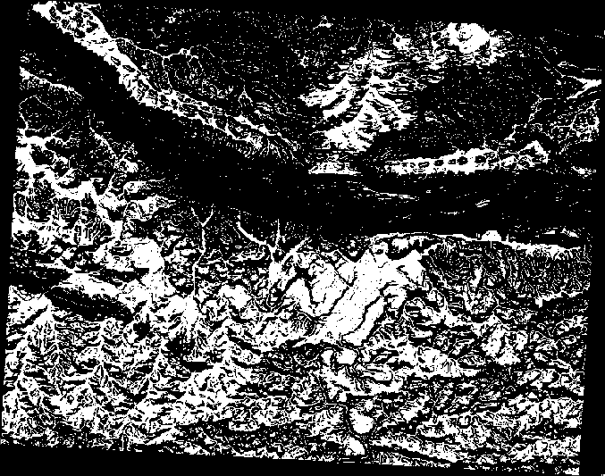

Simplifying the Raster
--------------------------------------

As you can see from the image above, the combined analysis has left us with many, very small areas where the conditions are met. But these aren't really useful for our analysis, since they're too small to build anything on. Let's get rid of all these tiny unusable areas.

-   Open the Sieve tool (Raster --&gt; Analysis --&gt;
    Sieve).
-   Set the Input file to all\_conditions, and the Output file to all\_conditions\_sieve.tif (under exercise\_data/residential\_development/).
-   Set both the Threshold and Pixel connections values to 8, then run the tool.

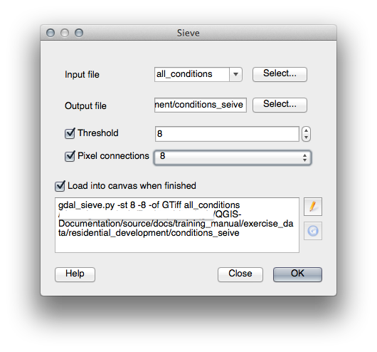

Once processing is done, the new layer will load into the canvas. But when you try to use the histogram stretch tool to view the data, this happens:

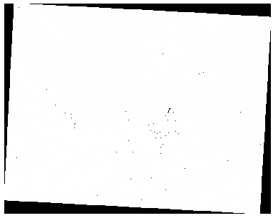

What's going on? The answer lies in the new raster file's metadata.

-   View the metadata under the Metadata tab of the Layer
    Properties dialog. Look in the Properties section at the bottom.

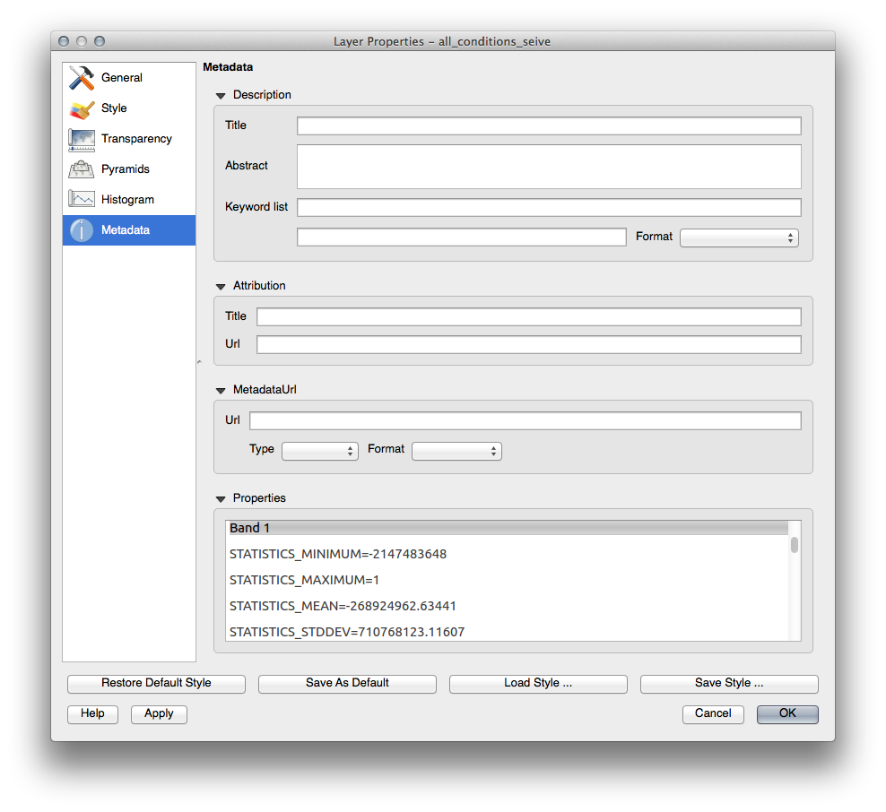

Whereas this raster, like the one it's derived from, should only feature the values 1 and 0, it has the STATISTICS\_MINIMUM value of a very large negative number. Investigation of the data shows that this number acts as a null value. Since we're only after areas that weren't filtered out, let's set these null values to zero.

-   Open the Raster Calculator again, and build this expression:

    (all\_conditions\_sieve@1 &lt;= 0) = 0

    This will maintain all existing zero values, while also setting the negative numbers to zero; which will leave all the areas with value 1 intact.
-   Save the output under exercise\_data/residential\_development/ as all\_conditions\_simple.tif.

Your output looks like this:

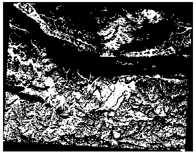

This is what was expected: a simplified version of the earlier results. Remember that if the results you get from a tool aren't what you expected, viewing the metadata (and vector attributes, if applicable) can prove essential to solving the problem.

