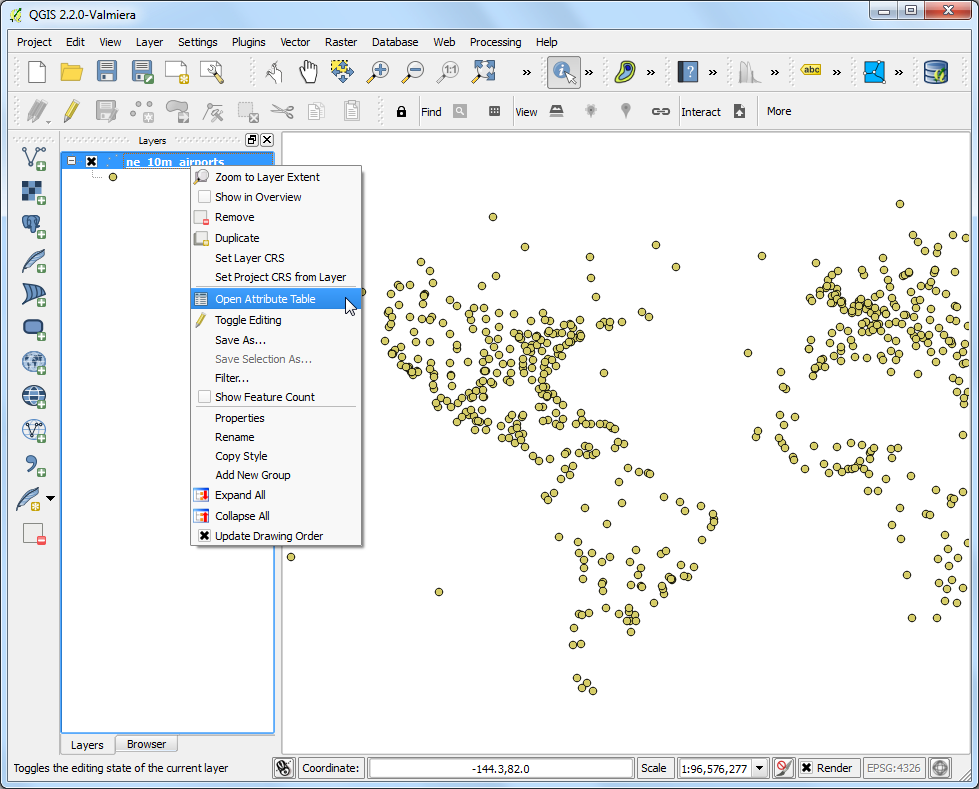
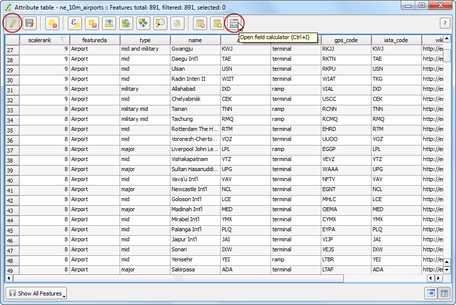
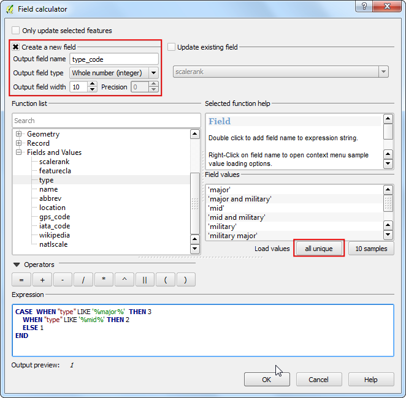
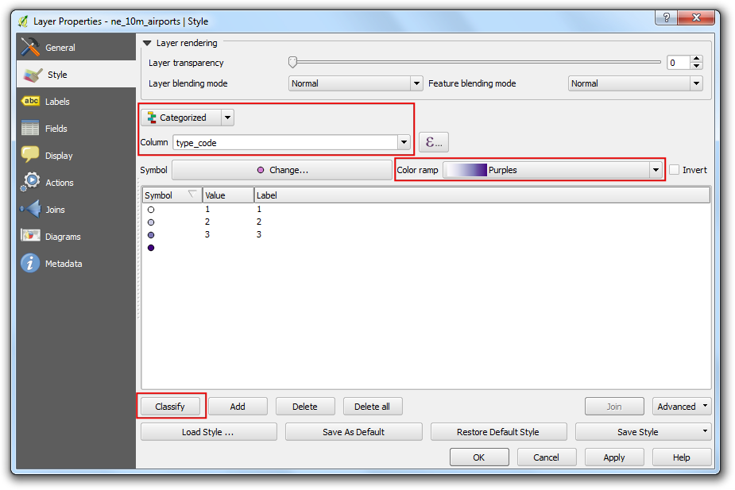

Web Maps with qgis2web
===============================

Intro
-----

Leaflet and Op is a popular open-source Javascript library for building web mapping applications. **qgis2web** plugin provides a simple way to export your QGIS map to a functioning leaflet-based web map. This plugin is a useful way to get started with web mapping and create an interactive web map from your static GIS data layers.

**Goal of the task** We will create a leaflet web map of world's airports.

### Other skills you will learn

-   Using `CASE` SQL statement in Field Calculator to create new field values based on different conditions.
-   Locating and using SVG custom icons in QGIS.

Get the data
------------

We will use the [Airports](http://www.naturalearthdata.com/downloads/10m-cultural-vectors/airports/) dataset from Natural Earth.

Download the [Airports shapefile](http://www.naturalearthdata.com/http//www.naturalearthdata.com/download/10m/cultural/ne_10m_airports.zip).

Procedure
---------

-   Install the `qgis2web` plugin by going to `Plugins > Manage and Install Plugin... > Install` search for it  and install it.  

-   Unzip the downloaded `ne_10m_airports.zip` file. Open QGIS and go to Layer --&gt; Add Vector Layer. Browse to the location when the files were extracted and select `ne_10m_airports.shp`. Click OK.

-   Once the `ne_10m_airports` layer is loaded, use the Identify tool to click on any feature and look at the attributes. We will create an airport map where we classify the airports into 3 categories. The attribute `type` will be useful when classifying the features.

-   Right-click the `ne_10m_airports` layer and select Open Attribute Table.

-   In the attribute table dialog, click the Toggle Editing button. Once the layer is in editing mode, click the Open Field Calculator button.

-   We want to create a new attribute called `type_code` where we give major airports a value of 3, mid-sized airports a value of 2 and all others a value of 1. We can use the *CASE* statement and write an expression that will look at the value of `type` attribute and create a `type_code` attribute based on the condition. Check the Create a new field box and enter `type_code` as the Output field name. Select Whole number (integer) as the Output field type. In the Expression window, enter the following text.

        CASE  WHEN "type" LIKE '%major%'  THEN 3
         WHEN "type" LIKE '%mid%' THEN 2
         ELSE 1
        END

-   Back in the Attribute Table window, you will see a new column at the end. Verify that your expression worked correctly and click the Toggle Editing button to save the changes.

-   Now we will style the airports layer using the newly created `type_code` attribute. Right-click the `ne_10m_airports` layer and select Properties.

-   Select the Style tab in the Layer Properties dialog. Select Categorized style from the drop-down menu and choose `type_code` as the Column. Choose a color ramp of your choice and click Classify. Click OK to go back to the main QGIS window.

-   Here you will see a nicely styled airport map. Let's export this to create an interactive web map. Go to Web --&gt; qgis2web --&gt; Exports a QGIS Project to a working leaflet webmap.

-   In the QGIS 2 Web dialog, choose a basemap, like OSM and click *Update Preview* refresh the map. 
-   Choose a Output project folder on your system where the plugin will write the output files. 
-   Choose *Fit to layer extent* as the Extent of the exported map.
-   Choose Max zoomlevel 20, so the user can't zoom deeper then QGIS has styles. 
-   You can add a layer list, a measure tool, a geolocate button and several other tools
-   You can also add a Adress search, if you use leaflet.
-   You can choose to export a leaflet or openlayers map.
-   Click Export

-   Once the export process finishes, locate the output folder on your disk. Open the `index.html` file in a browser. You will see an interactive web map that is a replica of the QGIS map. You can zoom and pan around the map and also click on any feature to get an popup window with attribute information. 
You can copy the contents of this folder to a web server to have a full featured web map.

### Extra task

Also the routes of delijn to the map and see the result. 
http://geoservices.informatievlaanderen.be/raadpleegdiensten/DeLijn/wms

