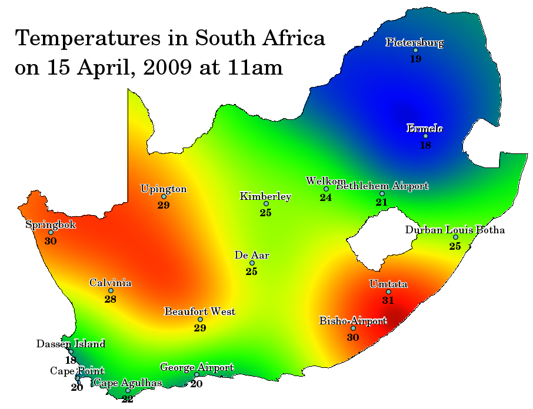
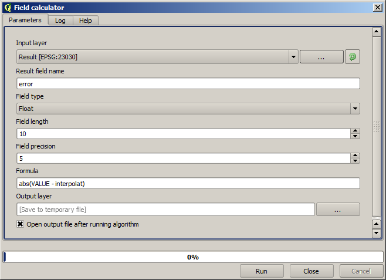
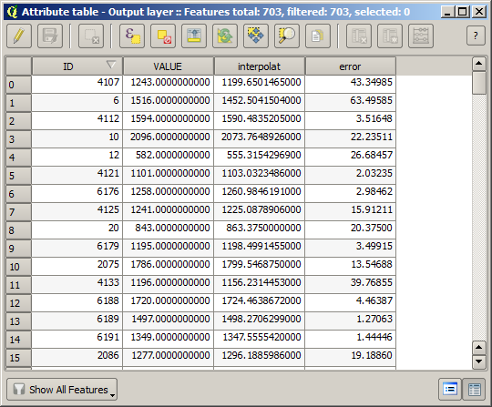
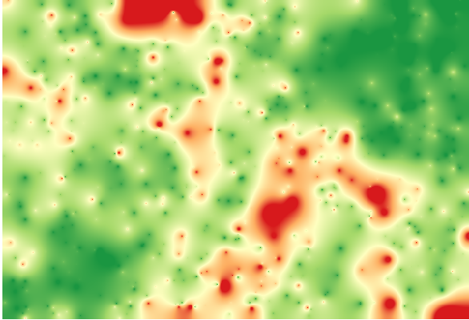

Interpolation
==================

Intro
------

Spatial interpolation is a geostatistical technique of using points with known values to estimate values at other unknown points. For example, to make a precipitation (rainfall) map for your country, you will not find enough evenly spread weather stations to cover the entire region. Spatial interpolation can estimate the temperatures at locations without recorded data by using known temperature readings at nearby weather stations (see figure below). This type of interpolated surface is often called a statistical surface. Elevation data, precipitation, snow accumulation, water table and population density are other types of data that can be computed using interpolation.

**Goal of the task:** Interpolation is a common geostatistical technique, and it can be used to demonstrate several techniques that can be applied using the QGIS processing framework. 

Procedure
--------

The data for this lesson contains also a points layer, in this case with elevation data. We are going to interpolate it much in the same way as we did in the previous lesson, but this time we will save part of the original data to use it for assessing the quality of the interpolation process.

- First [Download the Data](../data/interpolation.zip)

First, we have to rasterize the points layer and fill the resulting no--data cells, but using just a fraction of the points in the layer. We will save 10% of the points for a later check, so we need to have 90% of the points ready for the interpolation. 

To do so, we could use the *Split shapes layer randomly* algorithm, which we have already used in a previous lesson, but there is a better way to do that, without having to create any new intermediate layer. Instead of that, we can just select the points we want to use for the interpolation (the 90% fraction), and then run the algorithm. As we have already seen, the rasterizing algorithm will use only those selected points and ignore the rest. 

The selection can be done using the `QGIS geoalgorithms > Vector selection tools > Random selection` algorithm. Run it with the following parameters.

That will select 90% of the points in the layer to rasterize

The selection is random, so your selection might differ from the selection shown in the above image.

Now run the `GDAL/OGR > [GDAL] Analyses > GRID (Inverse distance to a power) ` algorithm to get the a raster layer. Use "Value" as Z-field, -9999 as nodata, leave the other parameters default for now. 

If there holes in your raster you can run the `SAGA > Grid - tools > Close gaps` algorithm to fill the no--data cells \[Cell resolution: 100 m\]. The result will look like this:

To check the quality of the interpolation, we can now use the points that are not selected. At this point, we know the real elevation (the value in the points layer) and the interpolated elevation (the value in the interpolated raster layer). We can compare the two by computing the differences between those values.

Since we are going to use the points that are not selected, first, let's invert the selection.

The points contain the original values, but not the interpolated ones. To add them in a new field, we can use the `SAGA > Shapes - GRID > Add raster values to points` algorithm

The raster layer to select (the algorithm supports multiple raster, but we just need one) is the resulting one from the interpolation. We have renamed it to *interpolate* and that layer name is the one that will be used for the name of the field to add.

Now we have a vector layer that contains both values, with points that were not used for the interpolation.

Now, we will use the fields calculator for this task. Open the `QGIS geoalgorithms > Vector Table tools > Field calculator` algorithm and run it with the following parameters.

If your field with the values from the raster layer has a different name, you should modify the above formula accordingly. Running this algorithm, you will get a new layer with just the points that we haven't used for the interpolation, each of them containing the difference between the two elevation values.

Representing that layer according to that value will give us a first idea of where the largest discrepancies are found.

Interpolating that layer will get you a raster layer with the estimated error in all points of the interpolated area.

