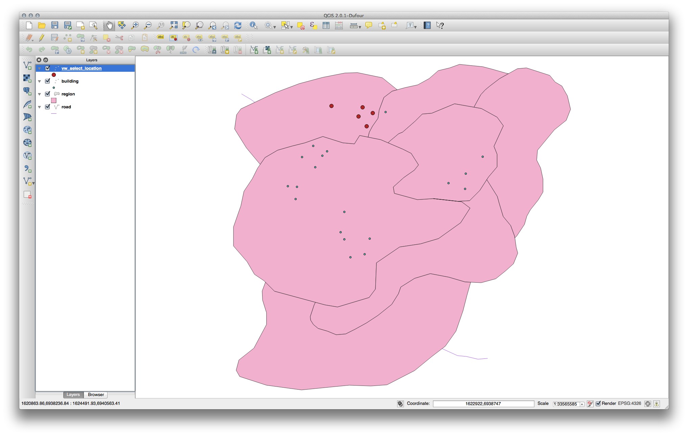
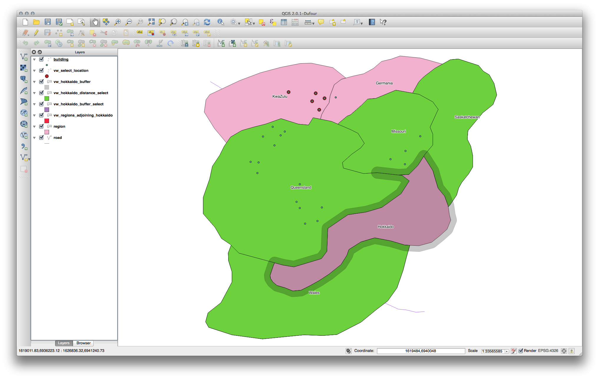

Spatial Queries
================

**The goal for this lesson:** To see how spatial functions are implemented similarly to "normal" non-spatial functions. The folliwng exercises are theoretical. 

Intro
-----

Spatial databases are databases that stores geograpical features in a column using the geometry type. 
With a spatial database, we have additional functions to query our database.
A geometry can be a point, a line or Polygon or combination thereof: a multigeometry. It also has a Spatial Referece ID (SRID), a number that corresponds the the projection of the data in the spatial_ref_sys-colomn. 
Spatial queries are no different from other database queries. You can use the geometry column like any other database column. 
The Belgian Projection Lambert Belge 1972 has SRID: 31370 . The international WGS-1984 has SRID: 4326.

Spatial Operators
-----------------

When you want to know which points are within a distance of 1000 meter to a point(X,Y) you can do this with:

```
    select *, ST_Distance( ST_Transform( geom, 31370 ) ,
                  ST_GeomFromText( 'POINT(151442 203761)', 31370 ) ) as DIST
    from people
    where DIST < 1000;
```
    
Result:

|  id |     name      | house_no | street_id |   phone_no    |   geom   |    DIST     |
| --- |:-------------:|:--------:|:---------:|:-------------:|:--------:| -----------:|
|   6 | Faulty Towers | 34       | 3         | 072 812 31 28 | <binary> |  45         |

--> 1 record was found, within a distance of 45 meter


Lets break down the functions we used:

- **ST_GeomFromText**: Return a specified Geometry value from Well-Known Text representation (WKT). This is an alias name for ST_GeomFromText. *--> we use this contruct a single geometry form a text-string, the second parameter is the SRID, See: https://en.wikipedia.org/wiki/Well-known_text *
- **ST_Transform**: Returns a new geometry with its coordinates transformed to the SRID referenced by the integer parameter. *--> we use this to make sure we get the data from table in the spatial reference as the point*
- **ST_Distance** : For geometry type Returns the minimum distance between two geometries in projected units. *--> we use this to calculate the distance between 2 geometries*


For a full list of all the spatial function support in Spatialite: 
http://www.gaia-gis.it/gaia-sins/spatialite-sql-4.2.0.html 

For a full list of all the spatial function support in Postgis: 
http://postgis.net/docs/manual-2.0/reference.html


Some more Examples 
------------------

### Select by location

Get all the buildings in the KwaZulu region, we have a table containing the regions of South africa and another with the buildings as points:

    SELECT building.id, building.name, ST_astext(building.geom) as point
    FROM building, region
        WHERE st_within(building.geom, region.geom) AND region.name = 'KwaZulu';

Result:
                                                       
| id | name |                  point                      |
| -- |:----:| -------------------------------------------:|
| 30 | house | POINT(1622345.23785063 6940490.65844485)   | 
| 33 | hopsital | POINT(1622495.65620524 6940403.878624)  |
| 35 | church | POINT(1622403.09106394 6940212.96302097)  |
| 36 | house | POINT(1622287.38463732 6940357.59605424)   |
| 40 | house | POINT(1621888.19746548 6940508.01440885)   |

the resulting table only contaings the builing in the KwaZulu region.




### Select neighbors

Show a list of all the names of regions adjoining the Hokkaido region:

    SELECT b.gid, b.name, b.geom
    FROM region a, region b
       WHERE ST_DISTANCE (a.geom, b.geom) < 100
       AND a.name = 'Hokkaido' AND b.name != 'Hokkaido';

We are selecting the same region twice and giving them 2 diffrant alias names so we can compare them with each other. We asume features within 100 meters are neighbors. 
        


Learn more
---------

The SpatiaLite Cookbook http://www.gaia-gis.it/gaia-sins/spatialite-cookbook/index.html
