Working with Terrain Data
=========================

Intro 
----

Terrain or elevation data is useful for many GIS Analysis and it is often used in maps. QGIS has good terrain processing capabilities built-in. In this tutorial, we will work through the steps to generate various products from elevation data such as contours, hillshade etc.

**Goal of the task:** The task is to create contours and hillshade map for area around Mt. Everest.

Other skills you will learn:

-   Searching and downloading freely available terrain data.
-   Exporting a vector layer as KML and viewing it in Google Earth.

Get the data
------------

We will be working with GMTED2010 dataset from USGS. This data can be downloaded from the [USGS Earthexplorer](http://earthexplorer.usgs.gov/) site. [GMTED (Global Multi-resolution Terrain Elevation Data)](http://eros.usgs.gov/#/Find_Data/Products_and_Data_Available/GMTED2010) is a global terrain dataset that is the newer version of GTOPO30 dataset.

Here is how to search and download the revelant data from USGS Earthexplorer.

-  Go to the [USGS Earthexplorer](http://earthexplorer.usgs.gov/) . In the Search Criteria tab, search for the place name Mt. Everest. Click on the result to select the location.

-  In the Data Sets tab, expand the Digital Elevation group, and check GMTED2010.

-  You can now skip to the Results tab and see the part of the dataset intersecting your search criteria. Click the Download
    Options button. You will have to log in to the site at this point. You can create a free account if you do not have one.

-  Select the 30 ARC SEC option and click Select
    Download Option.

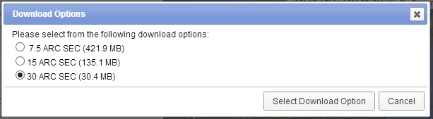

You will now have a file named GMTED2010N10E060\_300.zip. Elevation data is distributed in various raster formats such as ASC, BIL, GeoTiff etc. QGIS supports a wide [variety of raster formats](http://www.gdal.org/formats_list.html) via the GDAL library. The GMTED data comes as GeoTiff files which are contained in this zip archive.

For convenience, you can download a copy of the data directly from below.

[GMTED2010N10E060\_300.zip](http://www.qgistutorials.com/downloads/GMTED2010N10E060_300.zip)

Procedure
---------

-  Open Layer --&gt; Add Raster Layer and browse to the downloaded zip file.

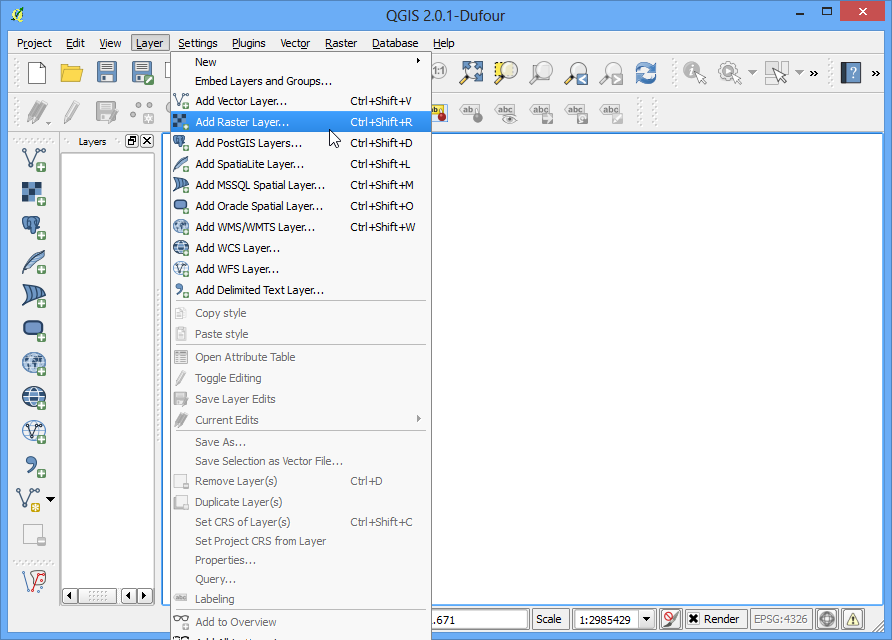

-  There are many different files generated from different algorithms. For this tutorial, we will use the file named 10n060e\_20101117\_gmted\_mea300.tif.

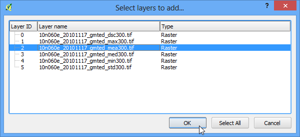

-  You will see the terrain data rendered in the QGIS Canvas. Each pixel in the terrain raster represents the average elevation in meters at that location. The dark pixels represent areas with low altitude and lighter pixels represent areas with high altitude.

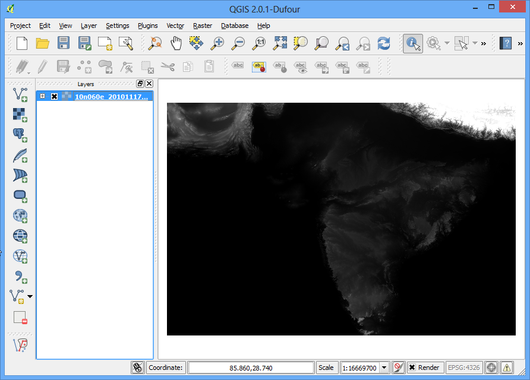

-  Let's find our area of interest. From [Wikipedia](http://en.wikipedia.org/wiki/Mount_Everest), we find that the coordinates for our area of interest - Mt. Everest - is located at the coordinates 27.9881° N, 86.9253° E. Note that QGIS uses the coordinates in (X,Y) format , so you must use the coordinates as (Longitude, Latitude). Paste 86.9253,27.9881 these at the bottom of QGIS window where it says Coordinate and press Enter. The viewport will be centered at this coordinate. To zoom in, Enter 1:1000000 in the Scale field and press Enter. You will see the viewport zoom to the area around the Himalayas.

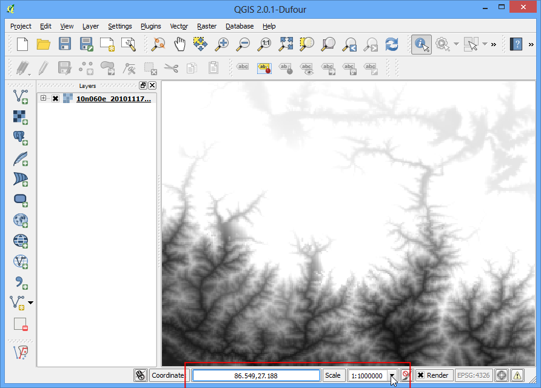

-  We will now crop the raster to this area of interest. Select the Clipper tool from Raster --&gt; Extraction --&gt; Clipper.

The Raster menu in QGIS comes from a core plugin called GdalTools. If you do not see the Raster menu, enable the GdalTools plugin from Plugins --&gt;
Manage and install plugins --&gt; Installed. See using\_plugins for more details.

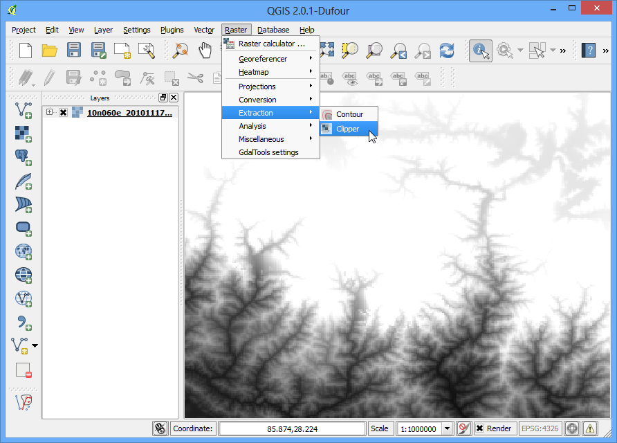

-  In the Clipper window, name your output file as everest\_gmted30.tif. Select the Clipping mode as Extent.

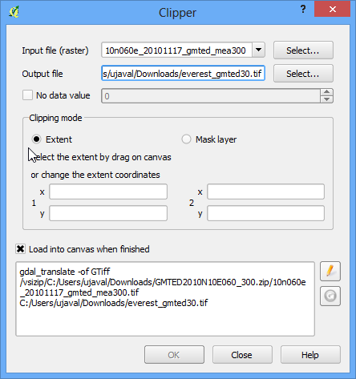

-  Keep the Clipper window open and switch to the main QGIS window. Hold your left mouse button and draw a rectangle covering the full canvas.

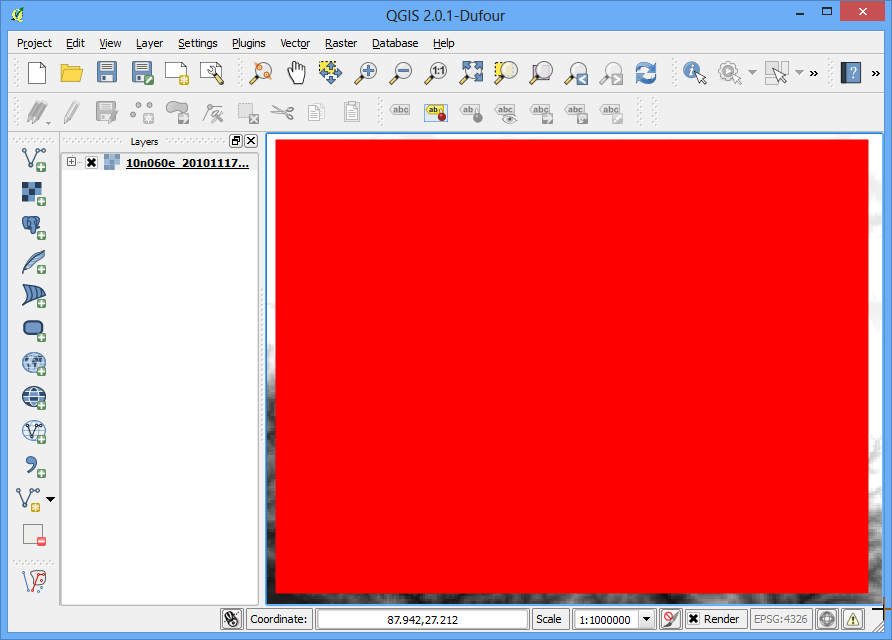

-  Now back in the Clipper window, you will see the coordinates auto-populated from your selection. Make sure the Load into
    canvas when finished option is checked, and click OK.

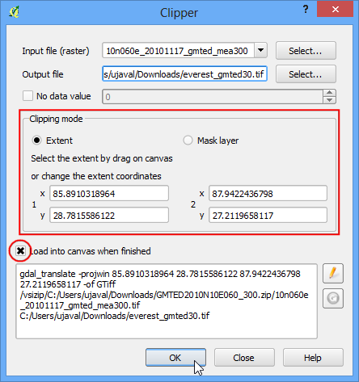

-  Once the process finishes, you will see a new layer loaded in QGIS. This layer covers only the area around Mt. Everest.Now we are ready to generate contours. Select the contour tool from Raster --&gt; Extraction
    --&gt; Contour.

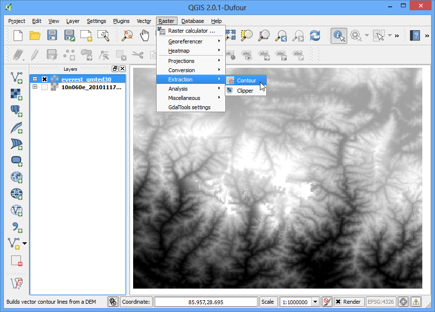

-  In the Contour dialog, select everest\_gmted30 as the Input file. Name the Output file for contour lines as everest\_countours.shp. We will generate contour lines for 100m intervals, so put 100 as the Interval between contour lines. Also check the Attribute name option so elevation value will be recorded as attribute of each contour line. Click OK.

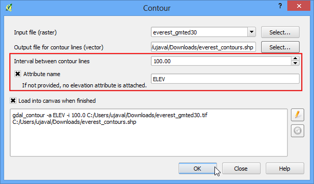

-  Once the processing is complete, you will see contour lines loaded into the canvas. Each line in this layer represents a particular elevation. All points along a countour line in the underlying raster would be at the same elevation. The closer the lines, the steeper the slope. Let’s inspect the contours a bit more. Right click on the contours layer and choose Open Attribute Table.

-  You will see that each line feature has an attribute named ELEV. This is the height in metres that each line represents. Click on the column header a couple of times to sort the values in descending order. Here you will find the line representing the highest elevation in our data, i.e. Mt. Everest.

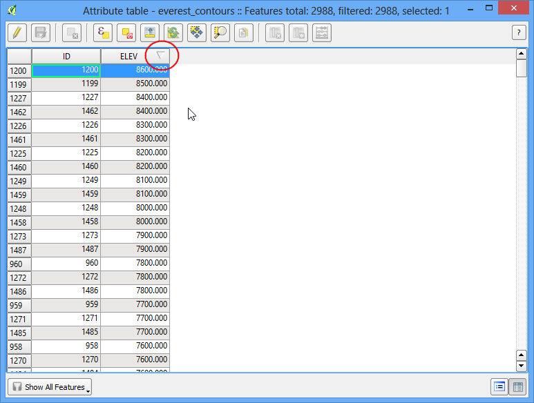

-  Select the top row, and click on the Zoom to selection button.

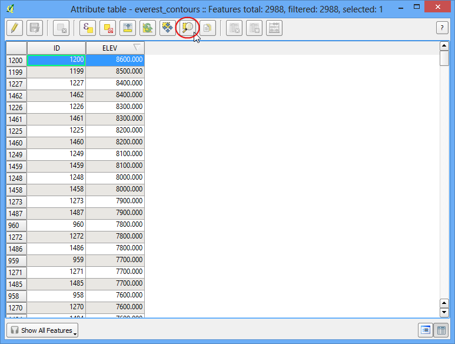

-  Switch to the main QGIS window. You will see the selected contour line highlighted in yellow. This is the area of the highest elevation in our dataset.

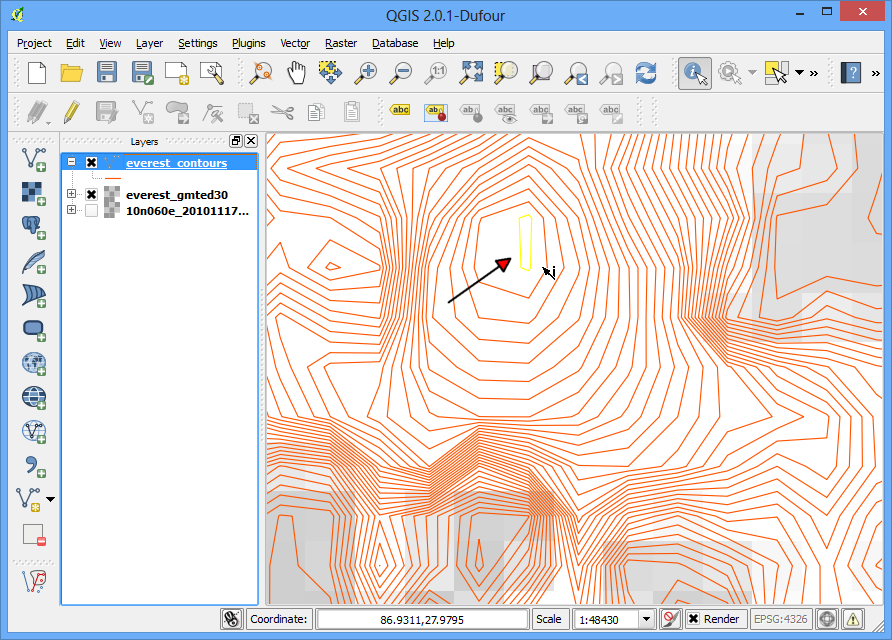

-  Now let us create a hillshade map from the raster. Select Raster --&gt; Analysis --&gt; DEM (Terrain Models).

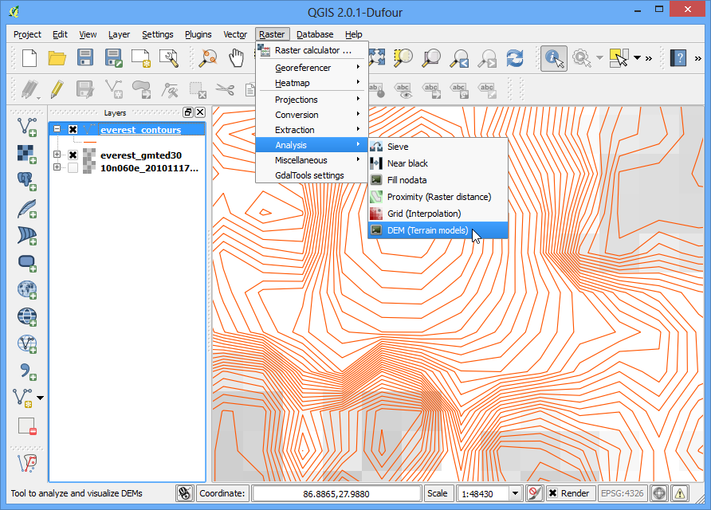

-  In the DEM (Terrain Models) dialog, choose everest\_gmted30 as the Input file. Name the Output file as everest\_hillshade.tif. Choose Hillshade as the Mode. Leave all other options as is. Make sure the Load into
    canvas when finished option is checked, and click OK.

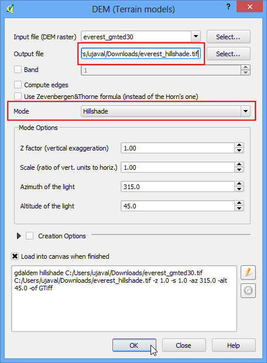

-  Once the process finishes, you will see yet another raster loaded into QGIS canvas. Since you maybe zoomed-in near the Mt.Everest region, right click on the everest\_hillshade layer and choose Zoom to Layer
    Extent.

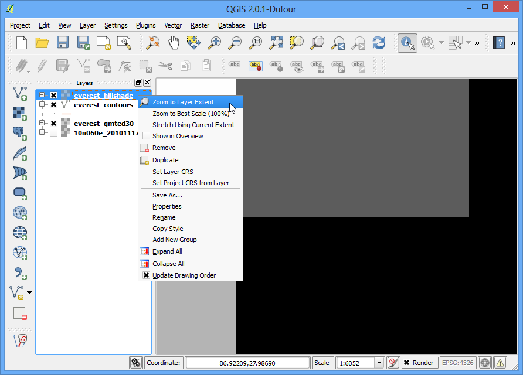

-  Now you will see the full extent of the hillshade raster.

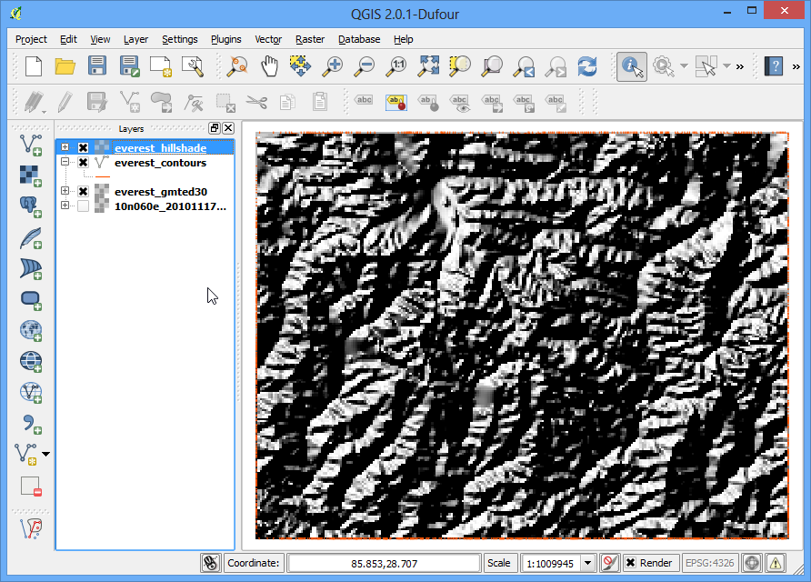

-  You can also visualize your contour layer and verify your analysis by exporting the contours layer as KML and viewing it in Google Earth. Right click on the contours layer, select Save as...

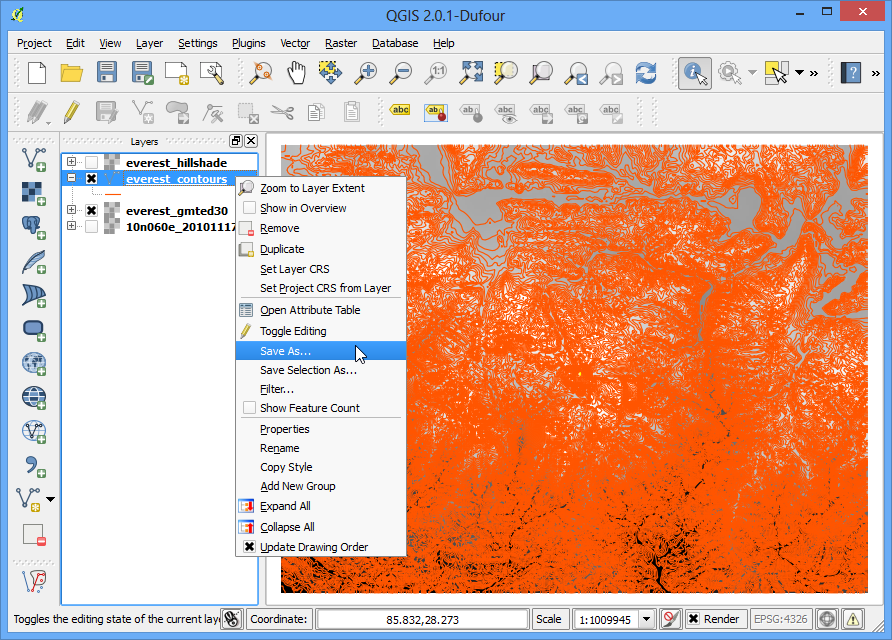

-  Select Keyhole Markup Language \[KML\] as the Format. Name your output as contours.kml and click OK.

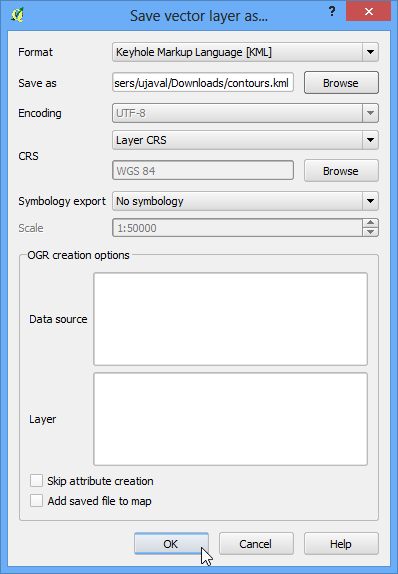

-  Browse to the output file on your disk and double-click on it to open Google Earth.

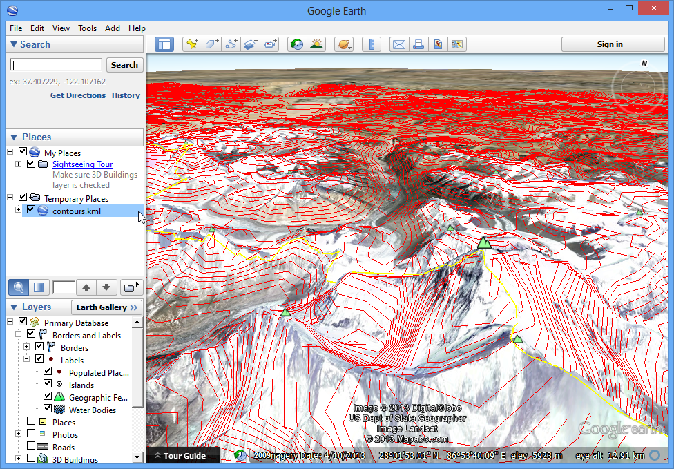

###Extra task 

Do this operation with the Processing toolbox instead. 
